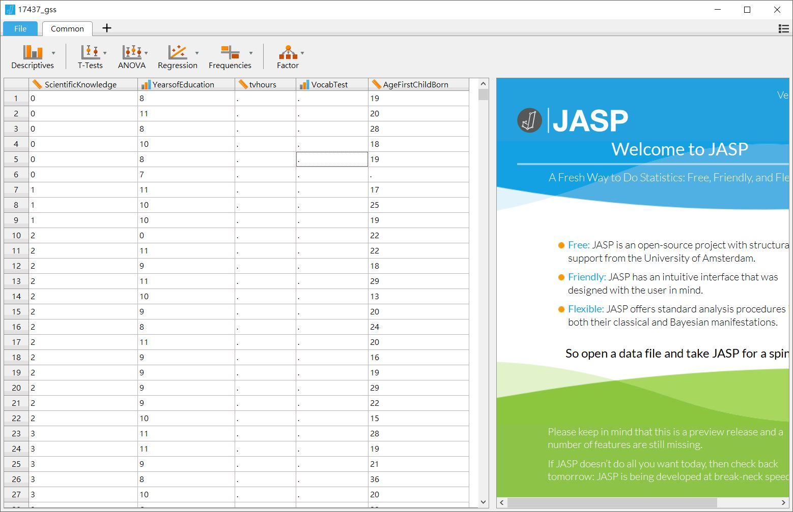

# 統計思考開門 {#intro}

科學創見從對現象的推測開始，只要好奇親眼目睹或耳聞的現象之發生原因，推測如何發生的過程，就有最初步的**假設(Hypothesis)**。假設要成為讓人信服的說法，需要有**正面證據(Positive Evidence)**的支持，以及不被**反面證據(Negative Evidence)**推翻。決定該找到什麼樣的證據，還有收集證據的方法，與假設放在一起就構成**科學思考(Scientific thinking)**。當證據是需要經過**隨機化(Randomization)**取得的**資料(Data)**，並且使用**機率模型(Probability Model)**整理與驗證資料裡的**正反面訊息**，這種科學思考就是**統計思考(Statistical Thinking)**。

## 統計思考實例：Emily Rosa的專題研究

用這個有正式發表論文的研究專題展示什麼是統計思考。曾任美國神智學會(Theosophical Society in America)的Dora Kunz在1970年代提倡**[治療性撫慰](https://en.wikipedia.org/w/index.php?title=Therapeutic_touch&oldid=813367620)**(therapeutic touch)，幫助病患紓解病痛與焦慮。提倡者主張人類身體自然散發能量場(energy field)，受過訓練的治療師能不接觸患者身體，感應患者的能量場，並運用自身能量撫慰患部，紓解病患的痛苦。到了今天，包括美國在內，全球大約有80所護理學校列治療性撫慰為正式課程，光是北美地區有80所左右的醫療機構允許護理人員使用治療性撫慰幫助住院患者。


```{r img-TT, fig.cap="正在接受治療性撫慰的男士。圖像取自HEAVYSTONES.com", out.width='30%', fig.align='center', echo=FALSE}
knitr::include_graphics("images/theraputic-touch.jpg")
```

1998年當時11歲的美國女孩Emily Rosa，想知道治療師感應人體能量場的真實能力，設計一套簡易測試。她請治療師坐在隔板之後，隔板只有下方兩個孔洞。測試時治療師將雙手透過孔洞伸到另一邊，測試者將自已的手隨機伸到治療師的其中一隻手掌上方8至10公分處，請治療師說出測試者的手是在左手還是右手上方，每位治療師反覆進行十次測試。**Emily假設如果治療師真的有感應人體能量場的能力，十次測試的答對率應該比完全亂猜(50%)高出許多。**

```{r img-Emily, fig.cap="左：Emily Rosa 11歲時的留影，取自維基百科。右：Emily Rosa施測現場素描，取自Rosa et al. (1998) Figure 1", out.width='70%', fig.align='center', echo=FALSE}
knitr::include_graphics("images/342px-Emily_Rosa.jpg")
```


在父母的幫助下，在前後間隔一年的兩次施測機會，Emily邀請到21位實際從事治療性撫慰的人士參與測試，其中7位取得合格證書。在Emily與父母以及一位醫師一起撰寫的論文裡，他們以長條圖呈現21位治療師的正確次數[@RosaCloseLookTherapeutic1998]，圖\@ref(fig:Rosa1998Fig2)是原始統計圖的重製版本：

```{r Rosa1998Fig2, echo=FALSE, fig.cap="Emily Rosa的研究結果", message=FALSE, warning=FALSE, out.width='60%', fig.align='center', paged.print=FALSE}
require(ggplot2)
CF <- as.factor(0:10)
NS <- c(0,1,1,8,5,7,2,3,1,0,0)
Emily_data <- data.frame(CF, NS)
##png(filename = "image/Rosa1998-fig2.png", bg = "transparent")
p <- ggplot(Emily_data, aes(CF, NS))
p + geom_bar(stat = "identity", width = 0.5) +
  xlab("正確試驗次數(平均數 = 4.4)") + ylab("累積人數") +
  theme_classic()
##dev.off()
##knitr::include_graphics("images/Rosa1998-fig2.png")
```

測試結果究竟證實了治療師們的真本領？還是揭露治療性撫慰的虛張聲勢？回答這些問題之前，我們先來解析這項專題研究的思路。如果你認為Emily Rosa的**假設**與**測試方法**是有道理的，或者你認為可以做更好的改良，那麼你已經有科學思考的基本能力。Emily的專題研究讓我們知道，能以科學思考探究的問題，必定有**可測試的假設**，以及**可實作的測試方法**。更嚴謹的話，還要加上**正反證據的成立條件**。

那麼為何Emily Rosa的專題研究是一種**統計思考**？首先Emily提出的假設有預期測量結果的發生機率：如果治療師們沒有宣稱的本事，全部的答對率應該和丟硬幣猜是正面還是反面向上的機率一樣：50%。如果治療師們真的有本事，答對率應該明顯高於50%，這也是正面證據與反面證據有效的條件。至於Emily使用的測試方法，看上去可以有效累積每位治療師的答對率。

圖 \@ref(fig:Rosa1998Fig2) 標示21位治療師的平均答對次數是4.4次，表示10次測試裡有4至5次是正確的。**平均4.4次**似乎與50%差不了多少，憑這個數值，Emily能說這群治療師的本事言過其實嗎？

如果你是能指出用那種**機率模型**最適合的讀者，你不必繼續閱讀這本書，更進階的機與統計，還有研究方法學習材料才適合你。如果你無法給出明確的答案，你應該繼續學習之後的單元，並且下載安裝我推薦的軟體，實作每個單元的範例與習題。Emily Rosa的判斷在第\@ref(ci)單元將有初步解答，但是你會發現理想的分析方法不只有一種，也許其他單元有更好的方法。認真走過一遍，你的統計思考能力會不斷提昇。

\clearpage 

## 如何檢驗測試結果：認識JASP與jamovi的界面

芝加哥大學國家民意研究中心([NORC](http://www.norc.org/Pages/default.aspx))每兩年會進行一次**一般社會調查(general social survey)**，並且[公開調查資料](http://gss.norc.org/Get-The-Data)[@SmithGeneralSocialSurveys]。我們使用2010年的部分資料之SPSS存檔(請由[這個網頁](https://studysites.sagepub.com/carlson/study/resources.htm)下載gss2010.sav)，認識JASP與jamovi的使用界面。

[JASP](https://jasp-stats.org/)是由荷蘭阿姆斯特丹大學Eric-Jan Wagenmakers教授領導的團隊於2015年啟動開發專案，核心是R套件路[BayesFactor](http://bayesfactorpcl.r-forge.r-project.org/)，所以JASP從一開始就是開源軟體[@JASP2018]。因為核心成員是貝式統計的專家，JASP不僅能做傳統的統計，也能計算貝式因子，並且操作方式與SPSS一樣。就算你還不明白什麼是貝氏因子，還是能用JASP學習傳統統計方法。

JASP能開啟的檔案格式有已格式化的文字檔(.csv, .txt)、SPSS資料檔(.sav)、以及Libera Office試算表(.ods)。從[官方網站](https://jasp-stats.org/)下載對應作業系統的安裝程式，安裝成功後打開JASP，切換到_File_界面(見圖 \@ref(fig:JASP-FILE) )，點選**Computer**，從存放在個人電腦中的資料夾位置，開啟gss2010.sav。從畫面上你可以看到，你可以透過網路開啟存放在[OSF](https://osf.io/)的檔案。開發團隊也釋放一些範例檔案**Example**讓使用者試用。


```{r JASP-FILE, out.width='70%', fig.cap="JASP檔案選單", fig.align='center', echo=FALSE}
knitr::include_graphics("images/jasp-file.jpg")
```

成功載入資料內容後，JASP自動跳到*Common*界面，如圖 \@ref(fig:JASPCOMMON) 。這筆資料有五個欄位，每個欄位名稱之前有一些特別的符號，稍後我們會知道這些符號提示欄位裡的資料，JASP是以什麼樣的**尺度**處理。

```{r JASPCOMMON, out.width='70%', fig.cap="JASP資料界面", fig.align='center', echo=FALSE}

```

接著來認識[jamovi](https://www.jamovi.org/)，這是由澳洲的軟體工程師[Jonathon Love](https://jona.thon.love/)開發的開源軟體。Jonathon曾參與開發第一版的[JASP](https://jona.thon.love/)，返回故鄉自立門戶後，與朋友合作開發jamovi[@jamoviprojectjamoviVersionComputer2017]。開發理念是讓不擅長寫程式碼的人士，能以接近試算表軟體的介面，使用重要的R套件。

從[官方網站](https://www.jamovi.org/)下載對應作業系統的安裝程式並安裝成功之後，會發現介面和JASP有些不一樣，像圖 \@ref(fig:jamovi-blank) 。

```{r jamovi-blank, out.width='80%', fig.cap="jamovi起始畫面", fig.align='center', echo=FALSE}
knitr::include_graphics("images/jamovi-blank.jpg")
```

你需要點擊界面左上角三條橫線的圖示( 見圖 \@ref(fig:jamovi-blank) 紅色圓圈處)，才能打開如圖 \@ref(fig:jamovi-menu) 的檔案選單，選擇開啟存在本機的檔案。

```{r jamovi-menu, out.width='80%', fig.cap="jamovi檔案管理選單", fig.align='center', echo=FALSE}
knitr::include_graphics("images/jamovi-menu.jpg")
```

最新版的jamovi只能開啟已格式化的純文字檔案(.csv, .txt)，以及已建立的jamovi存檔(.omv)與JASP存檔(.jasp)。所以如果你要處理的資料本來是SPSS存檔，目前只能先匯入JASP存檔後，再以jamovi開啟。以剛剛匯入JASP的gss2010.sav示範，使用jamovi開啟的樣子如圖 \@ref(fig:jamovi-opened) 。

```{r jamovi-opened, out.width='80%', fig.cap="jamovi資料界面", fig.align='center', echo=FALSE}
knitr::include_graphics("images/jamovi-opened.jpg")
```

你會發現五個欄位名稱旁邊的符號圖案雖然和JASP的欄位不完全一樣，卻似乎指涉同一種**尺度**。`ScienceKnowledge`、`tvhours`、`AgeFirstChildBorn`是同一種類，`YearofEducation`、`VocabTest`則是另一個種類。JASP與jamovi給予這些資料欄位的分類，都是根據程式設計師先做好幾條*定義*，如果欄位內的數值符合那些定義，就給予一種分類。*程式的分類*就是統計實務一開始必談的**尺度**，**尺度**決定處理一筆資料的方法。gss2010裡有名稱的資料欄位，統計實務稱為**變項**，決定好變項的**尺度**，才能告訴軟體我們要對這筆資料做什麼分析。在第\@ref(randomization)單元，你會認識**尺度**與**機率模型**完整關係，不過稍後我會稍微提示一下，請留意兩個關鍵詞：**集中趨勢**與**變異趨勢**。

\clearpage 

## 分析測試結果的實體：尺度與變項

JASP與jamovi的尺度定義共有四種，我將四種尺度的圖示表列如下。JASP與jamovi官方網站都有四種尺度說明，JASP官網的標題是[變項種類(Variable Type)](https://jasp-stats.org/getting-started/)，jamovi官網標題是[資料變項(Data Variable)](https://www.jamovi.org/user-manual.html#data-variables)。

||{width=35%}|{width=35%}|
|---|:---:|:---:|
|連續尺度(continuous scale)|{width=15%}|{width=10%}|
|間斷尺度(discrete scale)|{width=15%} {width=15%} {width=15%}|{width=10%} {width=10%} {width=10%}|

哈佛大學Stanley Stevens[-@StevensTheoryScalesMeasurement1946]在Science發表的文章主張最主要的測量尺度種類是量化尺度(qunatitative scale)與質化尺度(qualitative scale)，也就是上表的連續尺度與間斷尺度。兩種主要尺度之下再細分等比(ratio)與等距(interval)尺度，以及序列(ordinal)及名義(nominal)尺度。尺度的定義已成為今日統計軟體程式設計師的編譯原則。

- **連續尺度**：當一筆資料內容都是數字，數值有小數點或有超過25種數值，程式都會判定為連續尺度。這類資料的數值之間的差異可以互相比較，例如gss2010的看電視時數(tvhours)以及人生第一胎年齡(AgeFirstBorn)，心理學常見的智力商數(IQ)也是一種連續尺度。許多統計教科書會區分等距尺度與等比尺度，兩者的差別是等比尺度的資料有**零點**，就像gss2010的科學知識評分(ScientificKnowledge)，這筆資料是受訪者答對問題的題數，註記為0代表沒有答對任何一題。儘管有此差別，兩種尺度的統計實務處理方法通常是一樣的，所以JASP與jamovi都沒有再做分類。

- **間斷尺度(序列)**：一筆資料內容都是數字，但是沒有任何數值有小數點，而且在列的數值不超過25種，JASP與jamovi都會判斷為序列尺度({width=3%},{width=3%})。數值表示資料之間的順序，數值的相加或相減沒有意義，例如全班學生某次考試的成績排名。如果序列尺度的變項是分析的目標，通常會計算各種數值的累積百分比。稍後我們會學習計算中位數，是處理序列尺度的主要方法。

- **間斷尺度(名義)**：如果一筆資料的內容都是文字，例如受訪者的性別，居住的城鎮名稱等，JASP與jamovi都會判斷為名義尺度({width=3%},{width=3%})。這類資料的數值只有名稱的區別，不能相加相減，也沒有排序的意義。有時我們丟進軟體的資料內容都是數字，但其實是做為名稱的編號，例如全班學生的學號、受訪者的郵遞區號、最經典的**擲硬幣試驗結果**。程式無法幫我們判斷這種資料，我們要手動改換尺度圖示為{width=3%}與{width=3%}。稍後我們會學習計算眾數，是處理名義尺度的主要方法。

統計實務處理的資料通常不會只有一個變項，而且各種尺度的變項都會存在。變項越多的資料表示資料收集者希望解答的問題相當複雜，但是**有統計思考的資料收集者只會在意那些與測試目標有關的變項**。

\cleardoublepage 

## 資料的生命：自變項與依變項

科學思考講究提出有效的證據支持或推翻假設，統計思考要**使用合適的方法，確認資料是多有效的證據。**了解資料裡每個變項是那種證據要素，才能知道要使用那些方法才合適。當你知道每個變項是什麼要素，這份資料就有生命。不論你動用統計思考要解決什麼問題，首先要搞清楚那些變項是**自變項**，那些是**依變項**。手上資料進入統計思考，就會轉變成可以檢驗的命題。

我們以Emily Rosa檢驗治療性撫慰師能力的研究做個解說。她的研究有一個明確的依變項：**每位撫慰師的答對次數**。因為她想檢驗的假設是撫慰師的平均答對率有沒有高過50%，自變項要能將答對次數轉化為答對率，Emily Rosa選擇的是達成特定答對次數的人次，如答對8次有多少人，答對7次有多少人等。把答對次數除以人次，Emily Rosa就能知道參與這次實驗的撫慰師的平均答對率。

我們也可以用gss2010示範資料嘗試回答這個問題：**在學校接受教育越多年的民眾，科學知識會不會越豐富？**以問題的描述來看，能做證據的資料只有**科學知識評分**(ScientificKnowledge)與**受教年數**(YearsofEducation)兩個變項。這個問題可再轉化為分析程序的形式：**受教年數能解釋科學知識評分多少程度的提高趨勢？**前一種問題描述方式，是有受過中學教育的人們，都能理解的科學思考。後一種問題描述方式，只要是掌握統計思考的人士，可以理解需要一種方法顯示科學知識評分的**變異趨勢**，確實隨受教年數的數值次序提高。

統計思考的命題包含兩種證據要素：命題提及的測量對象可以轉換為**統計量數**，並且使用動詞與介係詞指示變項之間的關係。**統計量數**取決於變項的測量尺度，例如**撫慰師的答對次數**、gss2010的**科學知識評分**。命題裡的動詞，或者變項之間的介係詞，都是指示變項之間的關係。例如Emily Rosa的研究提到「有沒有高過50%」，以及gss2010的示範問題提到「科學知識會不會越豐富」，都是提示分析**統計量數**的方式。只要能將問題轉化為統計思考的命題，不論處理的資料有多少變項，資料規模不論大小，變項之間的關係都是用一組自變項對依變項做分類，或者用一組自變項標記依變項資料的差異。**前一種變項關係在統計實務是從資料找出最有預測力的迴歸式，後一種變項關係在統計實務是檢驗因果關係的實驗設計。**

不管當下的問題要探究的是那一種關係，**依變項**是可化為**統計量數**的資料集合，**自變項**規範呈現**統計量數**的形式–包括文字與圖表。以gss2010範例問題來說，受教年數是**自變項**，科學知識評分是**依變項**。我們有很多方式呈現科學知識評分隨受教年數增加改變的趨勢，其中一種是畫出兩個變項的**散佈圖(scatter plot)**，因為自變項與依變項的定位，散佈圖的**x軸**是受教年數，y軸是**科學知識評分**。圖\@ref(fig:gss2010demo1)是JASP與jamovi的操作成果，操作過程可參考[連結A](gif動畫1)與[連結B](gif動畫2)。

```{r gss2010demo1, out.width='95%', fig.cap="分析2010年美國一般社會調查，受教年數與科學知識評分的共變散佈圖。左：JASP分析結果；右：jamovi分析結果", fig.align='center', echo=FALSE}
knitr::include_graphics("images/gss2010demo1.jpg")
```

你可以看到jamovi輸出比JASP更多的資訊，但是兩套散佈圖都有一條直線，代表每個受教年數的受訪民眾的科學知識評分預測值。預測值明顯隨受教年數增加，表示這筆資料支持在學校接受教育越多年的民眾，科學知識越豐富的看法。這條直線是**迴歸線(regression line)**，我們將在第\@ref(corr)單元學習迴歸線的統計實務。

## 資料的起源：母群與樣本

我們要分析的資料能不能當成有效的資料，要看資料的數值內容有沒有充分表現所有**機率事件(Probability Event)**，稍後我們會討論什麼是機率事件。先簡單定義：能充分表達所有可測量結果的資料是**母群(Population)**，如果資料只有表達一部分的可測量結果，這種資料是**樣本**。許多統計教科書說明母群的例子是投擲硬幣的正反面、擲出六面骰子的結果等等，這些例子的所有結果均能找到實在的道具證實。但是人類行為少有能列舉所有可測量結果的實例，像沒有任何一筆智力測驗資料能列舉可測得的分數。除非把對象鎖定於有特定背景的人物，例如二十一世紀之前，曾經登陸月球的地球人，只有尼爾·阿姆斯壯等[十二人](https://zh.wikipedia.org/zh-tw/%E9%98%BF%E6%B3%A2%E7%BD%97%E5%AE%87%E8%88%AA%E5%91%98%E5%88%97%E8%A1%A8)。

所以行為科學的統計實務分析的資料通常是**樣本**，因為極少遇到能表達所有機率事件的資料。像是gss2010，是研究中心找兩千多位美國成年民眾做的調查，這類調查不可能訪問所有美國成年人，必須依各地的人口分佈，尋找足以代表全國成年人的受訪民眾。樣本雖然不能包括母群的所有機率事件，**只要能充分表現母群的集中與變異趨勢，依然是有效的證據。**

以投擲一枚1美元硬幣(見圖\@ref(fig:one-dollor))的試驗來說明如何分辨**母群**與**樣本**，這個試驗要測試這枚硬幣投出正面與反面的機會是否相等？需要的證據是投出正面與反面的次數相等。

```{r one-dollor, out.width='50%', fig.cap="一美元硬幣圖樣。一美元硬幣有許多種版本，有鑄造年份與人物頭像的那一面是正面，有幣值與象徵圖案的是反面。", fig.align='center', echo=FALSE}

```

這個試驗的**機率事件**只有兩種：正面與反面。兩種事件都有兩個可計數的元素：**數值**與**發生機率**。數值由能表達事件結果的尺度賦予，這個試驗就只有正面與反面兩種數值，可知是不可加減的名義尺度。機率由問題設定賦予，兩種事件出現機會相等，表示發生機率各為50%。如果我們給正面與反面一個數字，如0與1。機率事件分別是$0 \times 0.5$ 與 $1 \times 0.5$ ，全部機率事件的總和就是這道問題的統計實務要處理的**母群機率分佈**。

<iframe 
	src="https://students.brown.edu/seeing-theory/basic-probability/index.html#section1" 
	width="100%" 
	height="800px" 
	scrolling="no"
	style="margin-top: 15px;margin-bottom: 15px;"
	frameborder="0">
</iframe>


**機率事件**是可以運算的數學元素，所以能用圖表表現**母群機率分佈**。上面的互動式網頁取自史丹福大學研究生[Daniel Kunin](http://daniel-kunin.com/)開發的專題網站[Seeing Theory](http://students.brown.edu/seeing-theory/basic-probability/index.html#first)。這個網頁模擬投擲一枚1美元硬幣試驗結果，網頁右方是所有可能的試驗結果之母群機率分佈。

看到這裡，如果你還有精神的話，會注意到不需要有真實資料，也能充分掌握母群。只要知道所有機率事件的構成元素：數值與發生機率，就能精確地以文字和圖像描述。以後你還會學到很多心理科學的課題，最多只有猜想母群的集中與變異趨勢，就以手上的資料做分析及推論。能做分析與推論的必要條件，是我們能掌握**樣本的機率事件**。

繼續用投擲一枚1美元硬幣的試驗說明**樣本的機率事件**，同樣使用[Seeing theory的網頁](http://students.brown.edu/seeing-theory/basic-probability/index.html#first)，我們可以做上百次虛擬試驗。圖\@ref(fig:one-dollor-trials)是我在寫這本書時，做了連續三場一百次試驗的結果，其中兩場反面比較多，一場正面比較多。每場結果都是一個**樣本**，但是沒有一個樣本與母群一樣，樣本與母群之間的差異，就是所謂的**抽樣誤差**。

```{r one-dollor-trials, out.width='50%', fig.cap="投擲一枚1美元的三次試驗視覺化，截圖取自seeing theory。", fig.align='center', echo=FALSE}

```

你可以試著計算每場試驗的機率事件與母群機率事件的差異，加總之後會發現每場試驗結果的誤差會彼此相互抵銷。這是因為每場試驗都是隨機的結果，一個樣本裡的每個事件的發生機率，都是次數累積的相對比例。延伸到統計實務，就是計算資料中每個數值的實際發生次數，以及相對百分比或百分位數。估計資料中最具代表性的數值，或者一定範圍的數值發生次數，這類統計方法的哲學稱為**次數主義(Frequentism)**。

無法掌握所有機率事件的課題，我們越需要可靠的樣本做為統計思考的證據。硬幣試驗的例子指出可靠樣本的一個重要條件：**多次試驗結果趨向一致的機率分配**。在下一個單元，你會學習如何描述**樣本的機率分配**。在這之前，先認識搭配各種變項尺度的**統計量數**，統計的基礎學習是使用正確的統計量數，描述機率分配的特徵。

## 描述統計：認識基礎統計量數

最後介紹各種統計實務必定會處理的統計量數，同時示範JASP描述統計模組的基本操作。jamovi的描述統計模組介面設計與操作，和JASP大同小異，所以本章不做另外示範。最常遇到的統計量數有**集中趨勢(Central Tendency)**與**變異趨勢(Dispersion)**兩類，在操作示範畫面\@ref(fig:nominate-demo)、\@ref(fig:median-demo)與\@ref(fig:interval-demo)，可以看到模組的功能選單標記這兩類統計量數。這兩種統計量數如何幫助我們解讀資料，請看以下說明。

### 名義尺度的集中趨勢：眾數

> 20180318更新

因為前面示範的GSS2010沒有精確的名義尺度資料，我們從研究中心網站下載[原始GSS2010的SPSS存檔](http://gss.norc.org/Documents/spss/2010_spss.zip)，取其中的性別(sex)變項，配合這段示範演練。這個變項資料只有兩種數值：1與2，分別代表男性與女性。從圖\@ref(fig:nominate-demo)的JASP操作與輸出畫面，你可以注意到變項圖示是{width=3%}，表示以數字代表性別，因此**報表裡的眾數是2**，表示2010年調查的受訪者超過一半是女性。

不過畫成長條圖，用數字表示會讓讀者不易理解。JASP與jamovi都提供編輯數值標籤(Lable)的，所以我們能另外命名MALE與FEMALE，在長條圖標示每一個長條代表的對象。

```{r nominate-demo, out.width='75%', fig.cap="使用JASP計算名義尺度變項的眾數與繪製長條圖。", fig.align='center', echo=FALSE}
knitr::include_graphics("images/nominate-demo.jpg")
```

這個範例的性別變項與投擲硬幣試驗一樣，內容是兩個機率事件，能以累加次數比例代表機率。由於兩個數值之間沒有其他數值，必須以長條圖顯示所有樣本的機率事件。在這裡我們可以學到，資料裡有兩種以上機率事件的集合，比例總和是100%，這樣的集合就是**樣本的機率分配**。

因為**眾數(Mode)**指示累積次數最多的機率事件，所以連續尺度的資料也可以使用眾數分析，但是並非最佳呈現**集中趨勢**統計量數。稍後的範例有更進一步的討論。

### 序列尺度的集中趨勢：百分位數與中位數

序列尺度資料的可排序性，構成機率事件可以累加，也可以累積事件的百分比。這種特性讓我們能在實務面計算資料的**百分位數(percentile)**與**中位數(median)**，而**中位數**是**集中趨勢**的一種。這裡使用gss2010受訪者的受教年數資料做示範，圖\@ref(fig:median-demo)示範如何讓JASP輸出三個百分位數(25%,50%,75%)與中位數，以及**次數表(frequency table)**。

```{r median-demo, out.width='75%', fig.cap="使用JASP計算序列尺度變項的中位數、百分位數與繪製長條圖。", fig.align='center', echo=FALSE}
knitr::include_graphics("images/median-demo.jpg")
```

你會發現中位數與50%的百分位數是同一個，對照次數表的資訊，你還能發現為何是如此：留意靠著次數表右邊的三個欄位`Percent`、`Valid Percent`、`Cumulative Percent`，`Percent`、`Valid Percent`都是指示這個數值在這筆資料所佔的百分比，差異是`Percent`有計算沒有資料的遺漏值(missing value)所佔百分比，`Valid Percent`是排除遺漏值的計算結果。至於JASP的`Cumulative Percent`是依數值次序，累加`Valid Percent`。檢視`Cumulative Percent`的資訊，你會發現25%百分位數(12)的累進百分比(44.3%)超過前一個數值的累積百分比(17%)，但未到達到50%。50%與75%百分位數的累進百分比同樣如此，而且累進到50%，表示若隨機挑出其中的資料，約50%是小於或等於13的數值，其餘是大於13。所以50%又稱為中位數。

名義尺度與序列尺度資料都可以製作**次數表**，但是只有序列尺度資料才能計算累積百分比，才能計算中位數與百分位數。序列尺度資料也能計算眾數，你可以看到這筆受教年數資料的眾數(12)與中位數(13)不一樣，為何會如此？我們認識最後一個統計量數，就會了解原因。

### 連續尺度的集中與變異趨勢：平均數、變異數與標準差

> 20180318更新

我們用gss2010最沒有爭議的連續尺度資料：人生第一胎年齡(AgeFirstBorn)示範平均數(Mean)、變異數(Variance)與標準差(Std. Deviation)等統計量數。圖\@ref(fig:interval-demo)示範除了輸出統計量數應勾選的選項，還有展示**直方圖(histogram)**，只要勾選`distribution plot`。但是如果你夠細心的話，會發現前面示範性別(sex)(見圖\@ref(fig:nominate-demo))也是勾選`distribution plot`，怎麼繪製出來的是**長條圖**？這兩個示範的差異顯示JASP與jamovi能根據變項尺度，繪製合理的統計圖。**所以分析資料之前，確認每個變項的尺度，是負責分析的人要先做好的工作**。**直方圖**與**長條圖**都是表現資料內每項數值的對應機率，JASP畫出的直方圖與長條圖都是固定的總面積，再根據資料的累積次數比例切分。只是間斷尺度的累積是不連續的，連續尺度的累積是可連續的。在下一個單位，我們會更詳細地認識其中的原理。

```{r interval-demo, out.width='75%', fig.cap="使用JASP計算連續尺度變項的平均數、變異數、標準差與繪製直方圖。", fig.align='center', echo=FALSE}
knitr::include_graphics("images/interval-demo.jpg")
```

**長條圖**裡有一條粗線，粗線之下的面積與長條的面積總合相等，劃出這條粗線是根據JASP內建程式碼計算出來的**機率密度函數(probability density function)**，函數之內的方程式就是平均數與標準差數學公式，統計實務都用機率密度函數表現連續尺度資料的**偏態**，而且這道函數呈現**正偏態**：越高的數值密度低，所以平均數是三種集中趨勢量數的最大值。而中位數是三種量數的中間值，也是這筆資料沒有偏態時，位於中心的集中量數。

大部分時候的統計實務要報告平均數( $\bar{X}$ )與標準差(*s*)，原因是如果機率分配是對稱的，我們可以肯定平均數前後差距k個標準差之內的數值發生機率總和(k必須大於1)，不超過1/k^2^。這種規律稱為[柴比雪夫不等式](https://zh.wikipedia.org/zh-tw/%E5%88%87%E6%AF%94%E9%9B%AA%E5%A4%AB%E4%B8%8D%E7%AD%89%E5%BC%8F)，我們只要在報告中呈現平均數與標準差，曉得統計思考的讀者能理解一筆資料的分配情況。當一筆資料是用來推測有沒有不等於某個數值的效應，或者比較多筆資料的差異，平均數與標準差是相當實用的資訊。然而，很多時候我們手上的資料不會是對稱的，最簡單的判斷方法是看平均數、中位數、眾數是不是同一個數值。如果有三種量數有差異，最好要判斷**偏態的狀況**。在第\@ref(randomization)單元，我們會學到如何呈現機率密度函數的圖形，以及解讀方法，聰明地運用這些圖形，可以確保推測的正確性。

變異數是標準差的平方(*s^2^*)，在報告單一變項資料的實務通常不會報告。然而統計學還沒完全獨立於數學的時代，首先是發現變異數，再發現標準差，這在**相關與迴歸**的單元我們會再談到。最後我們看一個藏在JASP的操作裡的證據，在分析人生第一胎年齡的資料操作，只要增加勾選`Display correlation plot`，你會看到JASP輸出和圖\@ref(fig:interval-demo)一樣的**直方圖**。


## 習題

開發中。