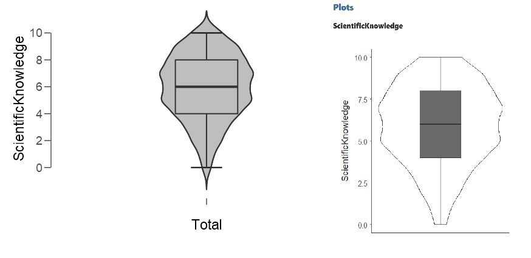

# 隨機方法是什麼？ {#randomization}

在第\@ref(intro)單元，我們示範分析2010年美國一般社會調查的部分資料[@SmithGeneralSocialSurveys]。這種資料是用**隨機方法從母群抽取樣本**的分析結果，我們能用統計方法分析其中資訊，並以此以宣稱調查結果顯示2010年美國社會的狀況。調查者能在報告寫出他們認為可靠的結論，是靠著數學家與統計學家發現的**機率模型**，讓我們能轉化問題為統計思考的命題，並檢驗結論的可靠性。

這個單元使用視覺化範例，介紹隨機方法的重要原理。我們會取用史丹福大學研究生Daniel Kunin[-@KuninSeeingTheory2016]創作的網站seeing thoery，說明重要的觀念與原理。因為有視覺化材料，如果你是對數學沒有信心的初學者，不必先了解機率模型的數學公式，也能了解面對什麼問題要使用那種機率模型。**但是請注意，未來有需要進階時，還是要認識機率模型的數學原理，這個單元只是機率學的基本入門。**

這個單元多數示範分析是jamovi，因為jamovi的`計算變項`有資料函數功能，搭配視覺化範例的模擬資料分析，與真實資料分析，能讓你更了解第\@(intro)單元所提的統計量數應用原則。

## 隨機變數與簡單抽樣

### 認識隨機抽樣

<iframe 
	src="https://students.brown.edu/seeing-theory/probability-distributions/index.html#section1" 
	width="100%" 
	height="800px" 
	scrolling="no"
	style="margin-top: 15px;margin-bottom: 15px;"
	frameborder="1">
</iframe>

我們從[隨機變數示範網頁](https://students.brown.edu/seeing-theory/probability-distributions/index.html#section1)開始。這個網頁的設計目的是讓你動手做你想做的**隨機抽樣模擬**：隨機抽樣就像有一隻蜜蜂回到蜂巢，從那個孔進入裡面是**隨機的**。按下左方最下面的`sample distribution`之前，你可以先把蜂巢分成幾個區塊，只要先在你先點擊你選好的六角形使其變色，再於左方頁的對話框給一個值，按下`submit`剛點過的區域就會變色，並給予一個值。為了方便說明，我做了一個像圖\@ref(fig:random-variables-01)的兩個區塊，剛好將整個蜂巢分成兩半。

```{r random-variables-01, out.width='50%', fig.cap="Random Variable示範頁面的區域劃分示範。", fig.align='center', echo=FALSE}
knitr::include_graphics("images/random-variable-1before.jpg")
```

完成後按一下左方頁面最下面的`sample distribution`，你會看到兩個頁面都有跑動畫。右邊頁面模擬蜜蜂出巢，左邊頁面有長條圖逐漸形成。長條圖即時紀錄蜜蜂從那一的區塊出去，因為先這定了兩塊，所以有兩條長條持續增高。

圖\@ref(fig:random-variables-02)是我自己跑了約十秒鐘動畫的結果。如果你做了和我相同的設定，也跑了一次十秒鐘的模擬，結果雖然不完全相同，但是應該非常接近。而這個結果有沒有讓你想到第\@ref(intro)單元的投擲一美元的實驗結果？沒錯，這兩個示範都是模擬同一種隨機程序，儘管問題脈絡不一樣，兩個示範裡的變項，都只有兩種數值：正面與反面；區塊0與區塊1。而蜂巢模擬更讓我們看清楚機率事件的本質：每個數值代表的事件，可以在開始啟動隨機程序之前，設定發生的可能性。如果把區塊1面積減少到整個牆面的1/4，你會發現模擬結果會是區塊0約0.75，區塊1約0.25。所以，**就算我們事先不了解區塊面積比例，以隨機程序收集足夠的樣本，我們能從試驗結果推測蜂巢的版圖分佈。**

```{r random-variables-02, out.width='50%', fig.cap="Random Variable示範頁面的模擬結果。", fig.align='center', echo=FALSE}
knitr::include_graphics("images/random-variable-1after.jpg")
```

你可以嘗試改變蜂巢版圖的設定，像是區塊的排列方式，或是增加更多的區塊。接著你會發現模擬結果都與區塊面積比例一致，因為從機率的角度來看，母群是**預設測量結果的機率分佈**，而樣本是**有系統紀錄隨機事件所呈現的次數分配**。

在心理科學，許多課題的**預期機率分佈**並不明確，甚至研究者自己都不知道，但還是可以設定依變項的每個數值，發生機率是相等的。以此前提設計觀察情境、問卷項目、實驗分組等等，再以樣本資料推測我們預期的某個事件，發生機率有沒有大於或小於其他事件。以累積次數推論發生機率的統計方法，是由統計學者Jerzy Neyman與Egon Pearson共同奠基，現在被稱為**次數主義統計學(Frequentism Statistics)**。

## 間斷與連續隨機變數

有了母群是**預設測量結果的機率分佈**這樣的觀念，我們可以親手操作[seeing theory的機率模型動畫範例](https://students.brown.edu/seeing-theory/probability-distributions/index.html#section2)，**解剖**心理科學常遇到的**機率模型**。首先盤點第\@(intro)單元到現在，我們遇過的分析範例：(1)測試治療性撫慰師的真實能力；(2)投擲一美元硬幣試驗；(3)分析gss2010部分變項。前兩種範例剛好對應兩種間斷隨機變數：**二項分佈(Binomial Distribution)**與**伯努力分佈(Bernoulli Distribuion)**。gss2010的一部分變項是連續尺度，用這些變項來認識三種連續隨機變數：**均等分佈(uniform distribution)**以及**常態分佈(normal distribution)**。

### 機率模型動畫頁面說明

<iframe 
	src="https://students.brown.edu/seeing-theory/probability-distributions/index.html#section2" 
	width="100%" 
	height="800px" 
	scrolling="no"
	style="margin-top: 15px;margin-bottom: 15px;"
	frameborder="1">
</iframe>

在[機率模型的動畫網頁](https://students.brown.edu/seeing-theory/probability-distributions/index.html#section2)，你可以從左方頁面選擇間斷(discrete)或連續(continuous)，再從下拉選單選擇你想剖析的機率模型，整個網頁就會切換為你選擇的模型動畫。右方網頁預設顯示的黃色線條及陰影是**機率密度函數(probability density function)**的視覺化，下方可移動的橘色按鈕是展示**累積分佈函數(Cumulative distribution function)**，稍後會說明為何設計成可移動。所有機率模型都有*機率密度函數*與*累積分佈函數*，右方頁面座標圖的橫軸顯示**機率模型可輸入的數值**，從畫面差異可看到間斷隨機變數與連續隨機變數的不同，以及為何間斷尺度資料與連續尺度資料分別使用長條圖與直方圖呈現的關鍵。座標圖的縱軸顯示的數值，一律是從0到1，表示**機率模型輸出的機率密度**。

選定要呈現的機率模型，左方頁面下方會出現**機率密度函數**的數學公式，以及機率模型的**平均數(Mean)**及**變異數(Variance)**。最下面會出現可調整的參數，以下解說為何這種機率模型有這些參數可以調整，還有調整後動畫呈現的意義。

### 伯努力分佈：一次一枚硬幣的試驗

打開預設畫面你看到的只有0與1兩個數值，參數*p*決定數值1的出現機率，而數值0的出現機率就是$1-p$。這就相當於一次投擲一枚硬幣的試驗，p等於0.5就是用公平硬幣做試驗的狀況。所以你認為試驗的硬幣並非公平的，只要調整p到你認為最有可能的發生機率，就能表現你心中預想的狀況。

拉動橘色按鈕，你會看到*累積分佈函數*是數值0與數值1機率的逐步疊加。因為只有兩個數值，所以只有從0到1兩步疊加就到頂點。調整參數*p*只有改變疊加的機率密度。請留意這些特徵，接下來的二項分佈是伯努力分佈的擴大版。

### 二項分佈：一次多枚硬幣的試驗

打開預設畫面你看到6個數值：0,1,2,3,4,5，這是由參數*n*設定。這個數值設定對應一次試驗投擲五枚硬幣，投擲結果有多少個正面。參數*p*與伯努力分佈一樣，表示數值1或一枚硬幣的正面出現機率。如果你將參數*n*改成1，會看到畫面與伯努力分佈完全一樣。

Emily Rosa設計的治療性撫慰師能力測驗，預設的結果也可以用二項分佈表示。每位接受測試的治療師有十次嘗試機會，如果每次嘗試是亂猜，參數*p*就是0.5，參數*n*設定為10，就包含十次嘗試的所有可能結果。你可以把參數*n*改為10，再把座標圖縮放到適當尺寸，就會看到猜中5次的機率最高。

拉動橘色按鈕，你會看到*累積分佈函數*從數值1開始疊加到最後一個數值。疊加的幅度與數值的出現機率成正比，所以你會看到數值5之前的幅度較大。如果你改變參數*p*，像是認為治療師真有本事，p應該到少等於0.8。調整完你會看到除了數值8的出現機率最高，*累積分佈函數*的疊加幅度也是到數值8為最高。

在這裡我們可以解釋左方頁面的**平均數**與**變異數**的意義。請先重新調整二項分佈的參數：n等於10，p等於.5，你會注意到這個設定的平均數是`r 10*.5`，也就是兩個參數的乘積，累積機率也是0.5。所以**平均數**是這個設定的試驗裡，最有可能得到的數值第一位，因此又有一個名字：**期望值**。在談論母群或機率模型的場合，通常用希臘字母$\mu$表示。

**變異數**與第\@ref(intro)單元提到的柴比雪夫不等式有關，這個不等式指出所有機率模型期望值前後相差k個標準差以外範圍的數值，發生機率總和不超過1/k^2^。如果k等於2，就是總和不超過.25。以n=10，p=0.5的二項分配來說，平均數是`r 10*0.5`，變異數是`r 10*.5*.5`，標準差是`r round(sqrt(10*.5*.5), 2)`，所以超過期望值兩個標準差以外的數值有0,1,9,10四個。我們可以運用**累積份佈函數**計算這四個數值的發生機率總和，算法是到數值1的累積機率，加上總機率減去到數值8的累積機率。兩部分的累積機率總和是'r round(1 - pbinom(8,10,.5) + pbinom(1,10,.5), 2)'，確實小於0.25。

再來看n=10，p=0.8的二項分配，有沒有符合柴比雪夫不等式。這個分佈的平均數是`r 10*0.8`，變異數是`r 10*.8*.2`，標準差是`r round(sqrt(10*.8*.2), 2)`，所以超過期望值兩個標準差以外的數值有0,1,2,3,4,5六個，計算到數值5的累積機率就能確認。**累積分佈函數**輸出的累積機率是`r round(pbinom(5,10,.8), 2)`，也是小於0.25。

在討論母群或機率模型的變異數或標準差時，通常使用希臘字母$\sigma^2$與$\sigma$表示。此外，傳統統計書會教你查表去找對應數值的累積機率，但是經歷幾個單元的演練，我希望你能學會使用程式去計算，詳情請參閱這個單元的源始碼。

### 均等分佈：任何結果皆可能發生

打開預設畫面你看到最小值a到最大值b的連續數值的**機率密度函數**，在兩個數值之內，所有數值的發生機率都是相等的，所以數值範圍越少，每個數值發生機率越高。我們用gss2010的**科學知識評分**做示範，所以我們設定最小值為0，最大值為10。以gss2010的背景來說，均勻分均具體化受訪者獲得各種評分的機率是相等的假設，所以平均數是5，變異數是`r (10-0)^2/12`。

拉動橘色按鈕，你會看到*累積分佈函數*是一個正三角形的斜邊。疊加到了平均數，累積機率剛好到達0.5。這雖然是最能合理解釋gss2010資料分析的假設，但是果真如此，這個世界便沒有什麼值得探討的事物，因為所有結果發生機率都是相同的。

### 常態分佈：中間是最可能發生的結果

打開預設畫面你看到的常態分佈**機率密度函數**，設定參數是平均數$\mu = 0$，標準差$\sigma = 1$。常態分佈的特性是只要參數確定，不管你得到的數值是什麼，發生機率與累積都是固定的。如果要分析gss2010的**科學知識評分**，我們可以假設美國人的表現平均數是5，標準差是2(實際資料平均數是5.95，標準差是2.37，不過我們現在討論的是母群，而非樣本)。你會發現這個常態分佈除了最小值0與最大值10，所有數值的發生機率都朝平均數遞增。如果你改變標準差，最明顯的變化是平均數的發生機率與標準差大小成反比，請記得這個特點，稍後解剖抽樣分佈會是關鍵。

拉動橘色按鈕，你會看到**累積分佈函數**是一條曲線，在平均數處出現轉折。改變平均數不影響曲線的樣貌，但是改變標準差會跟著機率密度函數的範圍伸縮。這個特性讓我們可以不管標準差多大，計算固定標準差範圍內數值的累積機率，都會是相等的。

統計實務我們希望資料的分配是常態分佈，因為以上的特點讓每個數值的發生機率能夠明確估計。然而常態分佈是可遇不可求，我們得到的資料都是不完全符合，如果需要使用常態分佈處理資料，統計學家已經開發出很多種轉換方法，這個單元結束之前，我會示範一種方法。

## 打造抽樣分佈的隱形之手：中央極限定理

這個小單元我使用jamovi製造幾份虛擬資料，請你跟著演練，觀察各種統計結果之間的規律。接著再來解剖[seeing theory的中央極限定理動畫](https://students.brown.edu/seeing-theory/probability-distributions/index.html#section3)，你會發現每次分析手上的資料，只是眾多樣本的其中一個。

示範之前認識jamovi的另一種欄位型態：計算變項(Computed Variable)。jamovi的`Data`選單裡有可新增與刪除變項的功能，新增變項可選擇增加資料變項或計算變項。確定增加計算變項，會出現公式編輯選單。如果你有使用Excel函數的經驗，計算變項選單的操作大同小異。Jonathon Love有製作動畫示範圖，展示新增計算變項的流程，請參考他的[部落格](https://blog.jamovi.org/2017/11/28/jamovi-formulas.html)。

### 均等分佈的樣本分析

請先下載[示範檔案](https://osf.io/bwapf/)，這個檔案已經有15個以最小值0及最大值10的均等分佈，產生90筆隨機數值的計算欄位。還有兩個計算欄位是計算前五欄的平均，以及前十欄的平均。示範檔案已經分析最後兩個計算欄位的平均數、變異數與標準差。請記得這個均等分佈的平均數是5，變異數是`r (10-0)^2/12`，你可以觀察看看jamovi的描述統計結果，兩個欄位的平均數是不是很接近5？五欄平均的變異數是不是大於十欄平均的變異數，而且兩者都小於均等分佈的變異數？

你可以再製造一個十五欄平均的`計算變項`，做一次描述統計會發現平均數同樣接近5，但是變異數更小了。請你將均等分佈的變異數`r (10-0)^2/12`，分別除於5,10,15，應該會發現很接近jamovi算出來的變異數，而且十五欄平均的變異數會是最接近的。你可以增加更多計算欄位，像是`UNIF016`、`UNIF017`，增加到20項、25項等等，觀察看看二十欄平均的平均數與變異數與前者的差異？**建議在此做個筆記，等一下是剖析中央極限定理的關鍵。**

### 常態分佈的樣本分析

請先下載[示範檔案](https://osf.io/6bqme/)，這個檔案已經有15個以平均數5及變異數4的常態分佈，產生90筆隨機數值的計算欄位。還有兩個計算欄位是計算前五欄的平均，以及前十欄的平均。示範檔案已經分析最後兩個計算欄位的平均數、變異數與標準差。請記得這個常態分佈的平均數是5，變異數是4，你可以觀察看看jamovi的描述統計結果，兩個欄位的平均數是不是很接近5？五欄平均的變異數是不是大於十欄平均的變異數，而且兩者都接近常態分佈的變異數1/5及1/10倍？

你可以再製造一個十五欄平均的計算變項，做一次描述統計會發現平均數同樣接近5，變異數更小了。同樣地，也可以增加計算變項，看看更多樣本的描述統計與前者的差異。**你有沒有注意到，雖然母群是常態分佈，樣本分析結果與均等分佈的本有一致的規律。**

### 剖析中央極限定理

<iframe 
	src="https://students.brown.edu/seeing-theory/probability-distributions/index.html#section3" 
	width="100%" 
	height="750px" 
	scrolling="no"
	style="margin-top: 15px;margin-bottom: 15px;"
	frameborder="1">
</iframe>

注意到這個規律之後，我們可以來剖析[中央極限定理動畫](https://students.brown.edu/seeing-theory/probability-distributions/index.html#section3)。這個範例的母群是**貝他分佈(Beta distribution)**，有兩個可以自訂的參數$\alpha$與$\beta$。預設的兩個參數都是1，如此設定的貝他分佈相同於最小值是0且最大值是1的均等分佈。如果兩個參數都是5，這個貝他分佈就相等於平均數是`r 5/(5+5)`，變異數是`r round((5*5)/((5+5)^2*(5+5+1)), 3)`的常態分佈。我們用這兩種設定，觀察接下來的抽樣分佈。

建議先在左方頁面的`Sample size`與`Draw`填入任意數值，然後勾選`Theoretical`，右方頁面會立刻顯示抽樣分配的**機率密度函數**。你可以先任意調整貝他分佈的參數，會發現不論母群如何變化，抽樣分配都是常態分佈，只是平均數與變異數會有些微差異。這是數學家發現中央極限定理的第一件事：**不論你預期的母群機率模型是什麼，抽樣分配都是常態分佈**。

左方頁面下方兩個可填入的空格`Sample size`與`Draw`，相同於jamovi示範裡的計算變項欄位，以及每個欄位的觀察值。示範網頁的`sample size`可填入的最大數值是15，`Draw`可填入的最大數值是100。建議先在`Draw`填入90，`sample size`依序填入5、10、15，你會發現抽樣分配的**機率密度函數**會有變異數或標準差的變化。這是數學家發現中央極限定理的第二件事：**抽樣分配的變異數，是母群變異數除以樣本數(sample size)**。

設定好`sample size`與`Draw`，你可以按submit，網頁會跑出模擬數據抽樣平均數的直方圖。這個過程就像jamovi示範製造五欄及十欄平均等計算變項，再做描述統計。請改變`sample size`多跑幾次，你會發現`sample size`越大，直方圖越接近抽樣分配的**機率密度函數**。這個現象與中央極限定理的數學原理關係不大，但是是統計實務要牢記的訊息：試驗的樣本數越大，抽樣分配越逼近母群的平均數與變異數。

## 條件機率與抽樣

至此我們需要好好想想一個問題：抽樣分配與母群是不同的機率模型，就算母群是常態分佈，平均數與變異數也不大相同。那麼用抽樣分配估算資料數值的發生機率或累積機率，真正的意思是什麼？

要理解這個問題，需要重新學習你可能曾經聽過的**條件機率(conditional probability)**，我們用[seeing theory的條件機率動畫](https://students.brown.edu/seeing-theory/compound-probability/index.html#section3)搭配解說。這個動畫有三層板子(A,B,C)由上而下排列，不斷有球從上落下。由於這個單元一開始，我們就已經解析模擬蜜蜂回巢的隨機變數動畫，你可以把這三層板子想成一座蜂巢的一部分，每隻回巢的蜜蜂要到巢內的目的地，可能只要穿越A層或C層，可能要穿越A與B，或者B與C。在左方頁面下方的長條度，你會看到所有蜜蜂穿過每一層的機率都是相等的(0.33)，全部機率加起來是1。

<iframe 
	src="https://students.brown.edu/seeing-theory/compound-probability/index.html#section3" 
	width="100%" 
	height="750px" 
	scrolling="no"
	style="margin-top: 15px;margin-bottom: 15px;"
	frameborder="1">
</iframe>

按一下按鈕A，右方頁面會縮放到整個A層，包括在下面的一半B層。此時右方頁面是紀錄通過A之後，有到達B層或沒有到達B層的蜜蜂個數。所以左方長條圖橫軸變成三個數值$P(A|A),P(B|A),P(C|A)$，表示先通過A，再通過A,B,C的**條件機率**。因此$P(A|A)$的發生機率自然是1，通過A層的有一半會到達B層，所以P(B|A)是0.5，最後C層不在畫面裡，沒有通過A層的會到達C層，機率當然是0。

抽樣分配的形成過程就像紀錄通過A層並到達B層的蜜蜂數量，所以抽樣分配呈現的機率是一種條件機率：我們先透過隨機程序安排受測對像(A)，再使用可實作的測量方法收集資料(B)，以此估計預期事件的發生機率。如此一來資料有沒有分析的價值有兩個重點：首先是你的研究過程有沒有充分執行隨機程序？再來是收集到的資料有沒有符合常態分佈？

你採取的研究方法決定第一個重點的成敗，但不是這本書的重點。至於第二個重點，我們在解析中央極限定理已經學到足夠的樣本數是關鍵，但是不是每筆資料都能完美符合，如何檢查樣本資料符合常態分佈的程度？如果可一做適當的校正，讓資料符合常態分佈，該怎麼做？是本單元最後的學習重點。

## 資料密度的視覺化與轉換

要知道樣本資料接近常態分佈的程度，最簡單的方法是看集中趨勢的三種統計量數是否相同。常態分佈的平均數、中位數與眾數是相同的。如果不同，要評估不符合常態分佈的程度，傳統的方法是計算偏態(skewness)與峰度(kurtosis)，現在可以繪製**箱形圖(boxplot)**與**小提琴圖(violine plot)**，評估偏離常態分佈的程度。JASP與jamovi的描述統計模組都有繪製兩種圖的功能。

在此使用gss2010**科學知識評分**資料示範，示範檔案可從[連結A](https://osf.io/vy2fd/)與[連結B](https://osf.io/8f9bu/)下載。圖\@ref(fig:box-violin-demo)是JASP與jamovi將箱形圖與小提琴圖重疊輸出的結果，中間的箱形圖是以25%百分位數、中位數與75%百分位數構成中央的長方形與中間粗線。如果資料越不符合常態分佈，三個數值差距會越大。小提琴圖是最逼近資料的**機率密度函數**，到這裡我們已經看過不少seeing theory的動畫示範，你對常態分佈的**機率密度函數**應該有有深刻印象，肉眼就能判斷偏離常態分配的程度。


```{r box-violin-demo, out.width='90%', fig.cap="gss2010科學知識評分的箱形圖與小提琴圖。左圖用JASP輸出，右圖用jamovi輸出。", fig.align='center', echo=FALSE}

```

JASP與jamovi的繪圖選項都在統計模組的Plots選單裡。JAPS要先勾選`Display boxplots`，然後勾選`Boxplot Element`與`Violin Element`，就會輸出圖\@ref(fig:box-violin-demo)的結果。如果你想辨識實際的資料密度，乃至極端值，可勾選`Jitter Element`與`Label Outliers`。jamovi直接勾選`Box plot`與`Violine`兩個選項，就能輸出圖(待編輯)。這兩種的視覺呈現何種較佳見仁見智，但是都顯示整筆資料偏向大於5的評分。

如果你想要讓**科學知識評分**資料更符合常態分佈，你可以使用**z分數轉換**。現在能直接在軟體裡做到的只有jamovi，所以請見(Link B)的檔案內容示範。方法是創建一個計算變項，把每個科學知識評分的原始分數減去平均數，再除以標準差，你可以檢視計算變項`ScientificKnowledge_Z`的設定，接著在公式欄位裡輸入以下資訊：

```
(ScientificKnowledge - VMEAN(ScientificKnowledge))/VSTDEV(ScientificKnowledge)
```

統計實務需要進行**z分數轉換**的時機，是你不想或不能排除資料裡的極端值，又需要讓資料符合常態分佈，分析結果才能做有效推論。在調查研究常有轉換整筆資料的機會，不過在檢定假設的場合，剔除或轉換極端值可以讓資料更符合常態分佈的話，就不會轉換整筆資料。


## 習題

開發中。