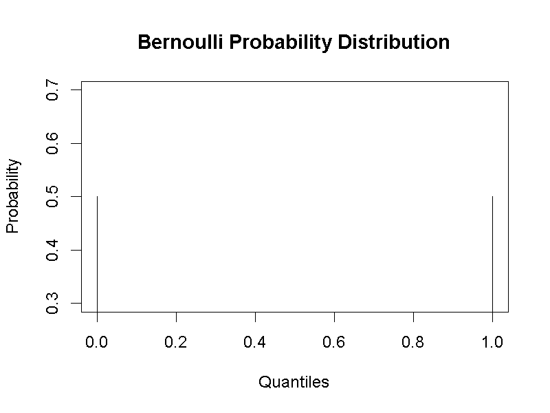
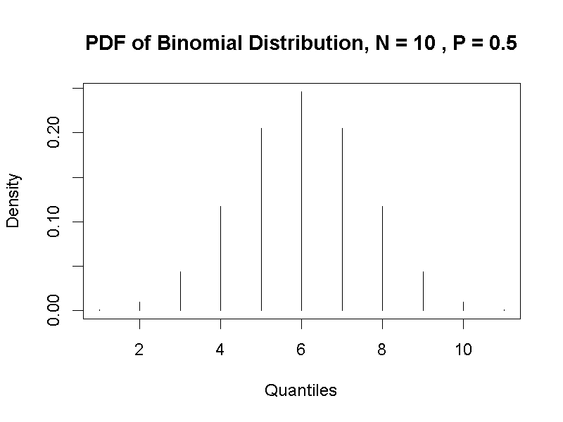
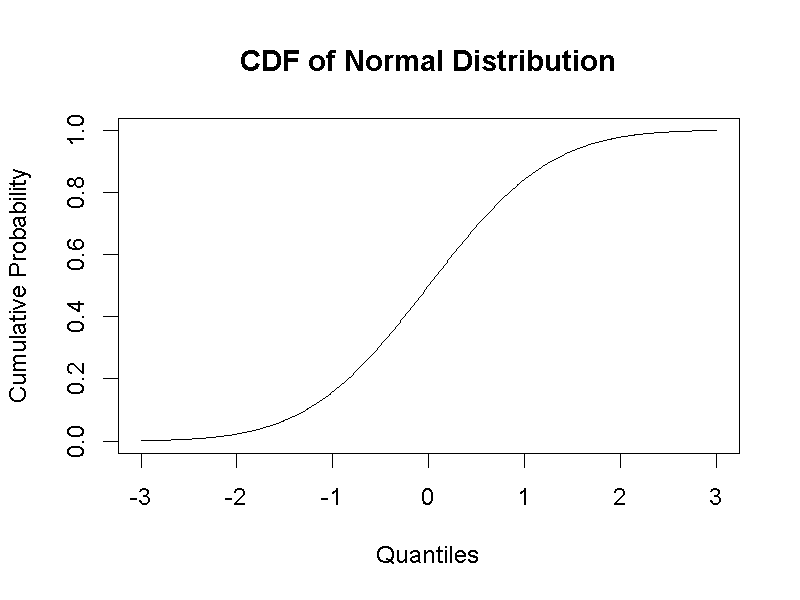
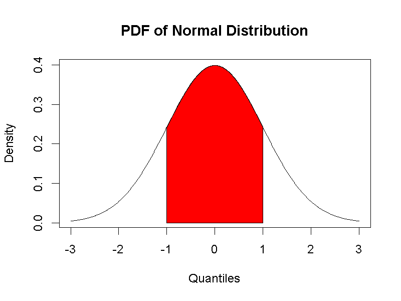

# 計算的機率分佈：統計方法的數學基礎 {#probability}

在這個單元與第\@ref(distribution)單元，我們將學習到什麼是**計算的機率**與**模擬的機率**。**計算的機率**來自數學領域的機率論，使用數學公式演繹這個世界的隨機現象。從這個單元起介紹的五種機率分佈函數，被統計學家用來開發本書陳列的統計方法。要理解如何運用這些機率分佈函數，需要重新整理機率事件以及條件機率的計算。只要讀者有一定的數學知識，可運用本單元提供的範例與習題，熟練計算的機率。

## 機率事件計算原理 {#probability-calculation}

### 集合論 {#probability-set}

任何能計算機率的事物，必先能定義為**集合**。例如從一副無鬼牌的撲克牌抽出指定花色及點數的牌組之機率；投擲十枚硬幣，其中五枚正面朝上的機率。這些範例都能列舉集合之內的**元素**，例如每副撲克牌的花色與點數一共有52種配對；十枚硬幣正面朝上的次數。以十枚硬幣的例子來說，集合之內有十種可能結果，一種結果代表十枚之中正面朝上的硬幣數目。這個集合以大寫字母$C$代表，其中有11項表列如下：

$c_1$: (正、正、正、正、正、正、正、正、正、正)  
$c_2$: (正、正、正、正、正、正、正、正、正、反)  
$c_3$: (正、正、正、正、正、正、正、正、反、反)  
$c_4$: (正、正、正、正、正、正、正、反、反、反)  
$c_5$: (正、正、正、正、正、正、反、反、反、反)  
$c_6$: (正、正、正、正、正、反、反、反、反、反)  
$c_7$: (正、正、正、正、反、反、反、反、反、反)  
$c_8$: (正、正、正、反、反、反、反、反、反、反)  
$c_9$: (正、正、反、反、反、反、反、反、反、反)  
$c_{10}$: (正、反、反、反、反、反、反、反、反、反)  
$c_{11}$: (反、反、反、反、反、反、反、反、反、反)

我們可以設定符合某些條件的結果，構成**子集合**。像是設定至少有五次正面的結果為子集合$A$，其中有$c_1, c_2, c_3, c_4, c_5, c_6$，設定正面出現最多次數只有達到5次的結果為子集合$B$，其中有$c_6, c_7, c_8, c_9, c_{10}, c_{11}$。子集合$A$與$B$涵括集合$C$的所有結果，所以我們可以稱子集合$A$與$B$的**聯集**，$A \cup B$，等於集合$C$。子集合$A$與$B$都有包含的結果種類是$c_6$，我們可以稱子集合$A$與$B$的**交集**，$A \cap B$，代表十枚硬幣的其中五枚正面朝上之結果。更進一步，我們可以只計集合$C$裡不屬於子集合$A$的結果，屬於**補集**$\bar{A}$；當然也可以稱呼集合$C$裡不屬於子集合$B$的結果，屬於**補集**$\bar{B}$。由此可知，兩個補集的聯集，$\bar{A} \cup \bar{B}$，涵括的結果沒有$c_6$，不等於集合$C$。

### 機率事件的排列組合 {#probability-permutation}

考慮十枚硬幣逐次投擲，紀錄硬幣正面的出現位序，除了全是正面與全是反面的狀況，其他結果有至少十種排列組合。依此可計算$c_1$到$c_{11}$，符合每種結果條件的事件數目，各結果事件數目表列如下：

|結果代號|計算公式|事件數目|發生機率($P(c_i)$)
|:---:|:---:|:---:|:---:|
|$c_1$|$C^{10}_{10}$|`r choose(10,10)`|`r round(choose(10,10)/sum(choose(10,10:0)),3)`|
|$c_2$|$C^{10}_{9}$|`r choose(10,9)`|`r round(choose(10,9)/sum(choose(10,10:0)),3)`|
|$c_3$|$C^{10}_{8}$|`r choose(10,8)`|`r round(choose(10,8)/sum(choose(10,10:0)),3)`|
|$c_4$|$C^{10}_{7}$|`r choose(10,7)`|`r round(choose(10,7)/sum(choose(10,10:0)),3)`|
|$c_5$|$C^{10}_{6}$|`r choose(10,6)`|`r round(choose(10,6)/sum(choose(10,10:0)),3)`|
|$c_6$|$C^{10}_{5}$|`r choose(10,5)`|`r round(choose(10,5)/sum(choose(10,10:0)),3)`|
|$c_7$|$C^{10}_{4}$|`r choose(10,4)`|`r round(choose(10,4)/sum(choose(10,10:0)),3)`|
|$c_8$|$C^{10}_{3}$|`r choose(10,3)`|`r round(choose(10,3)/sum(choose(10,10:0)),3)`|
|$c_9$|$C^{10}_{2}$|`r choose(10,2)`|`r round(choose(10,2)/sum(choose(10,10:0)),3)`|
|$c_{10}$|$C^{10}_{1}$|`r choose(10,1)`|`r round(choose(10,1)/sum(choose(10,10:0)),3)`|
|$c_{11}$|$C^{10}_{0}$|`r choose(10,0)`|`r round(choose(10,0)/sum(choose(10,10:0)),3)`|

如果硬幣都是依規定鑄造，不會每次投擲都是正面或都是反面，前表所列的每個事件發生機率都是相等的。所以某個結果的事件數目所佔的比例，就是該結果的發生機率，如前表所示。在機率論裡，如同投擲硬幣的案例稱為**等機率結果**：只要知道如何計算全部與特定結果的事件數目，就能計算特定結果的發生機率。

### 樣本空間 {#probability-space}

只要能明確定義一個集合的每個事件，這樣的集合就是**樣本空間**。所以投擲十枚硬幣，紀錄正面朝上次數的樣本空間是`r sum(choose(10,10:0))`種事件。實際實驗的任何一次結果，都會符合其中一種事件。但是讀者要區辨**事件**是計算機率的元素，實驗結果則是我們對現實世界的理解，各有適合討論的場域。

知道各種結果的發生機率，為了方便計算，我們可以將某種結果寫成$P(c_i)$。稍早我的定義的子集合$A$與子集合$B$，發生機率分別可寫成以下的算式：

$$P(A) = P(c_1) + P(c_2) + P(c_3) + P(c_4) + P(c_5) + P(c_6) = \sum_{i=1-6}P(c_i)$$  

$$P(B) = P(c_6) + P(c_7) + P(c_8) + P(c_9) + P(c_{10}) + P(c_{11}) = \sum_{i=6-11}P(c_i)$$

了解**樣本空間**的事件排列組合規則，我們就能知道手上的資料符合，或者逼近什麼樣的機率分佈，如此就能決定正確的統計方法。然而現實的統計實務，資料是經過多種條件設定所取得的觀察結果，不似投擲硬幣只有硬幣是否公正而已。數學家很早就了解這種狀況無所不在，提出**條件機率(Conditional Probability)**的觀念。

## 條件機率的計算 {#probability-conditional}

### 蒙提霍爾問題  {#probability-mh}

我們透過一件統計學公案，認識條件機率的觀念與計算方法。二十世紀下半葉，美國統計學界提出著名公案：蒙提霍爾問題[@Steveproblemprobabilityletter1975]。蒙提霍爾是二十世紀六十年代著名的美國猜謎節目主持人，這個節目有個知名橋段：主持人向觀眾展示三道門，其中一道門之後是豪華轎車，另外兩道門之後是山羊。每集節目邀請來賓選出正確的門，選到車子現場直接開回家。不過這個橋段有個製造緊張氣氛的安排：來賓先指出其中一道門，接著主持人打開另外兩道門的其中一道，這道門之後一定是山羊。最後就是橋段的高潮，主持人給來賓一次機會，選擇一開始指出的門？還是選擇沒被打開的另一道門？

統計學者與數學家最關心的是這個節目的來賓：「選擇另一道門是車子的機率有沒有高於一開始選擇的門？」這種情況就是比較兩種選擇的**條件機率**：已知其中一道門之後是山羊($B$)，選擇一開始指的門是車子($A$)之機率；對比選擇另一道門是車子($\bar{A}$)之機率。為了方便計算，一般寫成$P(A|B)$與$P(\bar{A}|B)$。同樣的道理，$P(\bar{A}|B)$代表已知其中一道門之後是山羊($B$)，另一道門是車子($\bar{A}$)之機率。雖然$P(A|B)$與$P(\bar{A}|B)$的總和是1，但是$B$也是一種機率事件，因為到底那道門之後是山羊，每一集節目都不會一樣。下表列出所有車子與山羊的狀況：

|狀況|1號門|2號門|3號門|
|:---:|:---:|:---:|:---:|
|1|車|羊|羊|
|2|羊|車|羊|
|3|羊|羊|車|

節目主持人先讓來賓指出一道門，接著根據情況決定要打開那道門讓觀眾與來賓看山羊。例如車子在1號門之後的狀況，來賓先選擇1號門，接著主持人就隨機打開2號門或3號門；如果是車子不在1號門之後的狀況，來賓先選擇1號門，主持人接著就打開另一道是山羊的門。所以主持人要打開那道門讓觀眾看山羊，也是一種隨機事件。不過主持人打開那道門的機率，與來賓最後選那一道門中車子的機率無關。

### 貝氏定理 {#probability-Bayes}

即使不能掌握P(B)，我們可以運用貝氏定理計算$P(A|B)$與$P(\bar{A}|B)$。讀者也許曾經學過貝氏定理的公式，本書談到貝氏定理的地方都是指以下公式：

$$ P(\theta|D) = \frac{P(D|\theta) \times P(\theta)}{P(D)} $$

以蒙提霍爾問題的情境來說，D代表主持人打開有山羊的門，$\theta$代表來賓在節目開始的選擇。我們表列來賓先選其中一道門，後來決定不選另一道門的各種結果。節目設計讓來賓一開始只有三種選擇，第一種是先選1號門：

|狀況|*1號門|2號門|3號門|結果|
|:---:|:---:|:---:|:---:|:---:|
|1|車|羊|羊|得車|
|2|羊|車|羊|得羊|
|3|羊|羊|車|得羊|

第二種是先選2號門：

|狀況|1號門|*2號門|3號門|結果|
|:---:|:---:|:---:|:---:|:---:|
|1|車|羊|羊|得羊|
|2|羊|車|羊|得車|
|3|羊|羊|車|得羊|

第三種是先選3號門：

|狀況|1號門|2號門|*3號門|結果|
|:---:|:---:|:---:|:---:|:---:|
|1|車|羊|羊|得羊|
|2|羊|車|羊|得羊|
|3|羊|羊|車|得車|


如果來賓是研究者，$P(\theta)$就是來賓的理論預測成功的機率，以上列表顯示來賓一開始的選擇有三種，所以$P(\theta)$是1/3。

主持人打開後面是羊的門，就像研究者根據理論收集的資料。來賓預期如果一開始選的門是對的，其餘兩道門會被主持人打開的機率應該是相等的。以一開始選擇1號門且車子就在這道門來說，主持人接著打開2號門或3號門的機率是一樣的，所以$P(D)$是1/2。因為是以來賓一開始的選擇決定主持人接著開門的樣本空間，一開始選擇的門真的有車，主持人接著開那一道門的機率都是1/2。

$P(D|\theta)$代表來賓應該考慮不論自己的猜測是否正確，主持人向觀眾開啟這道門的機率。如果一開始猜車子在1號門，主持人打開2號門可能是其中兩種狀況：第一種是**猜對了**，車子真的在1號門，主持人接著可以打開的就是2號門或3號門；第二種是**猜錯了**，車子並不在1號門，主持人能打開的只有後面是羊的那道門。所以如果一開始選擇1號門，接著主持人接著打開有羊的門，是一開始猜測正確的狀況之一，因此機率是1/2。

以上三種機率代入貝氏定理的公式，就能算出來賓得到車子是保持一開始選擇的機率是1/3。也就是說，如果這個節目每一集採用同樣的遊戲流程，決定換門的來賓們大約每三位有兩位能把車子開回家。以貝氏定理算出的事後機率$P(\theta|D)$，可做為下次研究的事前機率$P(\theta)$，但是很顯然參與蒙提霍爾節目的來賓，並不能靠過去的播出紀錄更新中獎機率[^3]。

[^3]: 本單元有關蒙提霍爾問題的計算說明，改編自余海峯博士的貝氏定理線上直播教程：https://youtu.be/176RDyzlJck

嚴謹的心理科學研究根據的假設，必定要提出$P(\theta)$的預測，收集資料的分析結果，則是呈現根據此假設獲得手上資料的條件機率$P(D|\theta)$。請讀者記住這點：本書各單元範例與習題，所展示的資料之抽樣來源，本質是某種$P(D|\theta)$的機率分佈。

## 機率分佈 {#probability-functions}

最後我們學習最典型的兩種機率分佈：二項分佈與常態分佈。首先從解析大樂透的中獎機率，了解機率分佈的構成要素。

台灣彩卷大樂透至今已開賣超過十五年，每期玩家可投注01~49任意六個號碼，開獎時看對中多少開出的號碼，對中的號碼越多，獎金越高。根據2019年的遊玩規則，中獎號碼與獎項的對應如下表：

|中獎方式 |獎項|
|:---|:---:|
|六個獎號完全相同|頭獎|
|任五個獎號＋特別號|貳獎|
|任五個獎號|參獎| 
|任四個獎號＋特別號|肆獎|
|任四個獎號|伍獎| 
|任三個獎號＋特別號|陸獎| 
|任二個獎號＋特別號|柒獎|
|任三個獎號|普獎| 

除了頭獎到肆獎彩金是將當期盈餘依規定的百分比分配，伍獎以下都有固定的中獎金額。為了方便說明，此處先排除有特別號的獎項，計算投注一組能中無特別號獎項的機率。

運用排列組合的計數方法，可知樣本空間的事件總數，也就是投注的號碼組合有$C^{49}_6 =$ `r choose(49,6)`種。六個獎號完全相同只是其中一個事件；中五個獎號的事件有$C^{6}_5 \times C^{49-6}_{6-5} =$ `r choose(6,5)*choose(49-6,6-5)`種；中四個獎號的事件有$C^{6}_4 \times C^{49-6}_{6-4}  =$ `r choose(6,4)*choose(49-6,6-4)`種；中三個獎號的事件有$C^{6}_3 \times C^{49-6}_{6-3} =$ `r choose(6,3)*choose(49-6,6-3)`種。每個獎項的中獎機率可以用以下的函數公式表示，這道函數就是大樂透不計特別號的中獎機率分佈：

$$ p(x) = \frac{C^{6}_x \times C^{49-6}_{6-x}}{C^{49}_6} \ \ \ \ \ \ x = \{ 3,4,5,6 \} $$

公式中的x是**隨機變數**：x涵括的數字是根據大樂透規則，每期可得獎金的獎號數目，每一注會有多少號碼符合，則由機遇決定。統計學家也稱呼機率分佈是**隨機變數可能結果的模型**，能以圖像顯示，如圖 \@ref(fig:lotty-model)：

```{r lotty-model, echo=FALSE, message=FALSE, warning=FALSE, paged.print=TRUE, fig.cap="台灣大樂透中獎之機率分佈(不計特別號)"}
y = choose(6,3:6)*choose(49-6,6-(3:6))/(choose(49,6))
x = as.factor(3:6)
plot( y~x, xlab = "中獎號碼數", ylab="中獎機率")
```

讀者可以運用[jamovi示範檔案](https://osf.io/xerd9/)，調整製造圖\@ref(fig:lotty-model)的R程式碼，配合這個單元的習題進行修改，讓自已更了解機率分佈。現在我們可以正式認識二項分佈與常態分佈。

### 二項分佈 {#probability-binomial}

二項分佈的隨機變數是一種離散型隨機變數，本單元一開始示範的投擲十枚硬幣之正面朝上次數，就是最佳的例子。

為了說明如何以二項分佈計算投擲十枚硬幣的各種結果之機率，我們先看投擲一枚硬幣所有結果的機率分佈，也就是**伯努力分佈(Bernoulli probability distribution)**。投擲一枚硬幣只有兩種結果：正面朝上或反面朝上，因此隨機變數值域只有兩個數值：${0,1}$，分別代表兩種結果。伯努力分佈的機率函數可歸納如下：

$$P_x(p,x) = p^x(1 - p)^{1-x}  \ \ \ x = 0, 1$$

函數的參數$p$可為0~1之間的任何實數，代表一次事件的出現機率，$p = 0.5$表示我們認定現在投擲的這枚硬幣是公正硬幣。圖\@ref(fig:bernoulli)是使用jamovi的`Rj`製作一枚硬幣擲出正面與反面的機率相等，所有結果的發生機率。讀者可運用[jamovi示範檔案](https://osf.io/t5rs3/)，調整投出正面的機率(p)，觀察所有結果的發生機率如何變化？

```{r bernoulli, echo=FALSE, message=FALSE, warning=FALSE, paged.print=TRUE,fig.cap="伯努力機率分佈函數(p = 0.5)"}

```

回到十枚硬幣的例子，我們已經知道一次投擲一枚硬幣有兩種結果，一次投擲十枚硬幣不計正反面出現位序，則有`r length(choose(10,0:10))`種結果。前面我們已經知道計算數種結果的出現機率，是總計對結果的機率值。了解伯努力分佈能表示投擲一枚硬幣所有結果的出現機率，相同的原理，二項分佈能表示擴展為數枚硬幣，會出現的各種結果之機率。比起伯努力分佈，二項分佈多了一個參數$n$表示所有的結果總數，隨機變數$x$依然表示任何一次結果。

根據數學計算公理，二項分佈是伯努力分佈的總和，可歸納為累積機率函數：

$$P(n, p, x) = \sum^n_{x = 0 - n}p^x\times(1-p)^{n-x} $$

根據**總機率定理**，累積機率函數的總和必為1。任何一個隨機變數$X$的事件發生機率，就是二項分佈的機率函數：

$$p(n, p, x) = C^n_xp^x\times(1-p)^{n-x} \ \ \ \ \  x \subset R_x$$

圖\@ref(fig:binomial)是使用jamovi的`Rj`製作十枚硬幣的任何一枚，擲出正面與反面的機率相等，所有事件結果的發生機率。讀者同樣可以運用[jamovi示範檔案](https://osf.io/t5rs3/)，調整投出正面的機率(p)，觀察所有結果的發生機率如何變化？

```{r binomial, echo=FALSE, message=FALSE, warning=FALSE, paged.print=TRUE,fig.cap="二項機率分佈函數(N = 10, p = 0.5)"}

```

### 標準化常態分佈 {#probability-normal}

至此我們應該注意到，如果要用機率分佈表現資料的發生機率，類別變項資料就是運用離散型隨機變數與其機率函數。適合連續變項資料的，則是**連續型隨機變數**。心理科學有許多測量指標在在一開始被提出時，研究者會設定所有人類的測量結果符合**常態分佈**，例如智力商數。

許多心理科學行為指標收集的資料不但是連續變數，可測量的值域範圍涵蓋負無限大到正無限大。不過實際的測得的資料，至少有75%會落在一個平均值前後兩個標準差之內的範圍，這個比例的估計是根據**柴比雪夫不等式**，沒有一種機率分佈會超過這個比例，因此只要找到能正確描述連續變項資料的連續型隨機變數，就能使用其機率分佈計算某個資料數值的發生機率。

有很長一段時間，心理學者們認為智力商數符合常態分佈。如果這個假設符合事實，不論全部人類的智力商數平均值是多少，都能符合某個常態分佈。每個智力商數減去平均值($\mu$)，再除以標準差($\delta$)，就成為**標準化分數**。如此轉換不只帶來計算的方便性，也讓心理學者能運用平均值為0，標準差為1的**標準化常態分佈**，計算從一群人之中，找到在某個智力商數之上或之下的個體之機率。

標準化分數是標準化常態分佈的唯一參數，也是一種連續型隨機變數。標準化分數通常以$z$表示，將原始分數$x$轉換為標準化分數的計算公式如下：

$$z = \frac{x - \mu}{\delta} \ \ \ \ x \subset R_x$$

由標準分數-1，累積到標準分數1的機率為`r round(pnorm(1)-pnorm(-1),2)`，可由標準化常態分佈的累積機率函數求出。這個函數的繪圖如圖\@ref(fig:normal-cdf)：

```{r normal-cdf, echo=FALSE, message=FALSE, warning=FALSE, paged.print=TRUE, fig.cap="標準化常態分佈累積機率函數"}

```

累積機率函數微分之後，就成為機率密度函數。也就是說-1到1之間的累積機率，以機率密度函數畫成的曲線來看，等於兩個分數之間的面積。也就是圖\@ref(fig:normal-pdf)塗成紅色的區域。

```{r normal-pdf, echo=FALSE, message=FALSE, warning=FALSE, paged.print=TRUE, fig.cap="標準化常態分佈機率密度函數"}

```

類似圖\@ref(fig:normal-pdf)的曲線圖，在之後的每個統計單元都會看到。讀者可以使用[jamovi示範檔案](https://osf.io/jzpmy/)，演練習題或自行設計題目，了解標準化分數與累積機率的對應。

## 總結 {#probability-summary}

- 機率事件的計算元素能定義為總機率為1的**集合**，根據計算條件，可定義子集合，以及子集合之間的聯集、補集、以及差集。

- 運用排列組合原理，能以函數定義各種事件的發生機率，可運用函數計算的事件與發生機率，是為樣本。一個子集合可構成一種樣本空間。

- 運用貝氏定理，即使不了解理論的機率函數，也能透過樣本的機率函數推算理論成立而能獲得樣本資料的條件機率，以及獲得樣本資料而能肯定理論成立的條件機率。

- 二項分佈與標準化常態分佈，是類別義項與連續變項的代表性機率函數。

## 習題 {#probability-practice}

1. 根據投擲十枚硬幣的表列事件次數，計算子集合$A$與子集合$B$的聯集之發生機率：$P(A \cup B)$；交集之發生機率：$P(A \cap B)$；補集之發生機率：$P(\bar{A} \cup \bar{B})$。

2. 一幅撲克牌有四種花色與13種點數，「同花順」指抽到相同花色且點數連號的五張牌。運用這個單元示範的機率事件計算方法，計算抽到同花順的機率。

3. 如果主持人蒙提霍爾在某集特別節目，增加為五道門，其餘規則不變。請根據貝氏定理計算選擇後不換門得到轎車，與選擇後換門得到轎車的機率。

4. 蒙提霍爾問題的設定與現實條件差異，體現機率的數學運算不同於現實世界觀察現象發生次數。試著說明你發現的差異關鍵。

5. 參考本單元解析大樂透中獎機率的示範，完成有特別號的各獎中獎機率之機率分佈。

<!---
$$ P(x) = \frac{ (C^{6}_{x} \times C^{49-6}_{6-x} \times C^{43}_0  - C^6_2 \times C^{49-6}_{6-2} \times C^{43}_0 ) + (C^{6}_{x} \times C^{49-6}_{6-x} \times C^{43}_1 - C^6_6 }{C^{49}_6) } \\ x = \{ 2,3,4,5,6 \} $$
--->

6. 在某個線上遊戲有個寶物抽獎機制，其中一件重要道具的每次抽獎中獎率，官方宣稱平均1000名玩家中，能第一次抽中的機率是$1/100$。透過網路搜尋，你發現討論抽中這件道具的10000筆不同玩家的留言，有4筆表示第一次抽獎就抽中。請運用二項分佈的機率函數，分析官方的說法符不符合事實？

7. (探索常態分佈)