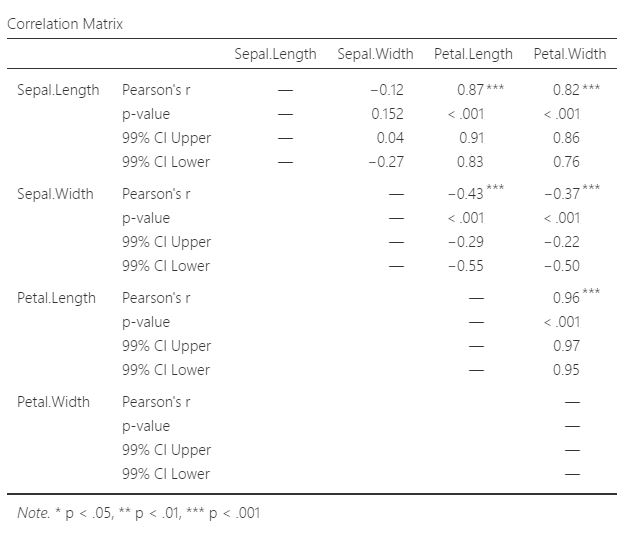
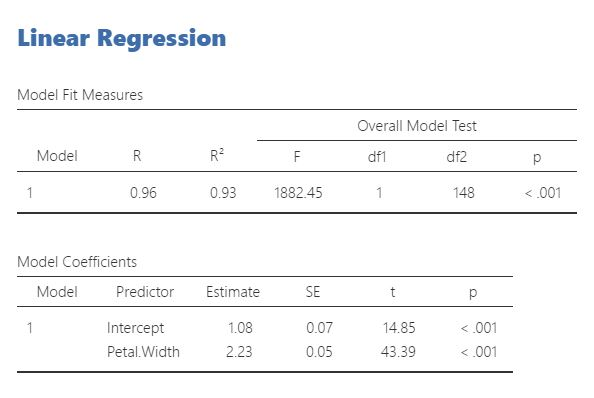
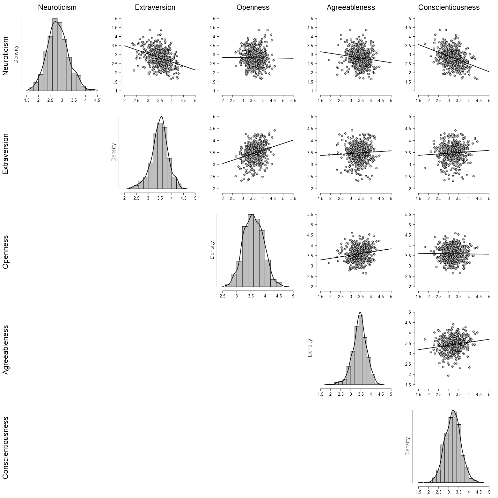

# 我倆多有緣？相關與迴歸 {#corr}

第\@ref(one-sample)到第\@ref(two-samples)介紹的都是單變項(univariate)分析方法，這個單元介紹的是雙變項統計：相關與迴歸。以統計方法的發展歷史來說，相關與迴歸的分析方法比假設檢定還早出現。早在十九世紀，[Francis Galton](https://en.wikipedia.org/wiki/Francis_Galton)(他的表親是提出演化論的Charles Darwin)測量大量不同人種的感官能力與各式運動反應資料，他把各種資料湊成好幾對，繪製成一系列**散佈圖(scatterplot)**，歸納出第一套計算**迴歸係數**的方法。他想要運用資料之間的迴歸，分析不同人種之間的差異。儘管理論和研究方法都還不夠成熟，Francis Galton收集與分析資料的方法直接影響智力的研究與智力測驗的發展。

進入大數據時代，資料科學家想做的事情和Francis Galton差不了多少，都是計算一系列變項的相關性，挑出其中最可能預測變項A的變項B，評估兩者迴歸關係的預測能力。在雙變項的世界，變項之間的共同變異(covariance，以下簡稱共變)，是表達變項相關的最佳指標。你將在這個單元學到的`Spearman's r`是心理科學最常見的相關係數指標。

這個單元使用經典資料`鳶尾花(iris data)`解釋與示範變項之間相關與迴歸的分析方法。相關係數與迴歸係數都是呈現變異趨勢的統計量數，所以也能因研究需要，進行假設檢定與計算信賴區間，而且Spearman's r就是一種效果量的估計方法，自然也可以估計考驗力。

## Iris資料介紹

美國植物學家[Edgar Anderson](https://en.wikipedia.org/wiki/Edgar_Anderson)在1949年的著作**Introgressive Hybridization**首次公開三種各50筆鳶尾花的花萼(sepal)長度(length)及寛度(width)與花瓣(petal)長度及寛度資料(見圖\@ref(fig:iris-pictures))。這筆資料成為生物遺傳學研究的經典範本，也是資料科學數據分析的入門教材。Edgar Anderson繪製花萼與花瓣等四個變項變項的散佈圖(見圖\@ref(fig:Iris-dataset-scatterplot))，變項間共變的視覺化能明顯看出三種鳶尾花的外觀差異。

```{r iris-pictures, out.width='80%', fig.cap="三種iris data收集的鳶尾花。左：山鳶尾(setosa)；中：變色鳶尾(versicolor)；右：青龍鳶尾(virginica)。取自維基百科。", fig.align='center', echo=FALSE}

```

```{r Iris-dataset-scatterplot, out.width='80%', fig.cap="iris資料集散佈圖。取自維基百科。", fig.align='center', echo=FALSE}
knitr::include_graphics("images/Iris-dataset-scatterplot.svg.png")
```

[seeing theory相關分析示範](https://students.brown.edu/seeing-theory/regression-analysis/index.html#section2)提供微觀每個散佈圖的互動材料。左方頁面先點選你想看那種鳶尾花資料，我建議你先點選全部品種，下面就會出現花萼與花瓣長寬四種變項的相關係數矩陣(correlation matrix)，每一格之內是某兩個變項之間的Spearman's r。請留意數值不是1的格子，只要點擊任何一格，散佈圖就會變成那一格的兩個變項散佈圖，請你留意正相關(藍色格子)與負相關(紅色格子)的散佈圖特徵。

<iframe 
	src="https://students.brown.edu/seeing-theory/regression-analysis/index.html#section2" 
	width="100%" 
	height="800px" 
	scrolling="yes"
	style="margin-top: 15px;margin-bottom: 15px;"
	frameborder="1">
</iframe>

jamovi的範例資料有iris data，我們可以趁此機會再學習計算變項的用途。jamovi `0.8.18`版已提供更多有用的函數，我們能透過這些函數，認識如何計算Spearman's r。請下載[示範檔案](https://osf.io/upzxf/)，我已用花瓣長度與寬度做示範，因為這兩個變項的相關係數有0.96。

請從左至右檢視四個新增計算變項的函數設定，`Z_Petal.Length`與`Z_Petal.Width`都是把原始資料轉換為Z分數，之後的`Z_Petal.Length_Z_Petal.Width`是這兩個變項的乘積，最後將乘積加總除以樣本數減1，就會得到0.96。所以這四個計算變項裡的函數是Spearman's r公式的分解，你可以拿其他任何兩個變項來試試看。

```{r Iris-computed-vairalbes, out.width='80%', fig.cap="使用jamovi計算變項函數功能計算相關係數。", fig.align='center', echo=FALSE}
knitr::include_graphics("images/iris-computed-variables.jpg")
```

## Iris相關分析

了解任何兩個變項的相關係數如何計算，我們可以思考如何運用資料解答這些問題：

- 那兩個變項的相關性是值得注意的？

- 相關係數要多大才能考慮是正相關或負相關？

前面提到相關係數就是一種效果量，所以我們可以參考統計學家Jacob Cohen的建議，以相關係數的絕對值0.1,0.3,0.5，設為小、中、大的界限，我們可以設定0.3是值得注意，能確認是正是負的起點。

### 分析前的宣告

iris資料的四個變項之間有6種配對，根據相關係數，我們可以探討絕對值大於0.3的五對變項，是不是顯著的正相關或負相關，小於0.3的變項配對(花萼長度與花萼寬度)有沒有顯著的效關性。因此，我們可以從iris資料學習相關係數的單尾與雙尾假設檢定，還有信賴區間的分析與解讀。這些探討目的可以寫成以下宣告：

> (1)如果iris資料相關係數大於0.3的變項配對是正相關或負相關，Spearman's r的單尾t檢定應該出現小於.01的*p*值且99%信賴區間不包含0，否則*p*值大於或等於.01且99%信賴區間包含0。(2)如果iris資料相關係數小於0.3的變項配對有相關性，Spearman's r的雙尾t檢定應該出現小於.01的*p*值且99%信賴區間不包含0，否則*p*值大於或等於.01且99%信賴區間包含0。

### 示範檔案操作說明

你可以從[這裡下載](https://osf.io/5v7ut/)資料分析檔案，圖\@ref(fig:jamovi-correlaion-operation)的操作選單是從`regression`模組選擇`Correlation Matrix`開啟，圖內已勾選的選項是根據雙尾t檢定的分析前宣告。如果要做正相關的單尾t檢定，只要改勾選`Hypothesis`下面的`Correlated positively`；做負相關的單尾t檢定，只要改勾選`Correlated negatively`。

```{r jamovi-correlaion-operation, out.width='80%', fig.cap="jamovi相關分析選單設定，以雙尾檢定為例。", fig.align='center', echo=FALSE}
knitr::include_graphics("images/jamovi-iris-correlation-operation.jpg")
```

### 示範檔案報表解讀

圖\@ref(fig:jamovi-correlaion-result)是雙尾檢定結果的報表，每一格裡的數值有相關係數，*p*值，以及信賴區間。除了已經宣告要做雙尾檢定的`Sepal.Width`與`Sepal.Length`，其他變項配對必須重新勾選`Correlated positively`或`Correlated negatively`才能取得正確的信賴區間數值。你會發現正相關係數的信賴區間上邊界是1，負相關係數的信賴區間下邊界是-1。這符合Spearman's r的值域在-1到1之間的本質。

```{r jamovi-correlaion-result, out.width='80%', fig.cap="jamovi相關分析報表，內容是雙尾檢定結果。", fig.align='center', echo=FALSE}

```

### 分析後報告

通常有三個以上變項的研究報告，都是以表格呈現。jamovi報表的相關係數表格已經符合APA格式規範，如果你要用WORD編輯報告，可以直接拷貝到文件裡。不過最好先和你的編輯、同事或指導老師確認，每一格要呈現的數值是什麼，不需要的數值可以從操作選單裡取消勾選。

由於iris資料有正相關、負相關、以及待確認的相關，建議使用文字搭配統計資訊呈現。以下是示範報告：

相關係數為正的三個變項配對都是顯著的正相關，`Petal.Length`與`Sepal.Length`：r(148) = 0.87，*p* < .001，99% CI [0.84 1.00]；`Petal.Width`與`Sepal.Length`：r(148) = 0.82，*p* < .001，99% CI [0.77 1.00]；`Petal.Width`與`Petal.Length`：r(148) = 0.96，*p* < .001，99% CI [0.95 1.00]。

相關係數為負的兩個變項配對都是顯著的負相關，`Petal.Length`與`Sepal.Width`：r(148) = -0.31，*p* < .001，99% CI [-1.00 -0.31]；`Petal.Width`與`Sepal.Width`：r(148) = -0.37，*p* < .001，99% CI [-1.00 -0.24]。

相關性待確認的變項配對並非顯著的正相關或負相關，`Sepal.Length`與`Sepal.Width`：r(148) = -0.12，*p* = .152，99% CI [-0.27 0.04]。

## 均值迴歸

第\@ref(ci)單元介紹信賴區間的捕獲百分比一節，曾提過**均值迴歸(regression toward the mean)**一詞，其實這個詞來自Francis Galton在多次實驗的迴歸分析發現的現象。我們也可以用iris資料模擬當初Galton如何發現，以及發現後的想法。

再看一次[seeing theory相關分析示範](https://students.brown.edu/seeing-theory/regression-analysis/index.html#section2)，點選相關係數最高的花瓣長度與寬度格子，試想你先發現花瓣長寬中等的*versicolor*品種，接著發現花瓣長寬最短的*setosa*，把長度與寬度的平均值拉低，後來又發現花瓣長寬超長的*virginica*，整體平均值又回到一開始。還有一種情況是你先發現*setosa*，後來才發現*versicolor*與*virginica*，你對鳶尾花花瓣長寬比的認識會從沒什麼相關，更新到有一致的比例。

<iframe 
	src="https://students.brown.edu/seeing-theory/regression-analysis/index.html#section2" 
	width="100%" 
	height="800px" 
	scrolling="yes"
	style="margin-top: 15px;margin-bottom: 15px;"
	frameborder="1">
</iframe>

Francis Galton當年也在許多人類行為實驗發現這樣的現象，除了命名，他也好奇這個現象的發生原因。經過自製知名的模擬機器[Bean Machine](https://en.wikipedia.org/wiki/Bean_machine)，他認為**任何可測量的目標，持續測得的樣本會有往中間值累積的趨勢，有一次極高的測量值，必會出現一次極低的測量值**。Galton的想法呼應第\@(two-samples)單元最後討論的低再現性問題，如果今天我們獲得一個顯著的結果，必須思考這是不是極端現象，有可信的再現結果，再來接受這個結果支持的主張。

## Iris迴歸分析

除了找出有高相關性的變項配對，建立有效的迴歸式，能區辨甚至預測不同個體的歸類。就像花瓣長寬可以互為自變項與依變項，建立區辨鳶尾花品種的迴歸式。這裡的迴歸示範雖然是一種簡單的分析，卻是許多人格或性向測驗建立效標的基本方法，甚至是機器學習及至人工智慧運用的方法，如果你之後將面對的統計實務是找出許多變項之間的關係，並且建立預測方法，可以朝線性模型(linear model)的方向進階學習。

我們從[seeing theory相關分析示範](https://students.brown.edu/seeing-theory/regression-analysis/index.html#section2)可看到兩條通過變項平均數的直線，是構成散佈圖的個變項互做依變項而造成的迴歸式。描述一條空間中的直線要呈現其斜率與截距，而斜率也是迴歸式的迴歸係數。迴歸係數與相關係數有轉換公式，如果你有興趣知道可以自行找尋資訊，我認為更值得你知道的是**相關係數的平方(r^2^)**，因為這個數值表示依變項的變異，有多少比例可被自變項解釋。這個數值又稱為**決定係數**，jamovi與JASP的迴歸分析預設值會做計算，事前宣告與報告結果都要留意這條迴歸線的決定係數是不是顯著的。

### 分析前的宣告

我們以建立花瓣長度為依變項，花瓣寬度為自變項的迴歸式做示範。選擇理由是這兩個變項有顯著的正相關，而且是所有變項配對最高。迴歸的統計實務是以相關分析的結果過濾出高相關的變項配對，再建立最能解釋目標依變項的迴歸式。

分析前可宣告如何以決定係數判斷要不要接受最後計算出來的迴歸式：

> 如果花瓣長度是依變項的迴歸式，且花瓣寬度是唯一有顯著迴歸係數的自變項，決定係數會大於.80，而且統計檢定的*p*值都不超過.01。

### 示範檔案操作說明

圖\@ref(fig:jamovi-regression-operation)是依照分析前宣告，在`Regression`模組的`Linear Regression`選單勾選的設定。`Covariates`選單可以增加新變項，但是在這個分析示範例不需增加。

```{r jamovi-regression-operation, out.width='80%', fig.cap="jamovi迴歸分析選單設定。", fig.align='center', echo=FALSE}
knitr::include_graphics("images/jamovi-iris-regression-operation.jpg")
```

### 示範檔案報表解讀

示範迴歸分析報表只有迴歸係數及截距的t檢定，以及決定係數的F檢定，可見圖\@ref(fig:jamovi-regression-result)。迴歸係數與相關係數還有平均數一樣，都是一種重覆隨機抽樣的平均結果，基本上接近常態分配。決定係數是變異數的比例，重覆抽樣結果不會接近常態分配。至於F檢定依賴的F分佈，我們在第\@ref(oneway-anova)再來認識。

```{r jamovi-regression-result, out.width='80%', fig.cap="jamovi相關分析報表，內容是雙尾檢定結果。", fig.align='center', echo=FALSE}

```

### 分析後報告

這個案例有數種不同性質的統計資訊，搭配結論的文字說明是最適合的報告方式。只有一個自變項與一個依變項的迴歸分析，通常只要報告迴歸係數與決定係數。我的示範如下：

花瓣長度預測花瓣寬度的迴歸係數是0.42(SE = 0.01, *t* = 43.39, *p* < .001)，而且花瓣長度能解釋花瓣寬度93%的變異(*r*^2^ = 0.93, *F*(1,148) = 1882.45, *p* < .001)。

## 習題

### Big 5人格量表分析

在此我提供一項真實的心理學研究資料，讓讀者演練從iris資料示範學到的東西。荷蘭心理學者Conor Dolan等人[-@DolanTestingMeasurementInvariance2009]使用五大性格因素量表(NEO PI-R)，向500位大學新生施測，統計出每位參與者的神經質(Neuroticism)、外向性(Extraversion)、開放性(Openness)、友善性(Agreeableness)、嚴謹性(Conscientiousness)五個向度的計分。JASP與jamovi都有收錄這份資料做為範例，圖\@ref(fig:Big5-scatterplot)是我用JASP繪製的五個向度散佈圖。

\@ref(fig:Big5-scatterplot)

```{r Big5-scatterplot, out.width='80%', fig.cap="五種人格量表分數之散佈圖，各變項資料分配密度圖。", fig.align='center', echo=FALSE}

```

請你根據散佈圖的資訊，規劃找出有高相關性變項配對的相關分析，以及建立有最高預測力的迴歸式。這道習題的作業內容請[點此連結](https://osf.io/7m8tc/)。
