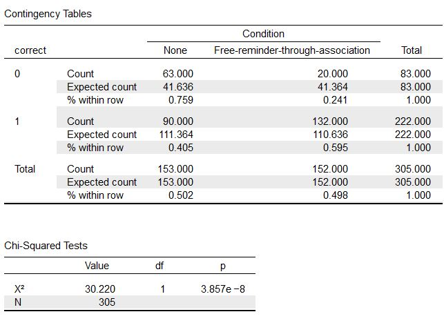

# 沒有母群如何比高低？無母數統計 {#non-para}

## 母數統計的基本條件

這個單元之前的統計方法都是**母數統計**，共同點是分析前宣告都是根據可估計測量結果出現的**機率模型**，也就是**母群的參數**。母群參數的估計值可以是平均數或相關係數，這些估計值轉化為效果量，還能評估研究結果的考驗力與型一錯誤率。然而有些時候手上資料不能構成母群參數的估計值，原因是這些資料是**間斷隨機變數**，數值無法四則運算。

除此之外，有些名義尺度或序列尺度的資料產生源頭，數值之間沒有**獨立性(independence)**。一個明顯的例子是田徑比賽的選手到達終點的名次，每位選手得到的名次取決於同場對手的臨場表現，不像心理科學實驗或調查的受測者，測得的分數無關彼此的感受。

如果有合適的間斷機率模型能描述這類資料的隨機現象，還是能使用統計方去分析研究結果的發生機率。統計學家已經發展出適用這些資料的統計方法，並且對應本書介紹的母數統計案例。這個單元示範心理科學最常用的母數統計：卡方檢定，還有簡介對應單組到多組平均數樣本，以及相關係數的無母數統計操作方法。這些方法都能透過**預先註冊**宣告計畫確認的結果，流程和母數統計沒有差別，本單元只介紹JASP與jamovi的操作示範。

## 獨立樣本的無母數統計：卡方檢定

卡方檢定是心理科學研究最常見的無母數統計方法，以下用兩個示範案例，展示運用卡方檢定分析資料的研究設計。

### 適合度考驗：重新檢視Emily Rosa的資料

第\@ref(ci)單元我們討論Emily Rosa與她的父母[-@RosaCloseLookTherapeutic1998]運用信賴區間，分析參與研究的撫慰師們真實能力。因為論文呈現所有撫慰師的答對次數，並未呈現兩次測試的結果。我們可以用另一個角度回應Emily Rosa的問題：21位治療師的答對十次嘗試的次數與投擲10枚硬幣的結果有沒有差別？每一枚硬幣出現正反任何一面的機率相等的話，如同每位撫慰師沒有感應人體能量場的能力。10枚硬幣投出各種正反面組合的機率分佈，正是試驗次數為10，各次機率為0.5的二項機率分佈。所以我們可以做出適合度考驗的分析前宣告：

> 如果21位撫慰師猜對次數不同於試驗次數為10，各次機率為0.5的二項機率分佈，適合度考驗應該出現小於.05的*p*值，否則*p*值應該大於.05。

只有jamovi可以執行適合度考驗，但是因為亞洲語言的系統顯示問題，請使用0.8.1.20版本之後的jamovi才能正常執行卡方檢定。示範檔案可以[由此下載](https://osf.io/5heg4/)，圖\@ref(fig:fit-operation)是由`Frequecies`模組的`N Outcomes`開啟的選單，請留意`Expected counts`輸入的數值，是二項機率分佈的每項數值相對出現次數，輸出的卡方檢定報表才符合分析前宣告。

```{r fit-operation, out.width='80%', fig.cap="卡方檢定適合度考驗操作設定示範。", fig.align='center', echo=FALSE}
knitr::include_graphics("images/fit-operation.jpg")
```
這個示範也展示適合度考驗的特色，你明白一組間斷尺度資料可以用合適的機率模型描述所有數值發生次數，就能進行適合度考驗。圖\@ref(fig:fit-result)是卡方檢定輸出報表，上面的表格是實際次數與期望次數的對照，實際次數來自你匯入的真實資料`NS`，期望次數是總次數乘以操作選單裡的`Proportion`。最下面的表格是輔助報告說明的統計資訊，我們看到分析結果與原始論文一致。報告示範如下：

```{r fit-result, out.width='80%', fig.cap="卡方檢定適合度考驗報表示範。", fig.align='center', echo=FALSE}
knitr::include_graphics("images/fit-result.jpg")
```

這21位撫慰師感應人體能量場的能力，與使用十枚硬幣猜測每次嘗試的答對率沒有不同，$\chi^2(10)$ = 11.64，p = 0.31。

### 獨立性考驗：重製Rogers與Milkman(2016)的分析

JASP與jamovi都可以執行獨立性考驗，JASP的功能由`Frequencies`模組的`Contingency Tables`開啟，jamovi的功能由`Frequencies`模組的`Independent Samples`開啟。這個示範案例[以JASP示範](https://osf.io/rfsjc/)。

Rogers與Milkman[-@RogersRemindersAssociation2016]發表如何幫助一般大眾在能使用折價卷的情況，記得使用折價卷的有效方法。其中一項網路實驗請受測者填寫一件問卷，最後有一個額外酬賞題，如果受測者記得點開並完成回答，就能領到額外賞金。他們比較問卷最後告知有此酬賞的提示，以及完全沒有給予提示的受測者，記得點開酬賞題的人數。

這項實驗之前已進行幾次現場實驗(field experiment)，證實這種措施有效果。在網路實驗的情況，研究者也要以合適的統計分析證實他們的措施有效，兩群受測者的總人數與點開酬賞題的人數如表\@ref(tab:contigency-data)所示：

```{r contigency-data, out.width='100%', fig.align='center', echo=FALSE}
knitr::kable(
  matrix(c(90,43,153, 152,0,152),nc=2, dimnames = list(c("有點開","未點開","總人數"), c("無提示","有提示"))), 
  booktabs = TRUE,
  caption = 'Rogers與Milkman(2016)的示範資料。'
)
```

表\@ref(tab:contigency-data)的格式有個專有名詞：**列聯表**。欄位名稱都是放置關鍵獨變項的分組名稱，列名稱是各分組內間斷尺度數值的出現次數。將原始資料轉換成列聯表，目的是分析分組間的次數比例是否相同。所以這項研究的分析前宣告如下：

> 如果有提示的受測者點開酬賞題的人數明顯不同於沒提示的受測者，獨立性考驗應該出現小於.05的*p*值，否則*p*值應該大於.05。

圖\@ref(fig:independence-operation)是開啟`Frequencies`模組的`Contingency Tables`操作選單畫面，請留意`Columns`最好放置關鍵的獨變項欄位。圖\@ref(fig:independence-result)的輸出報表上方表格就是列聯表，一般報告顯示各細格實際次數與百分比，這裡為了讓你比對獨立性考驗與適合度考驗的不同，將期望次數一併呈現。


```{r independence-operation, out.width='80%', fig.cap="卡方檢定獨立性考驗操作設定示範。", fig.align='center', echo=FALSE}
knitr::include_graphics("images/independence-operation.jpg")
```


```{r independence-result, out.width='80%', fig.cap="卡方檢定獨立性考驗報表示範。", fig.align='center', echo=FALSE}

```
圖\@ref(fig:independence-result)的下方表格是輔助報告的統計資訊，請留意與多了一個總人數(N)的資訊，示範報告寫作如下：

給予提示確實提高受測者點開酬賞題的行為，$\chi^2$(1, N = 305) = 30.220, *p* < .01。

## 其他基礎無母數統計

心理科學少見其他無母數統計，許多教科書也是使用虛構資料教學。我們使用Carlson與Winquist[-@Carlsonintroductionstatisticsactive2018]的第14章及第16章範例資料，製作示範檔案，請自行下載配合說明演練。

### 獨立樣本與相依樣本的無母數統計

平均數獨立樣本的無母數統計是Mann-Whitney法，JASP與與jamovi的操作選單都是開啟`T-Tests`模組的`Independent T-test`，接著勾選`Mann-Whitney U`項目，匯入變項欄位就能輸出統計資訊。至於平均數相依樣本的無母數統計是Wilcoxon法，JASP與與jamovi的操作選單都是開啟`T-Tests`模組的`Paired Samples T-test`，接著JASP勾選`Wilcoxon signed-rank`項目，jamovi勾選`Wilcoxon test`項目，匯入變項欄位就能輸出統計資訊。

我們提供相依樣本無母數分析的[JASP示範檔](https://osf.io/2cwsq/)與[jamovi示範檔](https://osf.io/s4u9w/)。建議你修改幾個版本的資料再匯入測試，因為JASP有檢測資料是否符合無母數統計條件的功能，如果資料不符合條件，報表會呈現無效數值(NaN)。

### 變異數分析的無母數統計

只有jamovi提供變異數分析的無母數統計功能，如果你要執行單因子獨立樣本變異數分析，請開啟`ANOVA`模組的`Kruskal-Wallis test`。如果你要執行二因子獨立樣本變異數分析，請開啟`ANOVA`模組的`Friedman test`。我們提供`Kruskal-Wallis test`的[jamovi示範檔](https://osf.io/5uebz/)讓你測試。

### 相關分析的無母數統計

只要參與相關分析的其中一個變項是間斷尺度，就要使用**Spearman's r**。JASP與jamovi的操作選單都是開啟`Regression`模組的`correlation matrix`，再勾選`Spearman`項目，匯入變項欄位就能輸出Spearman's r。你可以下載[JASP示範檔](https://osf.io/9zcy6/)與[jamovi示範檔](https://osf.io/vp3xa/)演練。

## 習題

開發中。
