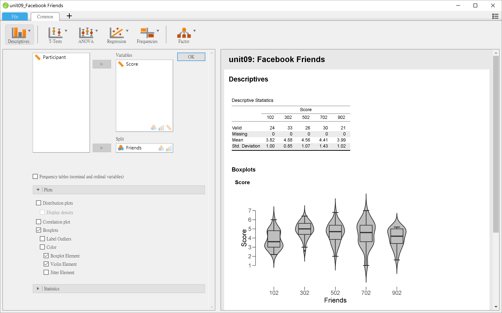
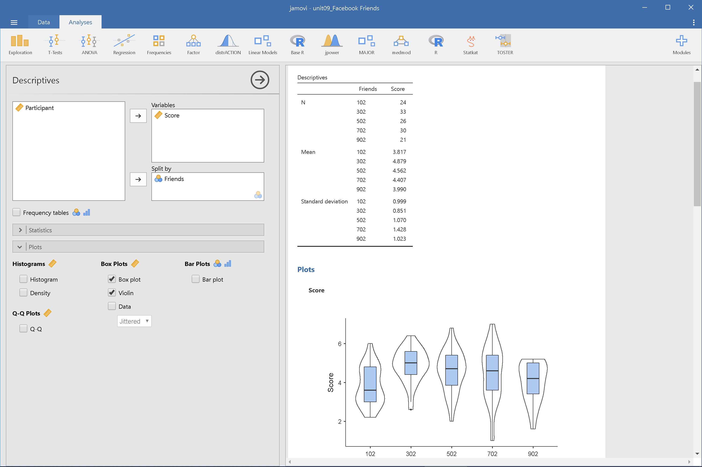
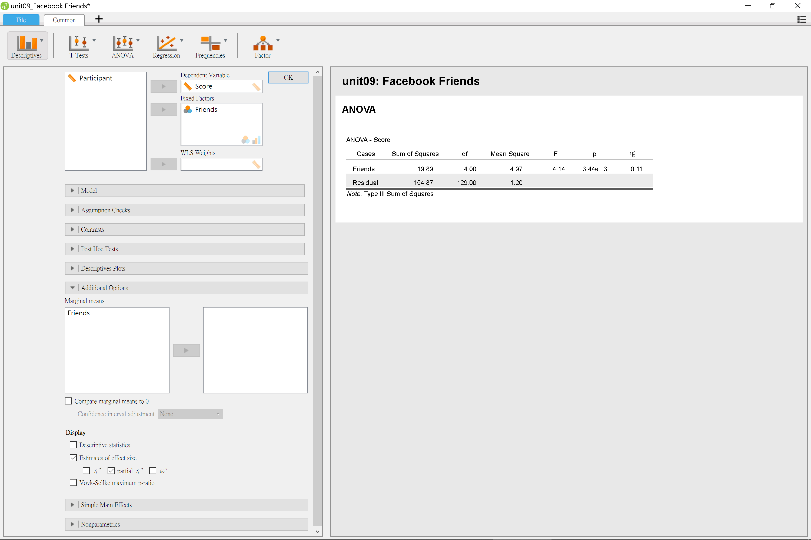
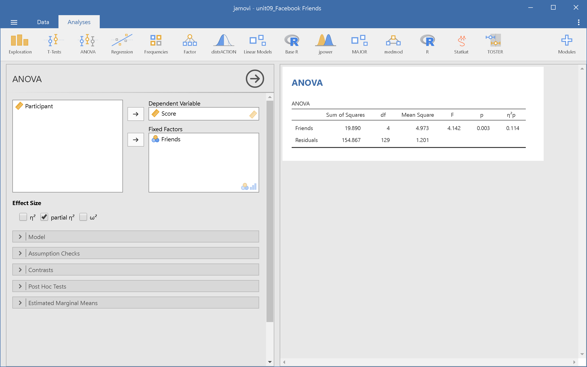
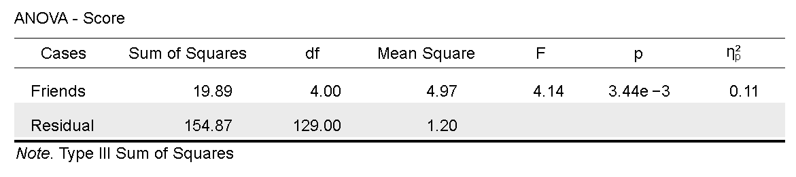
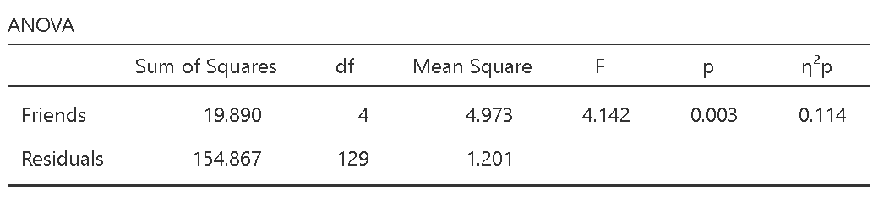
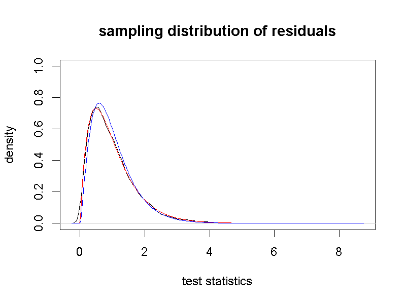
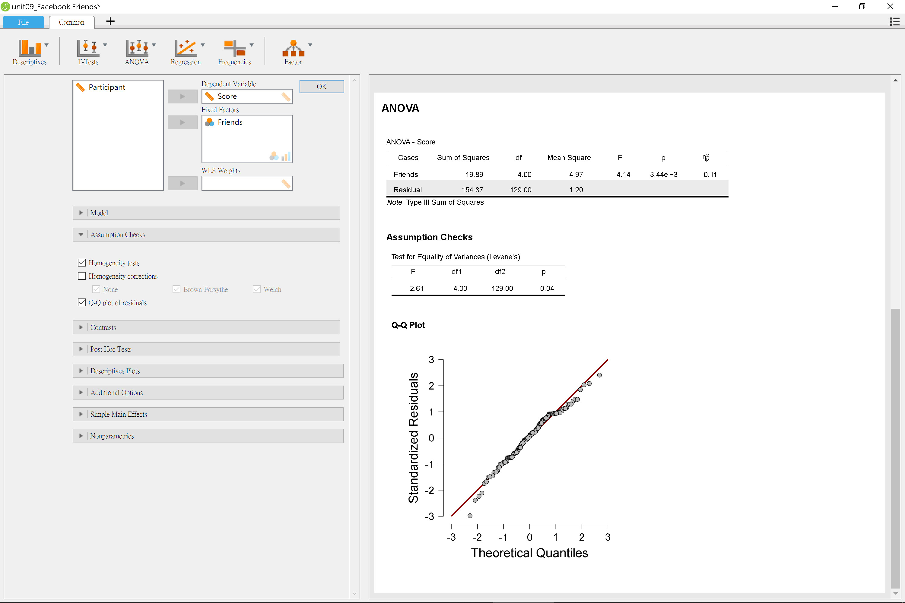
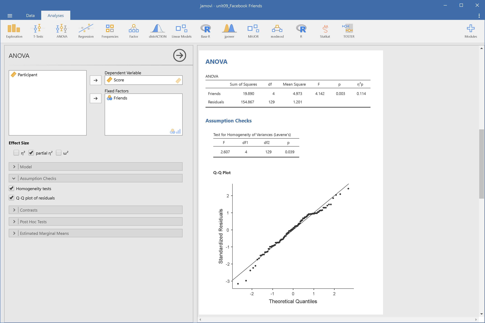

# 單因子變異數分析 {#oneway-anova}

如果你的分組測試資料歸納為兩個平均值，通常會使用獨立樣本t檢定(單元\ref(independent) )分析兩個平均值的差異。如果歸納的分組測試資料有三個以上平均值，就需要運用變異數分析。這個單元介紹比較組間平均的獨立樣本變異數分析，採用的迴歸式建立抽樣分佈模擬程序，比較多組平均數兩兩比較的模擬結果，理解為何應該使用異數分析。運用迴歸式的理解途逕，我們可以回頭理解本書介紹的所有統計方法，都能透過線性模型理解各種方法的使用原理。

## 獨立樣本變異數分析  {#oneway-independent}

### 分解變異數來源 {#oneway-SS}

在單元\@ref(corr-reg)，我們已經學到運用隨機程序收集的兩個變項資料：Y與X，可以用迴歸式$Y = a + b \cdot X$表示。現在設定X是獨變項資料分組的加權值，迴歸式可計算以各組平均數估計依變項的測量結果。迴歸式的截距a是總平均值，迴歸係數b化為各組平均值與總平均值差異的向量，使得X的加權值輸入迴歸式，可得各組平均值。

以三組各有5筆資料為例，總平均是10，各組平均數分別為7,11,13。形成以下表格：

|Y(觀察值)|a(總平均)|b(組間差異)|X(加權值)|殘差|
|---|---|---|---|---|
|7.1|10|1.5|-2|0.1|
|7.2|10|1.5|-2|0.2|
|6.9|10|1.5|-2|-0.1|
|7.3|10|1.5|-2|0.3|
|7.2|10|1.5|-2|0.2|
|10.7|10|1|1|-0.3|
|11.2|10|1|1|0.2|
|11.1|10|1|1|0.1|
|10.8|10|1|1|-0.2|
|11.3|10|1|1|0.3|
|13.1|10|3|1|0.1|
|13.2|10|3|1|0.2|
|12.7|10|3|1|-0.3|
|12.8|10|3|1|-0.2|
|13.1|10|3|1|0.1|

排除上表觀察值的殘差，會發現每個觀察值就等於各組平均值。隨機程序收集的資料必有殘差，所以變異數分析線性模型要做些改良，才能表現一群資料包含的成份。獨立樣本變異數分析的母群體，就能運用以下方程式設定：


$$ Y_{ij} = \mu + \alpha_j + \varepsilon_{i(j)} $$

$\mu$等於迴歸式的截距，也就是總平均值。$\alpha$是各組平均值與總平均值的差異，下標*j*標示來自那一組。$\varepsilon_{i(j)}$是每個觀察值與各組平均值的差異，不屬於前兩項的計算結果，所以稱為殘差(Residual)。下標*i*標示屬於那一筆觀察值，括號*j*表示各組殘差彼此獨立。

$\mu$是總平均值的母群體參數，由實際資料得到的平均值通常記為$\bar{Y}$。將此符號代入線模型，並移動到等號左邊，線性模型就成為各觀察值與總平均值的變異數來源分解式。$\alpha$就是各組平均值與總平均值的變異，$\varepsilon$是各觀察值與各組平均值的變異。每種變異都是一種離均差，
將離均差平方加總，即形成以下公式：

$$ \sum_i \sum_j (Y_{ij} - \bar{Y})^2 = \sum_j(\bar{Y}_j - \bar{Y})^2  + \sum_i \sum_j(Y_{ij} - \bar{Y}_j)^2 $$

每個離均差平方和可簡記為SS，如以下公式表明。變異數分析的目標是根據現在的資料，實驗效果變異的$SS_{Variable}$明顯區別於殘差變異的$SS_{Residual}$之可能性。

$$ SS_{Total} = SS_{Variable} + SS_{Residual} $$

### 示範檔案簡介 {#oneway-case}

示範檔案出自Moore, McCabe, 與 Craig [-@mooreIntroductionPracticeStatistics2012] 合著的 Introduction to the practice of statistics。這份研究邀請134位參與者閱覽幾份臉書使用者的社交資訊，評估這些使用者的社交吸引力分數(最低1分；最高7分)。參與者事前並不知道拿到的資訊來自臉書交友人數約為100人、300人、500人、700人、900人的臉書使用者。研究者想知道參與者事前不知情時，評估的社交吸引力分數是否與評估對象的臉書交友人數成正比。這份示範檔案可由以下連結下載：[JASP示範檔案0.9.2]()<!---；[JASP示範檔案0.9.1]()--->；[jamovi示範檔案]()。


### 示範檔案操作與報表解讀 {#oneway-demo}

首先建議讀者運用描述統計模組，整理五個分組的吸引力分數平均值與組間變異，並製作直方圖與小提琴圖，預覽五組之間的差異與研究者預期的差距。圖\@ref(fig:descriptive-jasp)與圖\@ref(fig:descriptive-jamovi)分別是JASP與jamovi的描述統計模組設定與報表畫面。

```{r descriptive-jasp, out.width='80%', fig.cap="臉書使用者社交吸引力調查描述統計：JASP操作畫面", fig.align='center', echo=FALSE}

```


```{r descriptive-jamovi, out.width='80%', fig.cap="臉書使用者社交吸引力調查描述統計：jamovi操作畫面", fig.align='center', echo=FALSE}

```

由示範畫面可見，除了臉書交友人數最少的這一組，平均評分低其他各組，其他各組的組間變異讓我們無法確定之間的差異不同於研究者的預期？此時使用變異數分析，能幫助我們進一步判斷，圖\@ref(fig:anova-jasp)與圖\@ref(fig:anova-jamovi)分別是JASP與jamovi的變異數分析模組(`ANOVA` -> `ANOVA`)設定與報表畫面。


```{r anova-jasp, out.width='80%', fig.cap="單因子獨立樣本變異數分析：JASP操作畫面", fig.align='center', echo=FALSE}

```


```{r anova-jamovi, out.width='80%', fig.cap="單因子獨立樣本變異數分析：jamovi操作畫面", fig.align='center', echo=FALSE}

```


JASP與jamovi的報表都有呈現效果量$\eta_p^2$(partial eta-squared)，請讀者留意模組設定畫面的選項，JASP與jamovi的變異數分析模組呈現效果量的選項設計並不相同。$\eta^2$(eta-sqaured)源自相關係數的數學原理，表示組間離均差平方和佔總離均差平方和的比例，比例越高，表示這次研究測得的組間差異越大。$\eta_p^2$是$\eta^2$的改良版，經過校正讓組間離均差平方和的佔比估計值，更符合實際資料。

```{r anova-table-jasp, out.width='80%', fig.cap="單因子獨立樣本變異數分析結果表：JASP操作畫面", fig.align='center', echo=FALSE}

```


```{r anova-table-jamovi, out.width='80%', fig.cap="單因子獨立樣本變異數分析結果表：jamovi操作畫面", fig.align='center', echo=FALSE}

```

圖\@ref(fig:anova-table-jasp)與圖\@ref(fig:anova-table-jamovi)是JASP與jamovi的示範案例輸出報表，除了JASP有在報表左下方標記**第三型離均差平方和**(Type Ⅲ Sum of Squares)，兩種報表呈現的資訊沒有差異。在正式報告裡，變異數分析結果不會呈現所有的Sum of Squared與Mean Square，最多只會呈現殘差的Mean Square。因為只要根據自由度與F值，就可以用殘差的Mean Square還原所有Sum of Squared與Mean Square。稍後我們會看到報告寫作的示範，接著來看為何可以使用F檢定判斷變異數分析的結果。

### 殘差變異的抽樣分佈模擬 {#oneway-residual}

以分析臉書資料範例來說，變異數分析的虛無假設是各組之間的社交吸引力分數沒有差異，也就是只存在殘差。因此製造只有殘差的模擬抽樣分佈，就可以理解為何變異數分析的統計值是F，以及模擬統計值接近設定的型一錯誤率之程度。

[jamovi示範檔案]()的第一塊Rj報表呈現只有殘差的模擬統計值分佈，如圖\@ref(fig:anova-res-simulation)的黑色曲線。圖中紅色與藍色曲線是使用F機率函數產生的分佈，紅色曲線的F分佈自由度等於報表(圖\@ref(fig:anova-table-jamovi))，藍色曲線的F分佈自由度是未減去平均值數目的5與150。計算曲線之間的最小平方差異可確認紅色區線最符合殘差的抽樣分佈。

(fig:sampling distribution of residuals)

```{r anova-res-simulation, out.width='80%', fig.cap="單因子獨立樣本變異數分析之殘差模擬樣本分佈。", fig.align='center', echo=FALSE}

```

設定型一錯誤率是0.05，我們只要計算模擬統計值有多少比例大於對應該機率的F分數，即可得知從等於分析結果自由度的F 分佈得到的決斷值，經過數次模擬估計的型一錯誤率，多次都是在0.5之下。如果讀者願意花些時間，可嘗試這道模擬程序多次，比較不同F分佈的型一錯誤率估計結果。

### 變異數分析適用性檢定 {#oneway-compatibility}

資料如果違反組間變異同質(Homogenerity)與樣本分佈常態(Normality)，變異數分析的結果將有偏誤。JASP與jamovi皆提供檢定選項，使用者可得知有無違反兩項條件。例如圖\@ref(fig:anova-jasp-assumption)與圖\@ref(fig:anova-jamovi-assumption)的示範。


```{r anova-jasp-assumption, out.width='80%', fig.cap="單因子獨立樣本變異數分析適用性檢定：JASP操作畫面", fig.align='center', echo=FALSE}

```


```{r anova-jamovi-assumption, out.width='80%', fig.cap="單因子獨立樣本變異數分析適用性檢定：jamovi操作畫面", fig.align='center', echo=FALSE}

```

違反變異同質的資料，檢定結果就會出現小於.05的p值，如同臉書使用者社交吸引力調查。違反樣本分佈常態的資料，分位圖的資料點會偏離迴歸線，因此這份調查資料並未違反這項條件。

對於違反變異同質的資料，使用者可改用Welch校正重新分析。JASP只要開啟圖\@ref(fig:anova-jasp-assumption)中的Welch選項；jamovi則改用`ANOVA` -> `One-Way ANOVA`分析這筆資料。若使用者認為變異同質檢定的結果在可接受範圍內，可以採用預設的分析結果。

<!---
## 變異數分析的效果量 ## {#oneway-effect}

JASP與jamovi都有提供三種效果量選項，讓使用者依自已的選擇計算：$\eta^2$，$partial \eta^2$，$\omega^2$。基本原理都是計算組間離均差平方和，佔總離均差平方和的比例。老字號的統計軟體如SPSS，SAS過去只提供$\eta^2$與$\omega^2$，不過日本學者岡田謙介[@okada_is_2013]指出，這兩種效果量計算公式都有高估的問題。本書採納近年較多學者建議的$partial \eta^2$，計算組間差異的效果量[@lakens_calculating_2013]。
--->
### 分析後報告  {#oneway-report}

在此以預設分析結果為例，示範在報告中呈現分析結果的規範格式。

> 交友數100人臉書使用者公開資料，在各組評分得到最低分(M =  3.82, SD =  1.00)，以設定的型一錯誤率不超過.05來看，五組之間的差異是明顯的： $F(4,129) = 4.14, MSE = 1.20, p = .003, \eta_p^2 = 0.114$。 

## 多組平均數的分析風險 {#oneway-multiple}

最後討論不使用變異數分析，採用已知的方法，如獨立樣本t檢定分析，會有什麼問題？要判斷各組之間有差異，可以進行所有的兩組比較，如果任何一項比較達到設定的顯著水準，就判斷五組之間存在顯著差異。如此一來型一錯誤率該如何設定？

首先考慮每一項比較都以型一錯誤率是.05，全部比較的型一錯誤率總和是$C_2^5 \times .05$，也就是`r choose(5,2)*.05`。運用[jamovi示範檔案]()的最後一塊`Rj`套件進行模擬，可得到近似的估計值。

如果將型一錯誤率以比較的組數調整，也就是.05除以`r choose(5,2)`，每一項比較的p值要小於`r .05/choose(5,2)`，才判斷為有差異。這次模擬程序得到所有比較的型一錯誤率總和接近.05。因此如果我們想將各組差異比較的總型一錯誤率控制於.05，變異數分析是比逐項t檢定更為經濟的做法。

## 總結 {#oneway-summary}

## 習題 {#oneway-practice}

開發中。

<!---

## 系出同源的推論統計方法

## 相依樣本變異數分析  ## {#oneway-repeated}


### 分解變異數來源

i: participant
j: variable

$$ Y_{ij} = \mu + \alpha_j + \pi_i + \varepsilon_{ij} $$

$$ \sum_i \sum_j (Y_{ij} - \bar{Y})^2 = \sum_j(\bar{Y}_j - \bar{Y})^2  + \sum_i(\bar{Y}_i - \bar{Y})^2 + \sum_i \sum_j(Y_{ij} - \bar{Y}_j - \bar{Y}_i + \bar{Y})^2 $$

$$ SS_{Total} = SS_{Variable} + SS_{Participant} + SS_{Residual} $$


### 示範檔案簡介


[JASP示範檔案0.9.2]()
[JASP示範檔案0.9.1]()

[jamovi示範檔案]()


### 示範檔案操作說明


### 示範檔案報表解讀


### 分析後報告
--->

