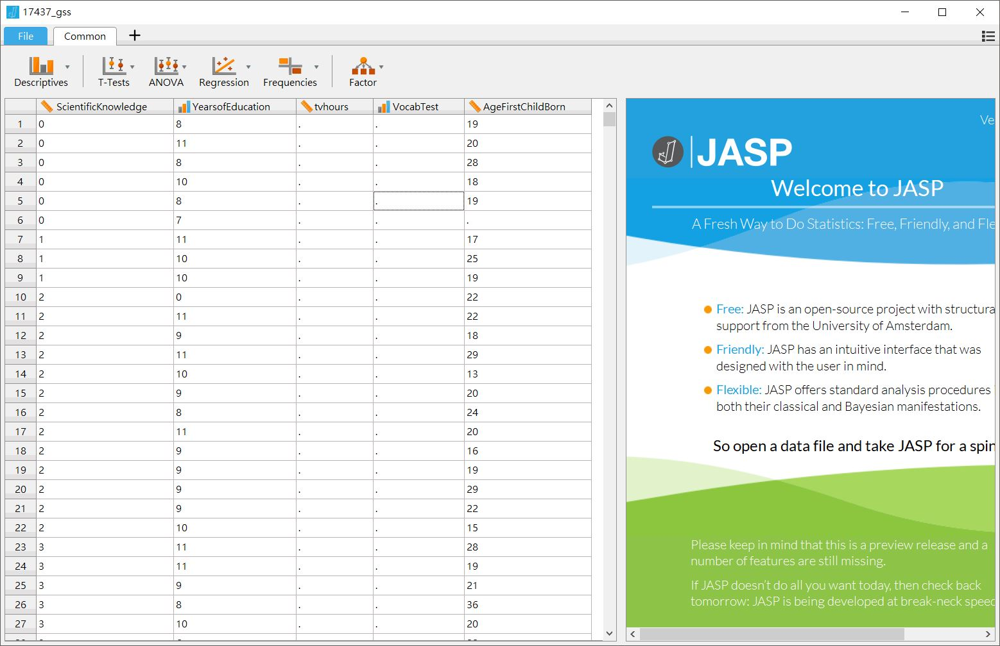
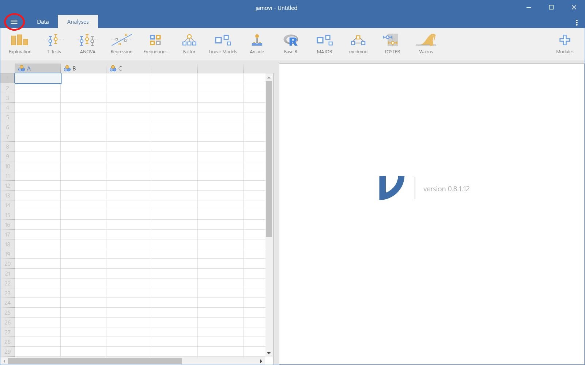
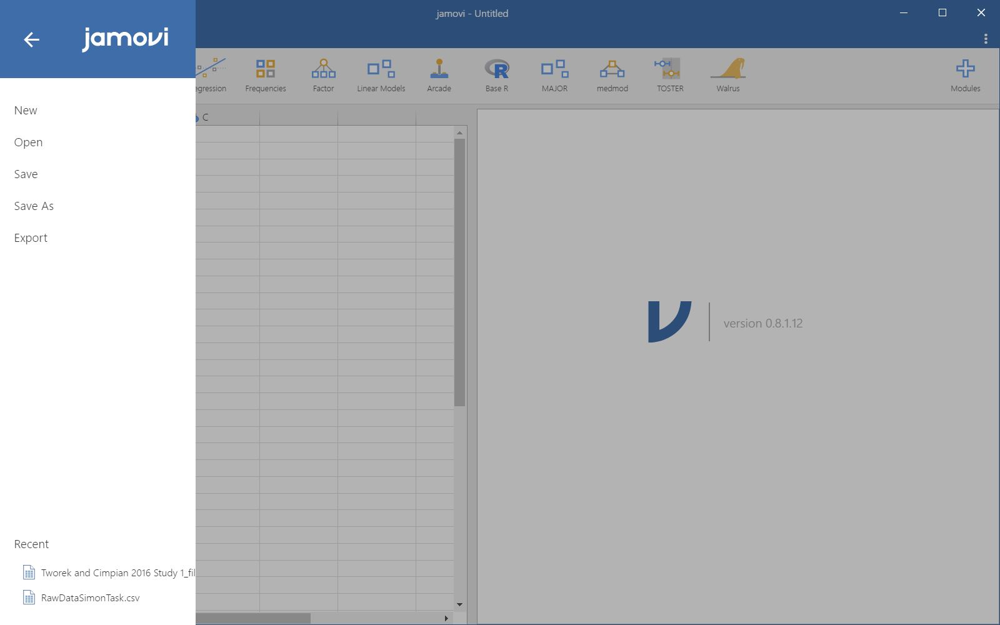
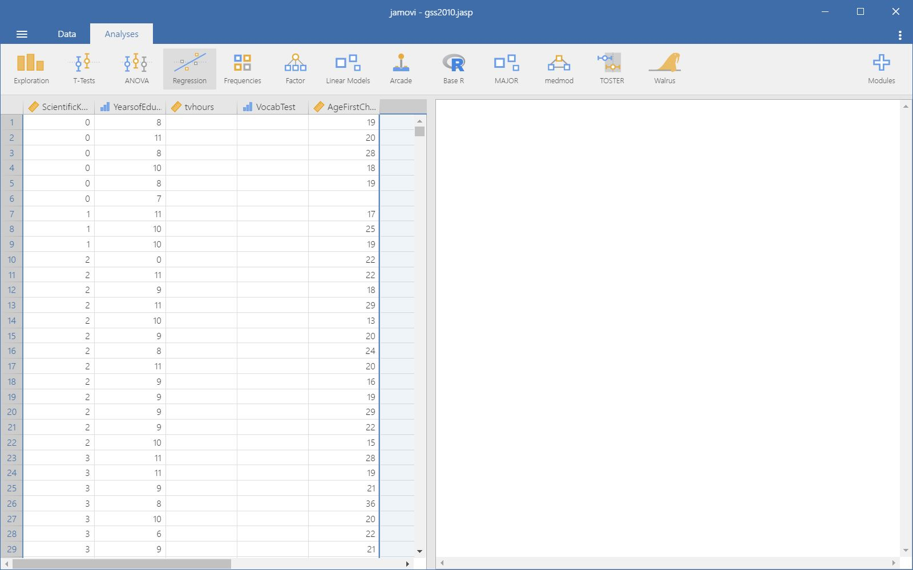

# (APPENDIX) 附錄 {-} 

## JASP與jamovi開發簡史與介面介紹 {#app_part1}

[JASP](https://jasp-stats.org/)是由荷蘭阿姆斯特丹大學Eric-Jan Wagenmakers教授領導的團隊於2015年啟動開發專案，核心是R套件路[BayesFactor](http://bayesfactorpcl.r-forge.r-project.org/)，所以JASP從一開始就是開源軟體[@JASP2018]。因為核心成員是貝氏統計的專家，JASP不僅能做傳統的統計，也能計算貝式因子，並且操作方式與SPSS一樣。就算你還不明白什麼是貝氏因子，還是能用JASP學習傳統統計方法。

JASP能開啟的檔案格式有已格式化的文字檔(.csv, .txt)、SPSS資料檔(.sav)、以及Libera Office試算表(.ods)。從[官方網站](https://jasp-stats.org/)下載對應作業系統的安裝程式，安裝成功後打開JASP，切換到`File`界面(見圖 \@ref(fig:JASP-FILE) )，點選**Computer**，從存放在個人電腦中的資料夾位置，開啟gss2010.sav。從畫面上你可以看到，你可以透過網路開啟存放在[OSF](https://osf.io/)的檔案。0.9版起，**Example**裡有相當豐富的範例檔案讓使用者學習。


```{r JASP-FILE, out.width='70%', fig.cap="JASP檔案選單", fig.align='center', echo=FALSE}
knitr::include_graphics("images/jasp-file.jpg")
```

成功載入資料內容後，JASP自動跳到*Common*界面，如圖 \@ref(fig:JASPCOMMON) 。這筆資料有五個欄位，每個欄位名稱之前有一些特別的符號，稍後我們會知道這些符號提示欄位裡的資料，JASP是以什麼樣的**尺度**處理。

```{r JASPCOMMON, out.width='70%', fig.cap="JASP資料界面", fig.align='center', echo=FALSE}

```

[jamovi](https://www.jamovi.org/)是由澳洲的軟體工程師[Jonathon Love](https://jona.thon.love/)領銜開發的開源統計軟體。Jonathon曾參與開發最早發表的[JASP](https://jona.thon.love/)，返回故鄉自立門戶後，與朋友合作開發jamovi。開發理念是讓不擅長寫程式碼的人士，能以接近試算表軟體的介面，使用各種強大的統計功能。

從[jamovi官方網站](https://www.jamovi.org/)下載對應作業系統的安裝程式並安裝成功之後，會發現介面和JASP有些不一樣，像圖 \@ref(fig:jamovi-blank) 。

```{r jamovi-blank, out.width='80%', fig.cap="jamovi起始畫面", fig.align='center', echo=FALSE}

```

你需要點擊界面左上角三條橫線的圖示( 見圖 \@ref(fig:jamovi-blank) 紅色圓圈處)，才能打開如圖 \@ref(fig:jamovi-menu) 的檔案選單，選擇開啟存在本機的檔案。

```{r jamovi-menu, out.width='80%', fig.cap="jamovi檔案管理選單", fig.align='center', echo=FALSE}

```

最新版的jamovi只能開啟已格式化的純文字檔案(.csv, .txt)，以及已建立的jamovi存檔(.omv)與JASP存檔(.jasp)。所以如果你要處理的資料本來是SPSS存檔，目前只能先匯入JASP存檔後，再以jamovi開啟。以剛剛匯入JASP的gss2010.sav示範，使用jamovi開啟的樣子如圖 \@ref(fig:jamovi-opened) 。

```{r jamovi-opened, out.width='80%', fig.cap="jamovi資料界面", fig.align='center', echo=FALSE}

```


## jamovi模組安裝  {#app_part2}

jamovi使用者可以增加自已或他人開發的模組。只要點選操作介面右上界標記`Modules`的大十字圖案，就可以開啟模組安裝與更新選單。本書介紹的模擬程序，都是透過jamovi模組`Rj`執行。有安排模擬程序的示範檔案，相關單元及程式碼內註解，都有說明重要參數設定，讀者只要改變參數數值，就可以觀察模擬結果的變化。

本書建議讀者安裝的模組有`Rj`(編寫與執行R程式碼)、`jpower`(考驗力分析與解說)、`distrACTION`(機率分佈圖解)、`R data sets`(R官方示範資料集)、`Statkat`(統計方法建議諮詢)、`learning statistics with jamovi`(同名教科書示範資料集)。

## 數值顯示設定 {#app_part3}


## 匯出資料與輸出報表 {#app_part4}

