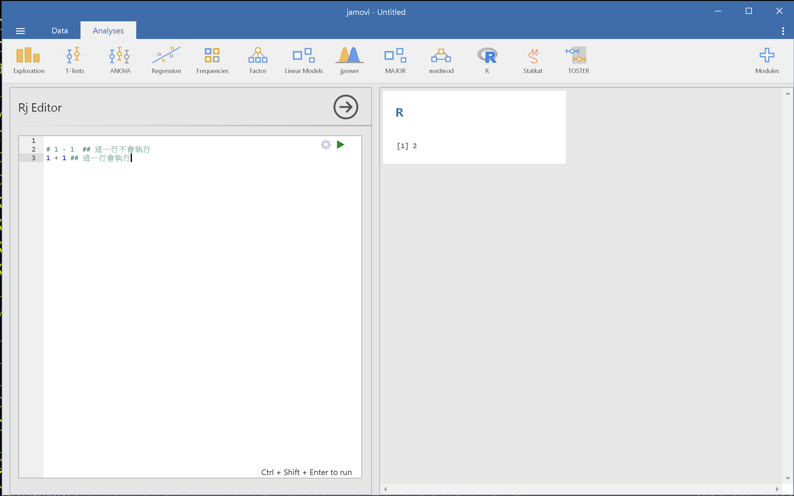
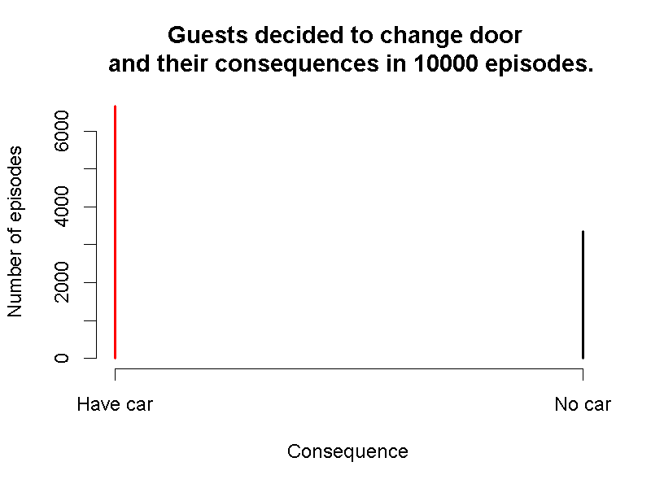
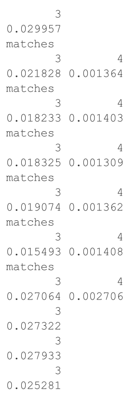
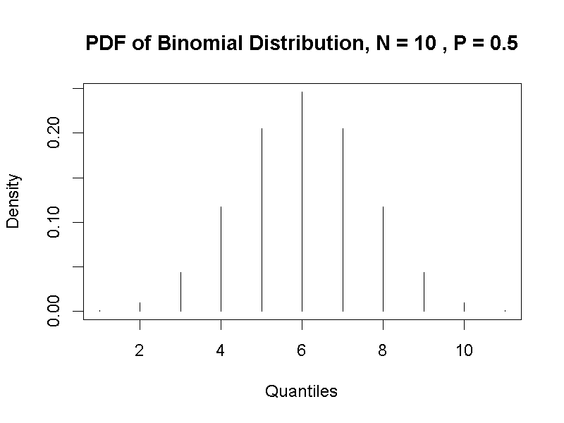
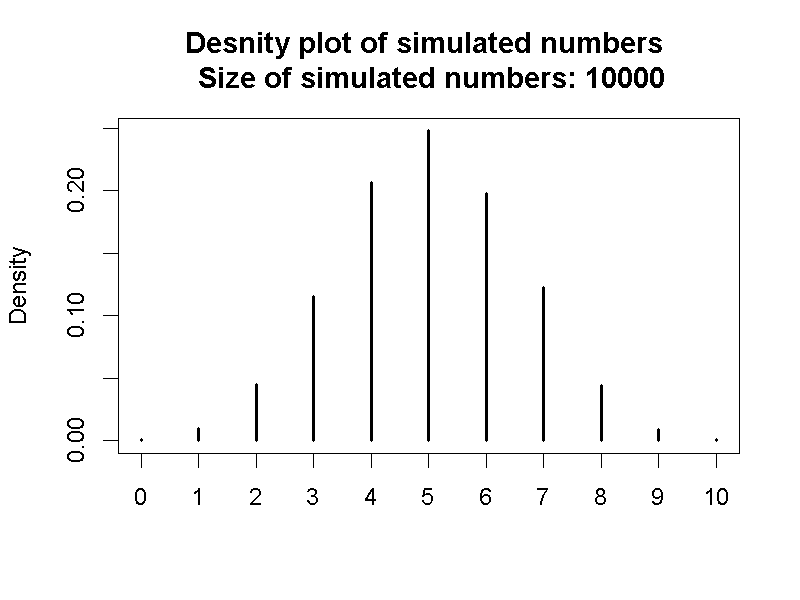
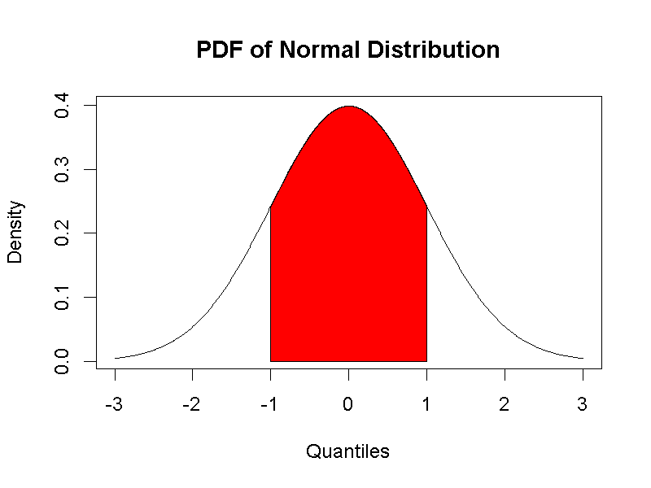
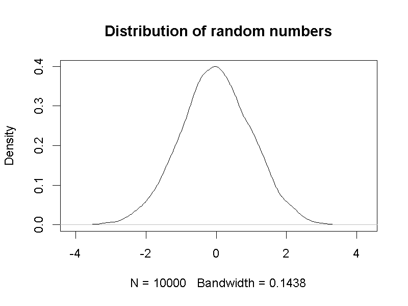

# 模擬的機率分佈：統計方法的實證作用  {#distribution}

統計實務經常運用符合特定理論的隨機方法累積資料，統計量數構成符合特定條件的一個或一組隨機變數。所以研究者能運用適常的機率函數，計算觀察現象的發生機率。所有推論統計方法都有一致的功能：讓研究者判斷現在的資料，符合那一種機率函數？

我們運用第\@ref(probability)單元討論的大樂透中獎機率與蒙提霍爾問題，說明為何**母群體(polulation)**與**樣本(sample)**是逼近機率分佈的產物；如何運用模擬方法理解接下來的單元介紹的統計觀念；都是這個單元的重要任務。

## 執行模擬腳本 {#distribution-Rj}

首先說明jamovi模組`Rj`的使用重點。`Rj`讓使用者在jamovi執行基本的R程式碼，瀏覽執行結果。本書運用`Rj`的場合是需要運用模擬程序說明或示範某項概念，不會說明程式碼的撰寫方法。在本書提供的範例程式碼中，有註解提示讀者如何自行修改一行程式碼裡的數值，以測試不同條件的模擬結果。

圖\@ref(fig:jamove-rj)的畫面是一道四則運算的執行示範。畫面左方是R程式碼編輯視窗，右方是執行結果輸出視窗，也是可另做存檔動作的報表。示範畫面有兩行程式碼，分別是四則運算`1 - 1`與`1 + 1`。編輯視窗中的程式碼確定編輯完成，要看執行結果只要滑鼠點擊編輯視窗右上角的綠色箭頭。

讀者應該注意到輸出視窗只有一個運算結果，因為第一行程式碼的最前方有註解符號`#`，只要程式碼任何一行開頭有註解符號，該行程式碼就不會被執行。這個符號的進一步功能是在要執行的程式碼上一行，或者在行末置入註解，提示使用者執行該行程式碼的目的與作用。本書所有使用`Rj`執行的程式碼，都有這樣的註解提示。

(\#fig:jamove-rj)jamovi Rj的執行畫面

## 條件機率之模擬 {#distribution-conditioning}

(模擬換門得車的機率)
在單元\@ref(probability-conditional)，我們透過蒙提霍爾問題認識什麼是條件機率，以及運用貝氏定理計算條件機率。儘管透過計算，我們得知來賓從三道門之中，最後換門而得到轎車的機率，高出最後不換門而得到轎車的機率一倍。然而在現實世界裡，除非蒙提霍爾真的主持上千集甚至上萬集，都跑同一套節目流程讓來賓試運氣，我們無法得知確實有2/3的來賓因為更換門而得到轎車。

模擬機率分佈讓我們可以在數秒之內，製造上萬次節目結尾的狀況。這個模擬程序只要製造兩種隨機變數：來賓一開始的選擇($\theta$)；車子在那道門之後($D$)。因為貝氏定理已經告訴我們，車子所在的門與來賓一開始選擇的門相同的機率($P(\frac{\theta}{D})$)，是車子所在的門與來賓一開始選擇的門不相同的機率($P(\frac{\bar \theta}{D})$)互為補集，所以兩者總和為1。要模擬的事件就是兩種隨機變數在某一集相同，與兩種不相同，累積的模擬次數就是蒙提霍爾問題的機率分佈逼近結果。

[範例檔案](https://osf.io/j5evz/)提供模擬程序的R程式碼，圖\@ref(fig:MH-simulation)是一次模擬結果，很明顯因換門而得車的次數，高出不換門而得車的次數一倍。讀者下載之後，可以多執行這個程序幾次，每一次結果雖然略有不同，整體顯示換門比不換門得到車子的次數高一倍。這個範例顯示模擬的機率不會完全等於計算的機率，但是現實世界處理的統計問題，可用模擬的機率評估預期結果的發生可能性。

(\#fig:MH-simulation)蒙提霍爾問題的模擬結果

## 母群體與樣本  {#distribution-sample}

Population的中文譯名有**母群體**與**母體**，行為科學領域常用的是前者，本書採用此譯名；Sample的中文譯名在各種領域都是**樣本**。這兩個名詞的解釋每本教科書的說法各有不同，我們從正式出版的中文學術辭典節錄相關的說明：

- **母群體**
  - 教育大辭書[^4]：「母群體是根據某些原則來加以認定的所有觀察量數之總數（集合）。」
  - 資訊與通信術語辭典[^5]：「按研究目的所有對象之全體。」

- **樣本**
  - 教育大辭書[^6]：「樣本是指由母群體觀察量數中抽樣而得的部分集合體。」
  - 資訊與通信術語辭典[^7]：「通常為了解一群個體或物質的特性，無法就所有的個體或物質一一檢查，而從其中隨機挑選出來一定數目稱之為樣本。」
  

[^4]:引用網址 http://terms.naer.edu.tw/detail/1304019/
[^5]:引用網址 http://terms.naer.edu.tw/detail/1670463/
[^6]:引用網址 http://terms.naer.edu.tw/detail/1313804/
[^7]:引用網址 http://terms.naer.edu.tw/detail/1285800/

兩套辭典的說法都是根據研究的目標來解釋什麼是母群體，什麼是樣本。這些說法必須建立在讀者已經了解研究方向與觀察對象的性質，才能有真正的理解。對於初學者來說，會有疑惑是不是應該先學習研究方法或有初步的研究經驗，才能學習這些統計觀念。

本書建議讀者先擱置這些疑惑，親手操作大樂透中獎機率的模擬程序，再來談談如何認識什麼是母群體，什麼是樣本。單元 \@ref(probability-functions) 以台灣大樂透為例，介紹如何計算不計特別號的各獎中獎機率分佈。一共有四種獎項，中獎率最高的是中3個號碼，機率是0.018，其次是中4個號碼，機率是0.001，再其次是中5個號碼，機率是3e-06，中獎率最低的是中6個號碼，機率是7.2e-08。最後兩個數字為小數點後6位與後8位。

模擬程序的R程序碼如圖\@ref(fig:lotty-simulation)，讀者可下載[範例檔案](https://osf.io/wr8h2/)，一邊參考這段說明，一邊操作測試。這個檔案最上方是根據下列公式，計算得出能中至少普獎的期望機率：

$$p(x) = \frac{C^{6}_x \times C^{49-6}_{6-x}}{C^{49}_6}  x = \{ 3,4,5,6 \}$$

計算結果見表\@ref(tab:lotty-expect)。

 中獎號碼數目    中獎期望機率 
--------------  --------------
      3           0.0176504   
      4           0.0009686   
      5           0.0000184   
      6           0.0000001   

其後的模擬程序有兩種隨機變數：第一種是某一期的中獎號碼組合`numbers`；第二種是任何一張當期投注彩卷的號碼組合`bet`。其中還有一行`N <- 1000`表示當期總共有1000筆下注號碼，所以模擬程序只要計算每一注中獎號碼數目，再總計中獎號碼數目的累積次數，就可輸出某一期中獎彩卷的機率分佈。

(\#fig:lotty-simulation)台灣大樂透中獎之模擬機率(不計特別號)

這段程式碼有一個迴圈設計，讓模擬程序能重覆執行十次，輸出每一次有中獎的號碼組合數目，也就是模擬十次有一千筆下注彩卷的中獎結果。在圖\@ref(fig:lotty-simulation)的輸出數值裡，只有中3個號碼的結果每次出現，中四個號碼的結果只有其中四次出現，而且每一次的模擬機率，不一定等於期望的中獎機率。

讀者只要在模擬程序裡修改某期下注總數，也就是`N <-`之後的數目，修改幅度越大，就會看到越不一樣的模擬結果。例如改成10000，中3個號碼與中4個號碼會每次都出現，中5個號碼的結果則會出現1或3次。雖然數字改得越大，模擬程序要花更多時間才能完成。測試這個模擬程序的目的，是讓讀者想想，如果每一次下注的彩卷是觀察的對象個體，為何總數要越大才能越逼近計算機率的函數圖形？

這個範例體現機率論的**大數法則(Law of large numbers)**，說明一項實驗重複越多次，累積結果的統計值越逼近母群體的**參數(parameter)**。何謂參數將在下一節說明，這裡我們再次提到的**母群體**。如果讀到這裡時，讀者己經自行修改多種下注總數，並進行多次測試，就能體會以下對於解釋**母群體的函數觀點**：

> 隨機變數涵括所有可能結果，以及給定各隨機變數發生機率之函數。

一開始列出的公式與表列各獎中獎機率，就是一種母群體函數。其中包括隨機變數(中獎號碼數目)，與對應的機率(期望的中獎機率)。模擬程並未製造所有可能的中獎號碼組合，`numbers`集合隨機產生的1000種號碼組合，再與另一組隨機製造的號碼組合`bet`，比對中獎號碼數目。1000筆模擬的中獎號碼數目相對比率，構成了**樣本**。由此案例，我們能理解**樣本的函數觀點**：

> 收集的資料屬於母群體函數之隨機變數值域，**獲得指定資料的期望機率**與母群體函數之事件機率一致。

由函數觀點可知，母群體與樣本是系出同源機率函數，但是樣本的機率函數不是也不必等同母群體的機率函數。從第\@ref(one-sample)單元開始，我們會學到所有統計方法的操作都是根據**樣本的機率函數**–在許多統計教材裡，被稱為**抽樣分佈(Sampling Distribution)**。

要能正確運用第\@ref(intro)單元提到的統計方法運用指南，除了要理解要處理的資料變項性質，也要了解當下的資料只是長久累積的一部分。大樂透中獎模擬範例也透過一個本書之後的每個單元裡，我們使用統計方法時要留意的問題：由當下的資料獲得的統計量，是不是真的符合母群體機率函數的計算結果？如果無法確定，設計模擬程序，根據執行結果判斷是否適當是最佳的操作方法。

## 二項分佈之模擬 {#distribution-binomial}

許多有數學運算功能的程式語言，都有提供常用機率分佈的相關函數。單元\@ref(probability-binomial)展示的二項分佈機率密度函數長條圖，是以R的機率計算函式製作。R也有提供產生指定數量亂數的模擬函式，能用來模擬特定機率分佈。總計模擬函式製造的數值，會發現每個數值的相對次數逼近二項分佈的密度函數，如圖\@ref(fig:binomial-simulation)展示模擬10000個數值的機率密度長條圖，以及由二項分佈機率密度函數計算結果產生的長條圖。讀者可以自行修改[範例檔案](https://osf.io/t5rs3/)裡面的`sim_n`，觀察增加數值總量，導致模擬結果越接近機率分佈計算的現象。

(\#fig:binomial-simulation)左：二項機率分佈函數(N = 10, p = 0.5)；右：模擬數值的機率密度函數

## 常態分佈之模擬  {#distribution-normal}

單元\@ref(probability-normal)簡要介紹標準化常態分佈，是指參數$\mu = 0$，與參數$\delta = 1$的機率函數計算結果。常態分佈的機率密度函數公式如下：

$$ f(x, \mu, \delta) =  \frac{1}{\delta\sqrt(2\pi\sigma^2)} e^{-\frac{(x - \mu)^2}{2\sigma^2}}$$

由以上公式可知所有機率分佈函數必有的參數是**隨機變數**，如同常態分佈，有連續型隨機變數做為參數的機率分佈函數，也有**期望值**$\mu$與$\delta$做為參數。**期望值**是該機率分佈的函數形態，由出現機率最高的隨機變數數值(平均數)與佔至多75%離散區間之內的數值(標準差，根據柴比雪夫不等式)所決定。代表**期望值**的參數又稱為**母數**，但是兩者的英文都是parameter。

與如同二項分佈的離散型隨機變數比較，後者雖然也可以計算平均數與標準差，機率分佈型態其實是由隨機變數及其他非期望值的參數所決定。R的常態分佈函式具有根據指定的期望值，製造隨機數值的功能，圖\@ref(fig:normal-simulation)呈現計算的標準化常態分佈函數，以及運用模擬程序製造10000筆隨機數值，繪製的機率密度曲線。讀者可使用[示範檔案](https://osf.io/jzpmy/)，自行更改模擬程序的數值數量，函式之內的期望值等，觀察模擬結果的變化。

(\#fig:normal-simulation)左：標準化常態機率分佈函數；右：模擬數值的機率密度函數

## 統計學兩大流派 {#distribution-approaches}
描述統計(descriptive statistics)與推論統計(inference statistics)的功能：描述統計集合各種呈現資料中“可推論資訊”的技巧，以適當的測量尺度呈現資料的**集中**與**變異**。推論統計評估“可推論資訊”符合預測的可能性，或者值得再做探討的價值。

現代統計學的發展歷史與心理學等需要分析資料的科學領域相輔相成。首先被廣泛使用的推論統計方法需要的計算資源較少，這個單元示範的機率分配模擬，直到十幾年前才開始在個人電腦實現，所以需要較多計算資源的統計方法能被更多人使用。Emily Rosa研究結果的示範分析是一種**貝氏統計(Bayesian Statistics)**的展示，而本書各單元主要介紹的是**次數主義統計(Frequenitist Statistics)**。

### 次數主義統計 {#distribution-frequentist}
二項分佈與常態分佈的模擬結果最逼近計算的機率分佈，都是累積至少一萬個隨機數值的狀況，相當於累積一萬次實驗結果。以多次實驗累積的機率分佈推論資訊，正是次數主義的中心思想。**所有研究問題都有一個最適合的機率分佈，只要能用最接近的模擬機率分佈評估資料出現的機率，就能用對應的統計方法判斷分析結果。**

許多研究問題的機率分配是總計根據某種假設，估計當前資料的發生次數，也就是前面討論貝氏定理時提到的$P(D|\theta)$。許多次數主義統計方法原理是建立在這種條件機率分配，但是研究者不必製造模擬數值，只要確定收集資料的條件符合要素，$P(D|\theta)$必定接近預設的機率分佈。常見的必要條件有**常態性(Normality)**與**等變異性(Equal variance)**，統計學家也開發許多方法，幫助研究者確認手上的資料符合這些條件 ，讓研究者能合理運用統計方法得到的資訊推論。

然而包括心理學在內的多數社會科學研究者，在學習次數主義統計方法的過程中並未充分理解$P(D|\theta)$不等於真正想研究的$P(\theta)$，近幾年有許多學者更是直接倡議，全面更改使用統計方法慣例[@benjamin_redefine_2017-1; @lakensJustifyYourAlpha2018]。次數主義統計方法雖然是本書的學習重點，每個範例有提示使用建議。

### 貝氏統計 {#distribution-Bayesian}

貝氏統計不必設定$P(D|\theta)$符合那一種機率分佈，而是設定$P(\theta)$符合的機率分佈，運用現有資料及模擬程序製造可形成機率分佈$P(D|\theta)$的隨機數值，以此得出機率分佈$P(\theta|D)$，用於推測資料意義或投入下一輪資料分析。因為真實的心理學研究課題包含許多變項，模擬程序需要複雜的演算法與計算資源，目前最常被應用的演算法是馬可夫蒙地卡羅方法(Markov chain Monte Carlo,簡稱MCMC)。

兩大流派的共同點是**能用統計方法處理的資料必須是透過隨機程序所得**，像是調查使用的抽樣，還有隨機化實驗的分派，$P(D|\theta)$才能符合方法原理的設定或可用演算法進行數據模擬。由於兩大流派的差異是處理$P(D|\theta)$的方式，所以每種已經發展成熟的次數主義統計方法都有對應的貝氏統計方法。本書設定讀者是統計初學者，不會直接介紹貝氏統計方法，有興趣的讀者可參考本書附錄，接觸貝氏統計方法的學習資源。

## 總結 {#distribution-summary}

- TBA

## 習題 {#distribution-practice}
