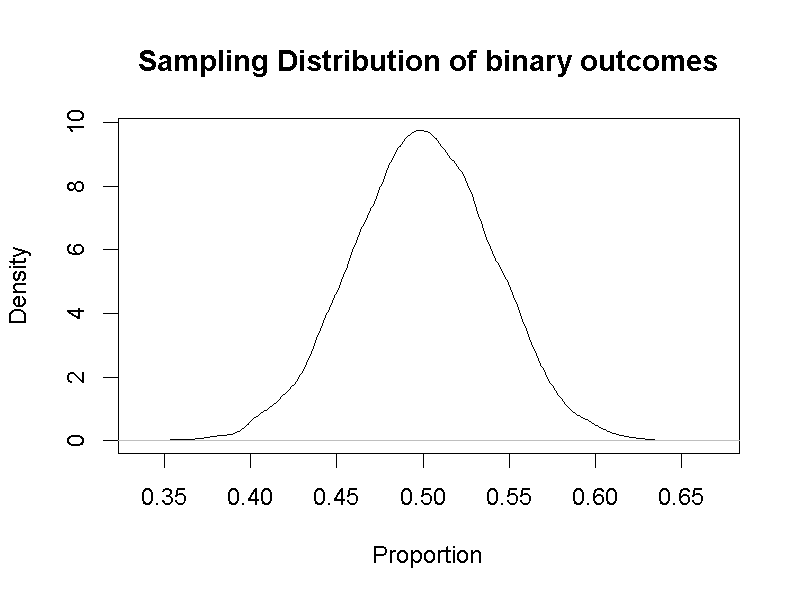
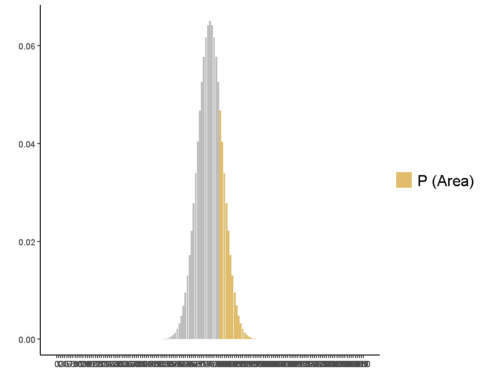
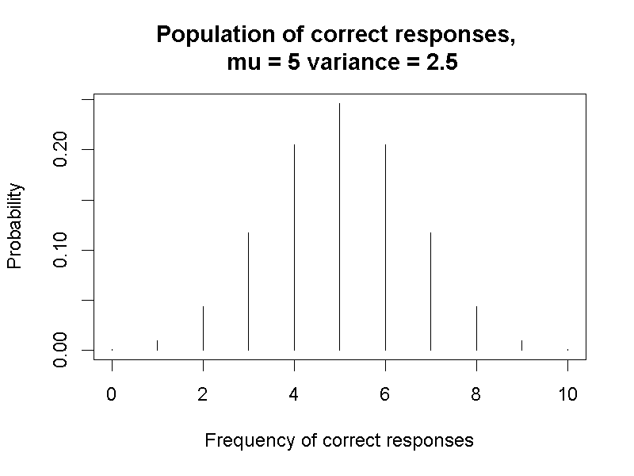
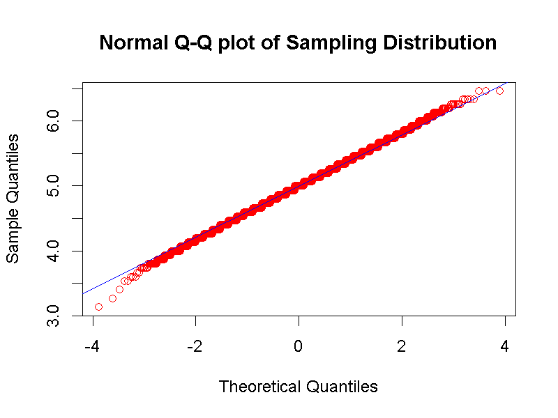

# 單一樣本的推論統計 {#onesample}

這個單元介紹第一種推論統計方法：單一樣本檢定。這類方法雖然少見於心理科學研究，但是使用上要注意的基本條件相對較少，是許多統計教材的推論統計入門單元。

透過第\@ref(intro)單元登場的Emily Rosa專題研究，我們以這個例子學習假設檢定的基本觀念，並運用二項檢定及單一樣本t檢定分析Emily Rosa的資料。學習t檢定分析的運程，我們將認識另一種連續型隨機變數：t分數，以及其機率函數：t分佈。還有學習信賴區間的觀念與使用方法。

## 預先註冊 {#onesample-preregistration}

解說如何使用統計方法之前，請讀者先認識**預先註冊(preregistration)**[@lindsayResearchPreregistration1012016]。預先註冊是一種將科學思考轉化為可徵信報告的流程，就統計實務來說，只有兩個步驟。步驟一：執行分析之前先留下計畫，說明用什麼統計方法分析手上的資料，判斷分析結果的標準是什麼；步驟二：按照計畫程序分析資料，呈現按計畫程序得到的分析結果。

使用任何新的統計方法時，可以透過預先註冊檢視自己有沒有學到正確的使用方法。要留下分析計畫，你必須掌握使用這種統計方法分析手上資料的合理性，以及了解各種分析結果的意義。做法看似很簡單，但是經驗越豐富的研究者，在養成過程中如果沒有建立清楚的觀念，遇到不如預期的資料，經常會陷入天人交戰的局面。只要是按步就班收集資料，無論分析結果是否符合預期，呈現出來都有助科學知識的更新。雖然預先註冊還沒有完全被全世界心理科學家接受，甚至正確認識，正在開始學習統計的你，了解預先註冊的觀念，可以培養判斷分析結論的。

## 虛無假設顯著性檢定 {#onesample-test}

我們在單元\@ref(distribution-approaches)得知次數主義的要旨，是根據得到某種分析結果的假設為前提($\theta$)，評估觀察得到當下資料(D)的條件機率($P(\frac{D}{\theta})$)。這個條件機率能以對應的機率函數計算與模擬，關鍵在於許多問題一開始無法明確預測會得到什麼結果，只能確定最不可能被現在的觀察資料證實的假設，得到當前結果的條件機率($P(\frac{D}{\theta})$)必定**不會超過研究者能接受的水準**。這種假設被稱為虛無假設(Null Hypothesis，許多統計教材簡記為$H_0$)，以虛無假設的機率分佈計算得到當前結果的條件機率，就是p值。這是虛無假設顯著性檢定的基本思考方式，也是本書介紹的所有統計方法的運作流程。

### 虛無假設與對立假設 {#onesample-hypothesis}

我們在單元\@ref(probability-permutation)討論投擲一枚正反面出現機率相等的硬幣，做一系列試驗得到的所有結果之可能機率，可用適當的機率函數計算。這個試驗案例改編自第一個本寫進教科書的假設檢定案例[@fisherDesignExperiments1966]，教科書的作者Ronald Fisher是假設檢定方法的奠基者之一。在Fisher的著作中，他提到曾在一次英式下午茶場合，遇到一位女士宣稱有能力分辨喝下的奶茶是先倒茶再加牛奶，還是先倒牛奶再加茶。當場他設計一個實驗，安排四杯奶茶先倒茶再加牛奶，以及四杯奶茶先倒牛奶再加茶，配成四組請這位女士一一試喝，每一組會先喝到那一種由調製者隨機決定。這個設計如同有四枚硬幣，先不讓對方看投擲的結果，請對方猜正面與反面朝上各有多少枚。

Fisher如此設計的想法，是因為在場沒有人真的知道那位女士的分辨能力。如果這位女士不是靠任意猜測的，我們可以假設她正確分辨一對奶茶調製方法的機率是$\theta_1$，根據二項分佈機率函數，她正確分辨所有奶茶如何調製的比率就是$P(\theta_1)$。但是既然沒有人知道她的真本事，就算測試結果是百分之百，也無法說服眾人$\theta_1$不是50%。當時的Fisher設定另一種假設：如果這位女士是靠猜測的，每一組分辨成功的機率是50%，簡記為$\theta_0$。運用單元\@ref(probability-binomial)學習到二項分佈計算方法，可以算出要正確猜對至少三對的機率是0.24，全部猜對的機率則是0.01。也就是說，這位女士全靠猜測的話，四組奶茶的測試全部正確的機率不到5%。

Fisher的奶茶試驗所設定的$\theta_0$，就是現代進行推論統計分析之前，要設定的虛無假設$H_0$；茶會當下想測試但是沒人知道的分辨能力就是對立假設(alternative hypothesis, $H_1$)。**對於試驗結果的判斷，Fisher的判斷原則來自計算的機率函數，而現代推論統計的判斷原則來自模擬的機率函數。**後者是與Roland Fisher同時代的兩位統計學者，Jerzy Neyman與Egon Pearson的貢獻，也是現代推論統計方法需要根據p值判斷分析結果的原因。

要了解如果運用模擬的機率函數進行虛無假設統計檢定，我們設定Fisher的奶茶試驗擴張到20組奶茶，如果這位女士每次測試的答對率有95%，就能模擬虛無假設與對立假設的機率分佈，也就是一次答對率各為0.5與0.95，試驗次數都是20次的二項機率分佈。

以答對率0.95的二項機率分佈製造這位女士可能的答對次數，放到答對率0.5的二項機率分佈，就能算出如果她是靠猜測的，發現這項結果的條件機率，也就是p值。我們知道次數主義的宗旨是長期實驗結果的累積，模擬10000次結果，就能製造10000筆p值。


Table: (\#tab:sim-tea-p-values)10000次奶茶試驗結果的p值累積次數

p_values    Freq
---------  -----
0           7386
2e-04       1872
8e-04        604
0.0051       120
0.0208        12
0.0612         2
0.1372         4

由表\@ref(tab:sim-tea-p-values)可知，10000次實驗裡，大於.05的結果有6筆，大於.01的結果總計18筆。許多運用虛無假設顯著性檢定的分析，採用.05或.01為檢定水準的理由來自類似的模擬程序。研究者要採用那一種檢定水準，最佳的策略是了解要測試的虛無假設與對立假設性質。理解計算的與模擬的機率分佈，我們可以歸納兩者性質如下：

- **虛無假設($H_0$)**：發現當下實驗結果的機率**相對較低**的實驗結果抽樣分佈。
- **對立假設($H_1$)**：發現當下實驗結果的機率**相對較高**的實驗結果抽樣分佈。

運用隨機程序製造符合虛無假設與對立假設的實驗結果抽樣分佈，我們能從圖\@ref(fig:tealady-sampling)看到兩者差異。

<div class="figure">

<p class="caption">(\#fig:tealady-sampling)下午茶實驗測試20組的虛無假設(黑色線條)與對立假設(藍色線條)模擬抽樣分佈</p>
</div>

### 型一與型二錯誤率 {#onesample-errors}

為了判斷當下的實驗結果是不是屬於虛無假設的抽樣分佈，必定發生兩種判斷失誤：(1)**錯誤肯定(False Positive)**～判定資料不支持虛無假設，實際上結論錯誤。(2)**錯誤否定(False Negative)**～判定資料支持虛無假設，實際上結論錯誤。運用虛無假設與對立假設的模擬正確率數值，總計大於正確率0.95的虛無假設數值個數，以及小於正確率0.95的對立假設數值個數，就是10000次實驗的結論為**錯誤肯定**與**錯誤否定**的失誤次數。換算為百分比，就是一般所稱的型一錯誤率與型二錯誤率。以一次測試20組奶茶的例子來說，我們設定答對18組是檢定水準，運用[示範檔案](https://osf.io/3h94k/)的模擬程序，就可以得到如表\@ref(tab:sim-alpha)的型一錯誤率(H0 is true, Reject H0)與型二錯誤率(H0 is false, Accept H0)。


Table: (\#tab:sim-alpha)從模擬數值計算型一錯誤率與型二錯誤率

             H0 is true    H0 is false 
----------  ------------  -------------
Reject Ho       0.06          0.64     
Accept H0       0.94          0.36     

介紹到此，讀者應該發現本書與其他統計教材的不同之處。我們先認識什麼是p值，接著才討論什麼是型一($\alpha$)與型二($\beta$)錯誤率，而且特意淡化檢定水準的說明。這是為了讓讀者，特別是實務經驗還不豐富的新手了解，**p值與型一錯誤率是兩回事**。即使以上例子的型一錯誤率剛好等於.05，與常見的檢定水準相同，但是檢定水準其實是由研究者自己設定，型一錯誤率是估計根據真實結果與檢定水準的比較，否定虛無假設卻結論錯誤的最大機率。仔細檢視[示範檔案](https://osf.io/3h94k/)的模擬程式碼，就能知道計算p值與估計犯錯機率的機制，是完全不同的。

相對於型一錯誤率，型二錯誤率指根據檢定水準判斷實際得到的p值，否定對立假設卻不正確的最大機率。能經得起長期考驗的研究結果，型一與型二錯誤率應該越小越好。設定檢定水準體現研究者對型一錯誤率的期許，型二錯誤率與研究者肯定對立假設的正確率互為補集，在統計學裡後者被稱為**考驗力(Power)**，也就是表\@ref(tab:sim-alpha)的0.64。除了透過儘可能最小的檢定水準得到顯著結果，經得起考驗的研究結果也要有儘可能最大的考驗力。我們在第\@ref(paired)單元，將進一步認識什麼是考驗力，以及如何確保研究結果有起碼的考驗力。

### 母數與無母數檢定 {#onesample-parametric}

單元\@ref(distribution-normal)提過有母數與無母數的機率分佈的區別，兩者關鍵差異是母群體的機率函數參數有沒有**平均數**與**標準差/變異數**。**平均數**在機率論又名**期望值(Expected value)**，因為展現隨機試驗所有結果的函數，代表每種結果的隨機變數(x)，與各自發生機率(p)的乘積總和，也就是平均數。機率論裡簡記為$E(x)$，其中的x正是隨機變數。例如Roland Fisher版本的奶茶試驗，受測者純粹靠猜測的期望值是$0\times\frac{1}{70} + 1\times\frac{16}{70}+2\times\frac{36}{70} + 3\times\frac{16}{70}+4\times\frac{1}{70} = 2$。也就是受測者靠著純粹猜測，最可能得到的試驗結果。

在第\@ref(describe)單元學習統計量數時，己知平均數是集中量數，與之相關的變異量數是變異數與標準差。既然標準差是變異數的開根號，我們只要了解變異數是每個隨機變數與期望值之差異平方的期望值，如以下公式：

$$Var(x) = E[(x - E(x))^2]$$

這個公式可以展開為兩種期望值：第一種是隨機變數平方的期望值$E(x^2)$，第二種是隨機變數期望值的平方$E(x)^2$，所以這個公式可以寫成：

$$Var(x) = E(x^2) - E(x)^2$$

我們在單元\@ref(distribution-sample)知道所有統計方法的操作都是根據**樣本的機率函數**，或者說**抽樣分佈**。由於平均數與變異數都是母群體機率函數的參數，**樣本的機率函數**的參數也有這兩者。因此實際資料的平均數與變異數可以視為**抽樣分佈**的參數估計值，而且有的統計方法就算不清楚母群體的參數是多少，也能使用樣本的平均數與變異數替代。

除了上述的參數估計，母數統計與無母數統計還有一些不同之處，在之後的單元再做介紹。如果兩種方法都可以分析手上的資料，何者較好並沒有絕對的標準，只有何者最適何分析面前的問題。以下用Emily Rosa的專題研究資料，示範無母數統計–二項檢定與母數統計–單一平均數t檢定的分析程序。

## 單一比率二項檢定 {#onesample-binomial}

Emily Rosa在論文中提到，當年先從學校作業發想，找了15位自願參與的治療師進行第一次實驗。之後有記者注意，為了進行採訪，找了包括曾參與第一次實驗部分人士與其他治療師等13位自願者，進行了第二次實驗[@RosaCloseLookTherapeutic1998]。因此，本單元以第一次實驗結果示範單一比率二項檢定。

二項檢定只要資料是0到1之內的比率值，配合資料的樣本數就能進行顯著性檢定，判斷資料能不能否定虛無假設。所以Roland Fisher的奶茶測試，可以用這種方法分析。設計與假設和奶茶測試如出一轍的TT測試，當然可以分析結果。

Emily Rosa假設如果治療師真的有本事，答對率應該明顯高於50%，或者十次試驗有超過五次答對。符合假設的**母群體機率函數的隨機變數**只有兩個數值：1(正確)與0(錯誤)。兩個數值代表的事件機率分別為0.5，因此母群體機率函數的圖示如同圖\@ref(fig:binomial-population)。

<div class="figure">

<p class="caption">(\#fig:binomial-population)單一比率二項檢定之母群體機率函數</p>
</div>

Emily Rosa第一次實驗收集了15人共150次回答正確或錯誤的紀錄，使用這個原則進行一萬次模擬，就能得到圖\@ref(fig:binomial-sampling)的**樣本機率函數**。

<div class="figure">

<p class="caption">(\#fig:binomial-sampling)單一比率二項檢定之樣本機率函數</p>
</div>

### 中央極限定理 {#onesample-central}

這個例子體現母群體的機率函數，不必然等於樣本機率函數。只要產生樣本的隨機方法符合母群體機率函數，樣本機率函數就會接近常態分佈。這種現象在機率論稱為**中央極限定理**，最早由十八世紀的法國數學家亞伯拉罕·棣美弗與十九世紀的皮耶-西蒙·拉普拉斯證明。中央極限定理是今日我們能運用樣本極率函數，或者抽樣分佈，以手中資料進行推論統計的基礎。

我們不必深入了解如何推導中央極限定理，只是必須知道如何判斷模擬的抽樣分佈確實是常態分佈。最直接的方法是判讀分位圖(Q-Q plot)：圖\@ref(fig:binomial-sampling-qq)是構成圖\@ref(fig:binomial-sampling)的隨機數值，所繪製的分位圖。分位圖的橫軸(Theoretical Quantilies)是隨機數值的標準化分數，也就是z值；縱軸(Sample Quantiles)是隨機數值裡，對應每個z值的累積百分比的分位數。分位圖包括兩種數值的散佈圖，以及通過兩類數值皆為0的迴歸直線。符合中央極限定理的抽樣分佈，繪製出的散佈圖資料點，必定完全貼合迴歸直線。統計語言R有內建分位圖繪圖函式。讀者可自行檢視[jamovi模擬程序示範檔案](https://osf.io/ygfsv/)，`Rj`套件操作視窗裡的`qqplot`與`qqnorm`函式。


<div class="figure">

<p class="caption">(\#fig:binomial-sampling-qq)單一比率二項檢定之樣本機率函數分位圖</p>
</div>

由此例開始，本書介紹的推論統計方法，只要所根據的抽樣分佈符合常態分佈，都會使用分位圖檢驗抽樣分佈。我們在第\@ref(paired)單元，進一步會學到即使完全不知母群體機率函數的模樣，但是只要肯定存在母數(期望值)，樣本機率函數是接近當下樣本平均數與變異數的常態分佈。


### 檢定程序示範 {#onesample-binomial-testing}

此處以JASP示範如何使用二項檢定分析Emily Rosa的第一次實驗資料。JASP的Data Library有收錄這筆資料，讀者除了可自行開啟，也可下載本書的[JASP示範檔案](https://osf.io/rax3g/)，觀摩如何使用`Frequencies` -> `Binomial Test`模組設定操作。

因為Emily Rosa假設有本事的治療師，正確率應該明顯高於50%，因此設定虛無假設：proportion = 0.5，對立假設：proportion > 0.5。所以設定視窗裡的`Test value`是0.5，Hypothesis勾選`> Test value`。

[JASP示範檔案](https://osf.io/rax3g/)之中的顯著性檢定結果回報兩個p值，各自代表正確與錯誤的回答比率都不能否定虛無假設。這些p值的計算是根據假設每次答對率為0.5，累積150次嘗試的二項分佈。再以實際的正確次數或錯誤次數，計算該次數到總次數的相對累積機率，這項p值即代表這群治療師的答對率有沒有高於0.5，如圖\@ref(fig:binomial-sampling-correct)是正確次數的二項檢定p值；而圖\@ref(fig:binomial-sampling-incorrect)是錯誤次數的二項檢定p值。讀者可在[jamovi模擬程序示範檔案](https://osf.io/ygfsv/)，探索以相同規模重做一次Emily Rosa的實驗，所有治療師要做對多少次，單一比率二項檢定才能肯定他們真有本事？
<!---
所以兩個p值都是由圖\@ref(fig:binomial-sampling)的抽樣分佈Proportion最大值，累積到對應資料Proportion之相對面積。
--->

<div class="figure">

<p class="caption">(\#fig:binomial-sampling-correct)單一比率二項檢定之正確次數p值視覺化</p>
</div>


<div class="figure">

<p class="caption">(\#fig:binomial-sampling-incorrect)單一比率二項檢定之錯誤次數p值視覺化</p>
</div>

### 估計型一錯誤率 {#onesmaple-binom-alpha}

在圖\@ref(fig:binomial-sampling-correct)與圖\@ref(fig:binomial-sampling-incorrect)，我們標示符合該抽樣分佈平均值與標準差的常態分佈的藍色曲線。即使模擬的常態分佈幾乎貼合理論的常態分佈，讀者必須區分兩者是不同的機率函數。透過常態分佈的機率函數，我們可以取大於平均Proportion1.64個標準差的總計正確次數，是能不接受當下實驗結果屬於虛無假設抽樣分佈一部分的臨界值。這裡展示估計型一錯誤率的方法是計算所有模擬的Proportion數值總數，總計大於這個臨界值的比例。重覆執行[jamovi模擬程序示範檔案](https://osf.io/ygfsv/)數次，讀者會發現型一錯誤率估計值在4%到6%之間變化，平均來說將趨近5%。


## 單一平均數t檢定 {#onesample-t}

除了所有治療師的答對率，Emily Rosa也可以用每位治療師的平均正確次數做分析。她與父母等人發表的論文是使用個人的正確次數，分析治療師們到底有沒有真本事。以下示範原始論文使用的單一平均數t檢定分析結果。

稍早在單元 \@ref(onesample-test) Roland Fisher的下午茶試驗解說中，我們得知Emily Rosa的實驗參考Fisher的設計，因此治療師們如果是靠運氣面對Emily的測試，每個人能做出正確次數的機率，符合一次試驗正確率p=0.5的二項機率分佈。每位治療師進行十次測試，依靠運氣的正確次數期望值就是$10 \times 0.5 = 5$。只要符合此期望值，不論治療師進行幾次測試，或招募多少位治療師，都能製造虛無假設的平均正確次數抽樣分佈。

如果Emily認為有本事的治療師應該有80%以上的答對率，我們就可以設定對立假設正確次數期望值是$10 \times 0.8 = 8$。招募的治療師確實有此本事的話，Emily不論做多少次實驗，平均正確次數的抽樣分佈之期望值將接近8次。

<!---
這個分佈可視為符合條件的母群體，其平均數是5，變異數是2.5，如圖\@ref(fig:normal-test-population)。

<div class="figure">

<p class="caption">(\#fig:normal-test-population)單一平均數t檢定之母群體機率函數</p>
</div>
--->

### 抜靴法製造模擬樣本 {#onesample-bootstrap}

1970到1980年代之間，越來越多採用統計推論進行研究的領域，面臨多數問題不能確認事先確認母群體機率函數甚至期望值的現實。許多樣本模擬方法應運而生，最重要的兩種方法是**蒙地卡羅法(Monte Carlo)**與**抜靴法(Bootstrap)**。本書採用抜靴法製造各推論統計單元範例的抽樣分佈，因為這個方法以實際的樣本資訊做為母群體，設定每個樣本平均值的樣本數，即可重覆再抽樣，形成平均值的抽樣分佈。

Emily Rosa的TT測驗是示範抜靴法的良好入門示範。因為虛無假設與對立假設的來源母群體都是二項分佈，我們可以分別製造虛擬的來源樣本數值，再以這些數值製造模擬實驗結果。可發現以此法製造的模擬抽樣分佈，都會遵循中央極限定理，形成以各假設期望值為中心的常態分佈。

運用虛無假設及對立假計的設定，製造一萬次模擬實驗結果，每次有十五筆平均正確次數，累積出如圖\@ref(fig:one-test-sampling)的兩套抽樣分佈直方圖。所有模擬實驗的平均數相當接近預設的期望值，但是變異數並不相同。以兩套抽樣分佈的期望值與變異數繪製常態分佈，可發現兩套抽樣分佈都相當接近常態分佈，顯示每位治療師測試結果的平均值，累積而成的抽樣分佈遵守中央極限定理，趨近常態分佈。

<div class="figure">

<p class="caption">(\#fig:one-test-sampling)單一平均數t檢定平均值抽樣分佈：虛無假設(藍色)、對立假設(紅色)、t分佈判斷標準(黑色垂直線)、常態分佈判斷標準(灰色垂直線)</p>
</div>


### 錯誤率估計比較：常態分佈 vs. t分佈 {#onsample-error}

然而我們為何要使用t分佈–而非常態分佈–判斷統計值屬於虛無假設的條件機率？從型一錯誤率估計結果，能得到一些可供解釋的資訊。圖\@ref(fig:one-test-sampling)呈現的兩道垂直線，分別代表t分佈與常態分佈預估的判斷標準，運用[jamovi示範檔案](https://osf.io/4tpdb/)的模擬程序，得到型一與型二錯誤率的估計值：常態分佈標準估計型一錯誤率約0.051，估計型二錯誤率約0.0019；t分佈標準估計型一錯誤率約0.0275，估計型二錯誤率約0.008。

如果採納一般約定的0.05顯著水準，常態分佈的標準看起來剛剛好，t檢定似乎過嚴。但是這個原則來自約定促成，並沒有考慮真正的機率計算。我們還必須參考一個條件：這是雙尾還是單尾檢定？

### p值與型一錯誤率計算起點：雙尾 vs. 單尾 {#onesample-tail}

連續隨機變數具備等距性質，因此機率函數可計算大於某量數的累積機率，或者小於某量數的累積機率，還可以總和大於較大量數與小於較小量數的累積機率。這些特性讓我們能根據問題性質，決定採雙尾的判斷標準，還是單尾的判斷標準。

採用雙尾的判斷標準，根據資料計算得到的統計值應視為**絕對值**，如Emily的實驗結果可能是-1.046，也可能是1.046。p值是分別由負無限大累積到-1.046，以及由1.046累積到正無限大的機率總和。運用jamovi的`distACTION`，可知jamovi與JASP的t檢定模組，為何算出的p值都是0.313。

採用單尾的判斷標準，必須事先設定得到的統計值小於或大於虛無假設期望值。確認累積機率的計算起點，才能從機率分佈得到符合問題狀況的p值。以-1.046來說，單尾t檢定的p值是0.157。

採用雙尾或單尾判斷標準當然也影響型一錯誤率的估計。已知示範檔案的預設判斷標準是雙尾，總計產生自虛無假設的模擬數據，只與大於這虛無假設期望值的標準比較，所以估計錯誤率越接近0.025者，越符合虛無假設的平均數抽樣分佈。

### 信賴區間 {#onesample-interval}

除了運用假設檢定，母數統計的使用者還可以計算**信賴區間(confidence interval)**，分析當前實驗結果，檢視現在的資料相容虛無或對立假設期望值的機率，與真陰率($1-\alpha$)或真陽率($1-\beta$)一致的程度。單一平均數t檢定的信賴區間數學表示與R程式碼表列如下：

|數學|R|
|:---:|:---:|
|$$\bar{y} \pm t_{\frac{\alpha}{2}} \times \frac{s}{\sqrt{n}}$$|t_cv <- qt(alpha,df=DF)<br>lci <- sim_TT0 - t_cv* sim_TT0_sd/sqrt(N)<br>uci <- sim_TT0 + t_cv* sim_TT0_sd/sqrt(N)|

信賴區間與假設檢定一樣，都是長期累積的可能結果。所以Emily的實驗結果，獲得95%CI [-1.017, 0.350]，也就是說正確次數5有95%的機率與這次結果相容。$\alpha$在假設檢定代表**最大的錯誤肯定機率**；在信賴區間代表**所有可能樣本的區間範圍，有多高比例包括假設的期望值**。這個比例是$1 - \alpha$，因此信賴區間的正式寫法記為%CI。[示範檔案](https://osf.io/zauw9/)的`Rj`報表最後一行，是總計1萬筆模擬數值的信賴區間，有包括5的總數目。這個數字會隨重新執行不斷變動，但是數字會在9400到9600左右，也就是大約有95%的模擬數值信賴區間，包含代表治療師們只是靠運氣做實驗的平均正確次數。

從模擬程序的圖解可以發現，p值是從逼近的t機率函數取得累積機率。信賴區間與型一或型二錯誤率的估計，則是來自大量模擬數據的累積，也是最接近真實資料的估計方法。因此有學者提倡心理學研究者應該使用信賴區間，而非p值呈現結果[@CummingInferenceEyeConfidence2005]。本書不特別評論那種方法較佳，讀者運用任何方法之前應該思考一個問題：兩種方法都是建立在本質是條件機率$P(\frac{D}{\theta})$的抽樣分佈，加上多數情況是根據期望能否定的虛無假設。如果我們想探討真實的$\theta$是否與假設相符，累積大量資料之後，假設檢定與信賴區間能給我們多少有意義的資訊？

### 檢定程序示範 {#onesample-t-case}

JASP與jamovi都有提供完整的t檢定模組，本書提供的[jamovi示範檔案](https://osf.io/4tpdb/)與[JASP示範檔案](https://osf.io/qgbrz/)都是以雙尾檢定示範。採取雙尾檢定的理由是Emily Rosa做這次實驗之前，並不明瞭治療師們的答對率有多高，只能假設如果真有本事，就不會亂猜；如果沒本事， 平均答對次數應該等於5。如果TT學會有公佈受訓過的治療師們做類似測試有一定的答對率，Emily使用單尾檢定才有意義。

請者可以自行更改t檢定模組中的test value與單尾/雙尾檢定的設定，比較不同設定的分析結果與模擬數據的差異。和二項檢定相比，t檢定要考慮更周詳的分析條件：如參與者人數，每人的測試次數，平均數能做抽樣分佈期望值之估計等等。如果符合可運用的條件，t檢定提供的錯誤率估計更全面，卻也容易被使用者忽略或誤會。

<!---
整合`描述統計`與`Rj`模組，讓讀者可在任何適用單一平均數z檢定的資料，可用此程序進行分析。[示範檔案](https://osf.io/zauw9/)的R程式碼編輯視窗前五行(如下)，是使用者依要分析的資料輸入設定。首兩行之後的數字來自`描述統計`統計結果的輸出；接著第三行與第四行是母群體的平均數與標準差，要填入數字或計算式，是根據使用者對於要測試的假設之認識；第五行是對立假設的設定，是不等於某平均數，還是大於或小於某平均數；最後第六行的`alpha`是p值否定虛無假設的檢定水準。

```
N <- 15                        ## 描述統計樣本數
Y_bar <- 4.667                 ## 描述統計平均數
mu <- 10*0.5                   ## 母群體平均數 = 嘗試次數 x 嘗試成功率 
sd <- sqrt(10*0.5*(1-0.5))     ## 母群體標準差 
h_option <- 2                  ## 1: not equal to mu; 2: larger than mu; 3: smaller than mu
alpha <- 0.05                   ## 設定p值檢定水準
```

以上設定的前四行是z統計數公式的要件，這個公式的數學表示與R程式碼表示表列如下：

|數學|R|
|:---:|:---:|
|$z = \frac{\bar{Y} - \mu_{\bar{Y}}}{\frac{\sigma}{\sqrt{N}}}$|z_test <- (Y_bar - mu)/(sd/sqrt(N))|

抽樣分佈的每一個數值代入z統計數公式，形成的機率函數曲線相當符合標準化常態分佈。如圖\@ref(fig:normal-test-statistics)中代表標準化常態分佈的藍色曲線，與所有樣本z分數的黑色曲線完全貼合(見圖\@ref(fig:normal-test-statistics)左半)。


<div class="figure">

<p class="caption">(\#fig:normal-test-statistics)單一平均數z檢定樣本統計數與標準常態分佈</p>
</div>


[示範檔案](https://osf.io/zauw9/)輸出Emily Rosa的第一次實驗結果z分數是-0.82，對應標準常態分佈的累積機率，p值是0.79(見圖\@ref(fig:normal-test-statistics)右半)。分析結果和單一比率二項檢定相同，單一平均數z檢定也無法否定虛無假設。

將圖\@ref(fig:normal-test-sampling)的數值繪製分位圖，如圖\@ref(fig:normal-test-sampling-qq)，顯示此抽樣分佈確實符合常態分佈，符合使用z檢定的前提。

<div class="figure">

<p class="caption">(\#fig:normal-test-sampling-qq)單一平均數z檢定抽樣分佈分位圖</p>
</div>
--->


## 總結 {#onesample-summary}

- 二項檢定與單一平均數t檢定的抽樣分佈都是來自一定範圍數值的隨機變數，分派數值之間的出現機率，能產生符合虛無假設或對立假設的抽樣分佈。

- 母數統計與無母數統計的重要區別是所根據的抽樣分佈性質：母數統計的抽樣分佈之形成必定遵守中央極限定理。

- 任何抽樣分佈必有一個逼近的機率函數，此機率函數是計算p值的來源。

- 任何抽樣分佈能用適當的模擬程序產生，模擬的抽樣分佈是估計型一或型二錯誤率的唯一可靠來源。

- 信賴區間來自模擬的抽樣分佈，任何一次實驗結果的信區間應視為所有可能結果裡，抽樣分佈期望值有多高機率相容於此區間內的任何數值。

## 習題 {#onesample-practice}
1. (jamovi模擬程序 Emily Rosa第一個實驗)

2. (型一與型二錯誤率)
