# 相依樣本的推論統計 {#paired}

這個單元以相依樣本(paired measurement)或稱重覆量數(repeated measurement)的案例，介紹無母數統計檢定：McNemar氏檢定；與母數檢定：相依樣本t檢定。透過相依樣本t檢定的案例，我們將認識三個決定推論統計品質的要素：樣本數(N)，效果量(effect size)，與統計考驗力(statistical power)。

## 類別變項的相依樣本推論統計 {#paired-categorical}

相依樣本是指觀察的個體在一段時間的開始與結束，接受某種處置所表現的行為，所以要處理的資料是一群個體在兩個時間點的表現差異。雖然同一位個體貢獻兩個觀察值，統計分析實驗是處理兩個觀察值的差異分數，所以實作程序與單一樣本推論統計幾乎相同。研究者必須在計畫與報告中，明確掌握樣本性質，才能正確使用相依樣本推論統計方法。

### 案例介紹 {#paired-categorical-case}

本書介紹的案例改編自 @navarroLearningStatisticsJamovi2018 的示範教材：假想最近的某一次選舉活動，你協助某個剛成立的政黨設計形象廣告。為了測試這個廣告的宣傳效用，你找了100位合格選民，邀請他們試閱廣告給予回饋。其中一項調查是民眾觀看廣告前與看完廣告之後，他們是否認同該政黨的立場，調查結果如下表：

|  | 試閱前: 認同 | 試閱前: 不認同 | 小計 |
|------------|:-----------:|:----------:|:-----:|
| 試閱後: 認同 | $^a5$ | $^b5$ | 10 |
| 試閱後: 不認同 | $^c25$ | $^d65$ | 90 |
| 小計 | 30 | 70 | 100 |

與廣告效用最有關係的調查結果，是試閱前後認同立場改變的人數。上表中看廣告之前不認同，看完之後認同的有5人；看廣告之前認同，看完之後不認同的有25人。人數之間的差距似乎顯示這則廣告效用不如預期，你為了說服廣告製作單元，需要使用統計分析，證實你的結論。

### McNemar氏檢定 {#paired-categorical-McNemar}

心理學家Quinn McNemar為了分析如同上述案例的調查結果，開發了以他的姓氏命名的檢定方法[@mcnemarNoteSamplingError1947]。這種調查結果雖然從目標對象總計出四種數字，但是能直接回答研究問題的資料，是關鍵處置前後的變化的總計值，也就是上述表格標記b與c的細格。用以下公式計算兩種細格裡的數字，代入運用卡方機率分佈($\chi^2$ distribution)，換算為檢定兩個數字是否相等的p值。

$$ 統計值 = \frac{(b - c)^2}{b + c} $$

類別變項的相依樣本抽樣分佈不但沒有期望值，樣本機率函數隨總數而異。根據statkat的指南[^8]，如果b與c的總和不超過20，這個樣本機率函數符合二項分佈；如果b與c的總和超過20，這個樣本機率函數符合**自由度為1**的卡方機率分佈，如圖\@ref(fig:mcnemar-sampling)。

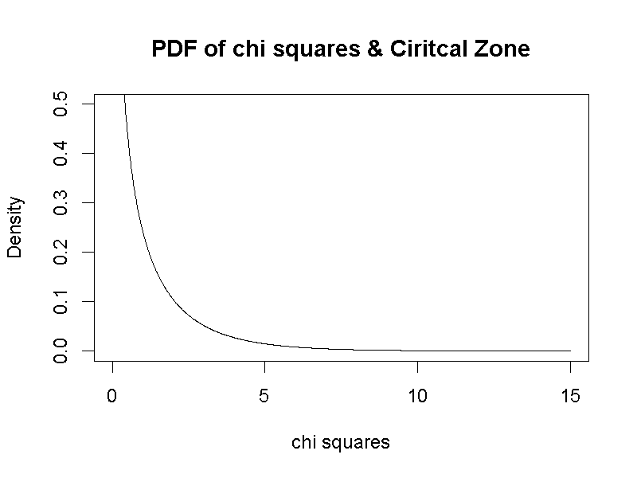

(\#fig:mcnemar-sampling)自由度為1的卡方機率密度函數曲線

[^8]:參考網址：https://statkat.com/stattest.php?t=39

**卡方分佈**是一種無方向性的機率分佈，統計值的計數限定由小往大計算，不像前面學到的常態分佈，可由小往大計算，也可由大往小計算，這種特性限制McNemar氏檢定只能設定虛無假設是b等於c，對比對立假設是b不等於c的假設檢定。許多統計教材稱此設定為雙側檢定或雙尾檢定(two-tail test)，如此命名是源於多數推論統計方法是根據如同常態分佈的對稱型機率分佈，稍後的相依樣本t檢定，我們將了解如何根據研究問題的性質，決定假設檢定的方向性設定。

jamovi提供的McNemar氏檢定模組，能以上述統計值公式，計算卡方分數與p值，讓使用者判斷兩項數字之間的差異是否達到必須接受的水準。在[jamovi示範檔案](https://osf.io/q6epv/)裡，我們使用這個模組提供的$\chi^2$與$\chi^2 \ continuity\ correction$兩種計算模式，計算假設檢定的統計數與p值。後者輸出的卡方分數較前者小，但較為可信。這個案例的調查者，需在報告中如此呈現結論：

> 分析100位試閱民眾觀看廣告前後的認同意見調查，其中70位前後認同一致，5位觀看前不認同但觀看後認同，25位觀看前認同但觀看後不認同。以0.05做為顯著性水準，McNamer氏檢定顯示觀看廣告導致民眾不認同的傾向，明顯高於導致民眾認同的傾向：$\chi^2 (1) = 12.03, p < .001$。

### McNemar氏檢定的抽樣分佈 {#paired-categorical-chisquare}

讀者可參考[卡方機率分佈示範檔案](https://osf.io/68usk/)，了解自由度如何決定卡方機率分佈的形態，以及事件累積機率的計算。示範案例的顯著性水準是自由度為1的卡方機率分佈部分累積機率，如圖\@ref(fig:mcnemar-cv)所示，紅色區域覆蓋的卡方分數，換算的p值都小於0.05。之後的單元中，我們會認識什麼情況的案例，會運用自由度大於1的卡方分佈。

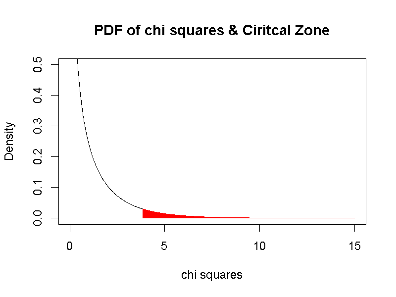

(\#fig:mcnemar-cv)自由度為1的卡方機率密度函數曲線及顯著水準累積機率

同樣要運用抽樣分佈的模擬資料，我們才能得到最接近的型一與型二錯誤率估計值。比起單一樣本統計檢定的狀況，相依樣本的例子有明確的對立假設期望值，製造的抽樣分佈可估計型二錯誤率。以3.8414588為判斷標準，可知型一錯誤率在5%以下，型二錯誤率約2%左右。圖\@ref(fig:mcnemar-error)是運用[jamovi示範檔案](https://osf.io/q6epv/)產生的模擬結果。

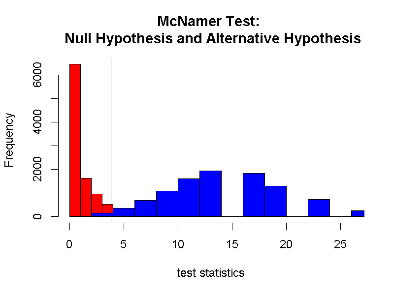

(\#fig:mcnemar-error)McNemar Test虛無與對立假設抽樣分佈模擬；黑色垂直線為型一與型二錯誤率判斷基準。

圖\@ref(fig:mcnemar-error)顯示無母數分析的特色：抽樣分佈不必然遵守中央極限定理成形。圖中的虛無與對立假設都相差常態分佈甚遠，儘管可以估計型一與型二錯誤率，卻難以整理錯誤率的變化與樣本數或樣本變異數之間的關係。

<!---
為了了解McNemar檢定的統計值為何符合自由度是1的卡方分佈，我們[jamovi示範檔案](https://osf.io/q6epv/)的報表最後一部分設計一道模擬程序示範解說。這道模擬程序首先根據範例條件，設定製造上萬次實驗結果的兩個參數：前後改變看法的人數(Target_N)，以及改變方向的比例(Switch_P)，分別依範例的設定設為30與0.5(代表改變方向的比例相等)。運用這兩個參數就能製造上萬筆與範例研究一樣的實驗結果，以及依檢定公式計算的統計數。上萬筆統計數的次數累積，形成如圖\@ref(fig:mcnemar-simulation)的柱狀圖。

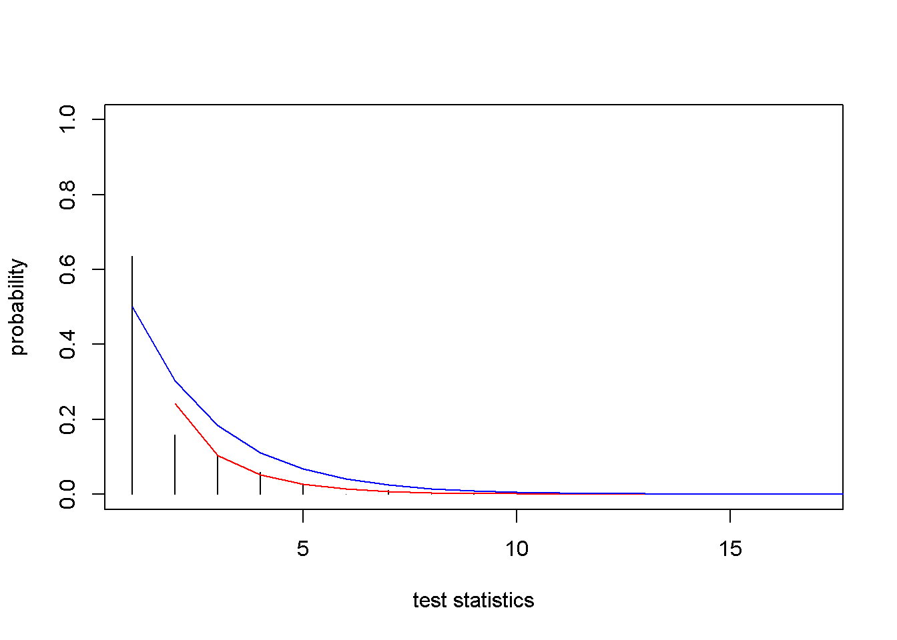

(\#fig:mcnemar-simulation)McNemar抽樣分佈機率函數(黑色柱狀圖);自由度為1的卡方分佈(紅色線條);自由度為2的卡方分佈(藍色線條)

圖\@ref(fig:mcnemar-simulation)也呈現自由度為1與自由度為2的卡方分佈，由圖的分佈可見，實驗結果的抽樣分佈似乎較符合自由度為1的卡方分佈。為何判定抽樣分佈比較接近那一道卡方分佈，我們可以計算每個統計數的機率值，與其他兩道曲線機率值的差異總和，總和越大代表這道抽樣分佈與該機率分佈的差異越大。由於密度值差異必定有正有負，合適的方法是將每個密度值差異平方，再計算總和。這種計算的成果在統計學叫做**差異平方和(Sum of Squared)**[^9]，雖然與計算變異數分子的方法類似，要注意後者是所有數值減同一個平均數。

[^9]:統計學以差異平方和決定那一種機率函數最符合資料的方法，稱為**最小平方法**。本書介紹的推論統計方法，都是以最小平方法的數學公式推導與資料模擬為基礎。

計算結果顯示圖中的抽樣分佈與自由度為1的卡方分佈之差異平方和是0.03，小於抽樣分佈與自由度為1的卡方分佈之差異平方和0.06[^10]。抽樣分佈與理論機率函數之間的差異平方和越小，表示運用該理論機率函數估計的機率越接近真實資料的發生機率。

[^10]:在自由度為1的卡方分佈，卡方量數之機率不可計數。此數未納入差異平方和的計算。
--->
## 連續變項的相依樣本推論統計 {#paired-continuous}

心理科學常見的資料型態之一，是以連續尺度測量的相依樣本資料，常見於人類基本心理歷程實驗，以及教學和臨床處遇。除了一種處置的前後測量，受測者在一段時間之內經歷不同處置的表現，也可以採用這種推論統計方法分析，這種測試設計稱為重覆量數(repated measurement)。

### 案例介紹 {#paired-continuous-case}

這裡使用來自 @mooreIntroductionPracticeStatistics2012 的示範資料，介紹相依樣本t檢定的使用條件與結果判讀方法。據普度大學兩位學者，紀錄十五名失智症(dementia)患者在一段長期觀察，出現破壞物品行為的次數。研究者認為有月亮的時候，患者出現破壞行為的次數比其他時候多，所以分在一段有月亮與沒有月亮的日期之間，紀錄每位患者出現破壞行為的平均次數。

每位患者的資料可見[JASP示範檔案](https://osf.io/rax3g/)與[jamovi示範檔案](https://osf.io/pfmkz/)。這個案例研究有月亮時出現破壞行為的平均次數，有沒有顯著高於其他時候的平均次數。所以抽樣分佈是所有患者兩個時候的次數差異之平均數，簡記為$\bar{D}$。如果研究者按步就班收集資料，$\bar{D}$的抽樣分佈必定是常態分佈，而來源的母群體的機率函數有多種可能，通常推測期望值等於當下資料的平均數。

### 樣本平均數的抽樣分佈與t分佈 {#paired-continuous-distribution}

19世紀末，數學家已經發現t分佈這種機率分佈，直到1908年，William Gosset發表論文指出t分佈符合重覆量數的平均數，形成的抽樣分配。t分佈是連續隨機變數，第一眼看起來像常態分佈，但是**t分佈的機率密度函數**只有一個參數*k*，也就是自由度(degree of freedom)

如同多數心理科學問題母群體函數不明，只有樣本平均值的特色。製造相依樣本的平均值抽樣分佈，**拔靴法**(參考單元\ref(onesample-bootstrap))同樣是最佳方案。我們以失智症患者出現破壞行為的紀錄，透過模擬程序，探討為何要使用t分佈檢定這筆資料的分析結果？以及相依樣本t檢定的自由度為何是n-1？使用拔靶法，從十五位個案紀錄製造10000筆隨機資料。每筆資料都有15對模擬數據，每對數據差異的平均值，累積為10000筆平均值抽樣分佈。

操作[jamovi示範檔案](https://osf.io/pfmkz/)的模擬程序，製造虛無假設抽樣分佈，每一對模擬數據都是來自沒有月亮的紀錄；以及對立假設抽樣分佈，每一對模擬數據其中之一來自有月亮的紀錄，另一個來自沒有月亮的紀錄。

圖\@ref(fig:paired-sample-means)是採取上設定的模擬結果。該圖顯示以t分佈的判斷水準(黑色垂直線)，估計的型二錯誤率小於以常態分佈設定的判斷水準(灰色垂直線)所估計的錯誤率。

<!---
我們再透過圖()比較t份佈與常態分佈。圖中藍色線代表t分佈機率密度函數的整體(上)與t值小於-2的部分(下)，黑色線代表平均數是1與標準差是0的常態分佈。調整最上面的**自由度**，會改變t分佈的函數曲線。你會發現自由度到29時，**兩個分佈的機率密度函數**幾乎重疊，這是有些統計教科書建議平均數樣本數目至少要30的理由。然而放大到通常被視為最大*p*值的一部分，還是有明顯的差異，**自由度要增加到50以上，差異的空間才會緊縮到沒有明顯變化的程度。**資料越符合常態分佈有明顯的好處，就是我們不必擔心統計軟體算出來的*p*值，與實際的累積機率函數有明顯差異。

首先設定有月亮與其他日期出現破壞行為次數的母群體機率函數，以兩段時間紀錄的平均值與樣本標準差，我們設定每位患者破壞行為次數是**均勻分佈**的隨機變數，分佈涵括的所有次數值發生的機率都相等，最小的發生次數是平均值減1.67倍樣本標準差，最大的發生次數是平均值加1.67倍樣本標準差。如圖\@ref(fig:paired-continuous-populations)所示。
--->

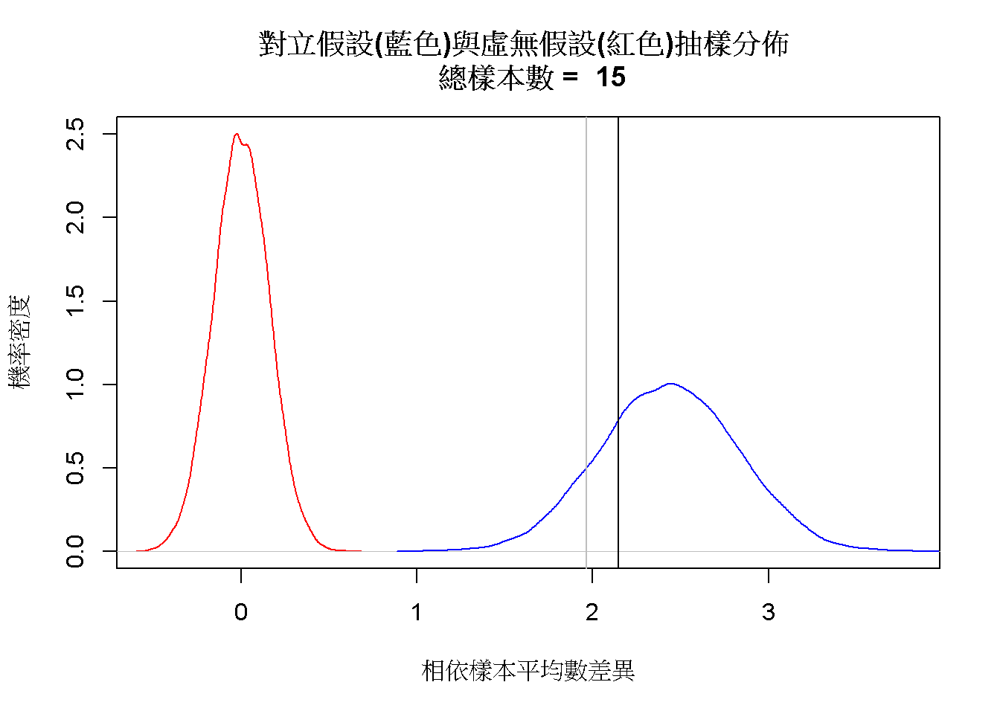

(\#fig:paired-sample-means)樣本差異分數平均數的抽樣分佈

構成對立假設抽樣分佈的模擬平均值差異，是相依樣本統計檢定需要的差異分數($\bar{D}$)，一次結果的差異分數要輸入以下公式，才能運用最符合抽樣分佈的機率函數計算p值。

$$\frac{\bar{D} - \mu_\bar{D}}{\frac{s_\bar{D}}{\sqrt{N}}}$$

公式中的N等同樣本數，s是平均值差異的樣本標準差，$\mu_\bar{D}$在相依樣本的例子等於無差異。將虛無假設的模擬數據運用公式轉換，可得到如圖\@ref(fig:paired-sample-stat)的機率分佈。比較t分佈設定的判斷水準(黑色垂直線)，與常態分佈設定的判斷水準(灰色垂直線)，可見以t分佈估計的型一錯誤率小於常態分佈的估計。對比兩者估計型二錯誤率的反差，代表判定研究結果支持存在有月亮出現破壞行為的論點，以t分佈結論而犯錯的機會將小於以常態分佈結論而犯錯的機會。

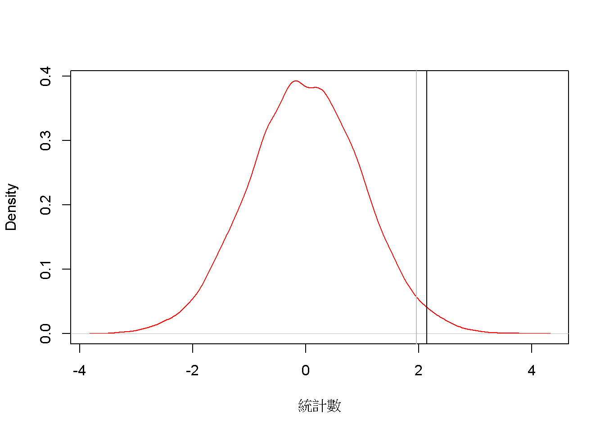

(\#fig:paired-sample-stat)樣本差異分數平均數的統計數機率分佈

<!---
如果案例的條件，分別從兩道機率函數隨機取得15個數值，依取出順序相減，獲得15筆差異分數D，平均值即為$\bar{D}$。依此方式模擬出10000筆$\bar{D}$，就是這個案例的抽樣分佈：樣本差異分數平均數的機率分佈，如圖\@ref(fig:paired-continuous-sampling)所示，其平均數正是兩個母群體期望值的差異。請讀者記住這個抽樣分佈的變異數，稍後會發現相當接近真實資料的**標準誤(standard error)**。

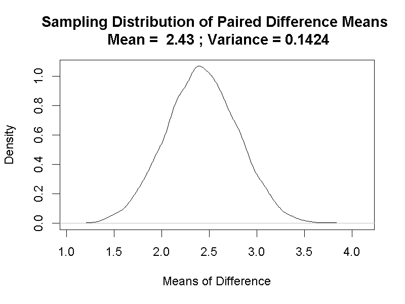

(\#fig:paired-continuous-sampling)樣本差異分數平均數的抽樣分佈

將10000筆模擬的差異分數平均數，繪製成分位圖(見圖\@ref(fig:paired-continous-sampling-qq))，可知這個抽樣分佈符合常態分佈。

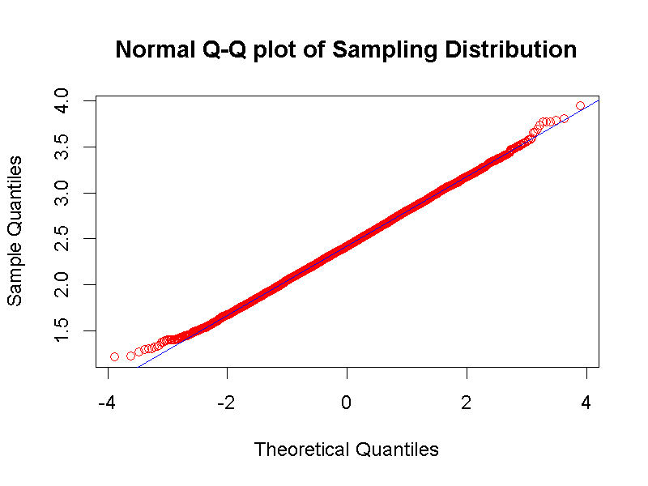

(\#fig:paired-continuous-sampling-qq)樣本差異分數平均數的抽樣分佈分位圖

至此出現一個問題：樣本差異分數平均數的抽樣分佈符合常態分佈，為什麼我們要使用t分佈，而不是使用常態分佈進行假設檢定？要回答的個問題，我們可以將每一筆模擬的差異分數平均數標準化，也就是每個差異分數減去抽樣分佈的平均數，再除以其標準差，所有標準化的差異分數平均數就會形成以0為中心點的對稱分佈，如圖\@ref(fig:paired-continuous-sampling-dist)的黑色曲線，與標準常態分佈(紅色曲線)，以及自由度是14的t分佈(藍色曲線)放在一起比較。

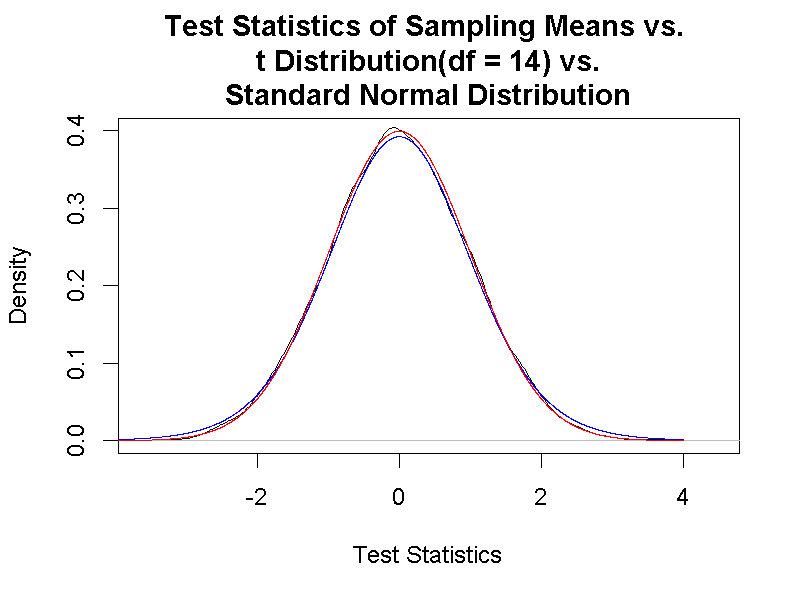

(\#fig:paired-continuous-sampling-dist)樣本差異分數平均數標準化分數 vs. 標準化常態分佈 vs. t分佈

這三道曲線的重疊部分相當多，所以我們無法直接從視覺化成品看出差異分數平均數的抽樣分佈到底接近那一個分佈。因為我們有繪製圖\@ref(fig:paired-continuous-sampling-dist)的抽樣分佈、標準化常態分佈、以及t分佈等三種曲線的密度值(Density)，只要計算兩群密度值之間的**差異平方和(Sum of Squared)**，就能知道抽樣分佈最接近那一個機率函數。

計算結果可參考[jamovi示範檔案](https://osf.io/pfmkz/)報表最後兩行，讀者會發現無論重覆執行幾次，標準化的樣本差異分數平均數之密度值與t分佈密度值的差異平方和，都是小於與標準常態分佈密度值的差異平方和。這項模擬結果證實為何我們應該使用t分佈進行相依樣本的推論統計，也說明樣本差異分數平均數的機率分佈函數參數，為何存在於t統計值公式：

$$t\ statistic= \frac{\bar{D} - \mu_{\bar{D}}}{\frac{s_{\bar{D}}}{\sqrt n}}$$
--->

抽樣分佈的標準差，也就是**樣本標準誤**，可用於計算信賴區間：

$$CI = \bar{D} \pm t_{critical} \times \frac{s_{\bar{D}}}{\sqrt{n}} $$

由於示範案例的差異分數平均值，超過虛無假設的期望值約六個標準差，造成模擬的信賴區間沒有一項包容虛無假設的期望值。如果這次研究的資料可被再現，能肯定有月亮的日子這類患者有很高的機會出現破壞行為。

最後的問題是為何是自由度為14的t分佈最符合抽樣分佈，而不是自由度為15的t分佈？這個問題可以從理解拔靴法的步驟解答：第一步設定初始樣本數值後，這群數值可總結一個平均值。未知母群體期望值時，以此平均值當做母群體的期望值，是最合理的假設。所以相依樣本的自由度是n - 1，n是資料的樣本數，1代表要估計的母群體期望值。

### 相依樣本t檢定  {#paired-continuous-t}

JASP與jamovi的相依樣本t檢定操作界面，與單一樣本平均數t檢定幾乎一致，除了沒有Test Value選項。因為運用相依樣本分析的主要目的，是確認差異分數平均值是不是存在。以下透過15位病患紀錄，說明如何設定[JASP示範檔案](https://osf.io/35nk8/)與[jamovi示範檔案](https://osf.io/pfmkz/)的相依t檢定程序，以及解讀和呈現分析結果。示範使用雙尾檢定與單尾檢定的時機，與報告的呈現方式。

- 雙尾檢定

我們想知道兩種時機病患出現破壞行為次數，到底有沒有差異？無論這個差異是多或是少，這時就可以使用雙尾檢定。雙尾檢定的對立假設是$\mu_{\bar{D}} \neq 0$，也就是兩種時機的平均次數不相等，`JASP`與`jamovi`的相依樣本t檢定模組(Paired Samples T-Test)設定視窗中，**Hypothesis**這一塊都是選擇 $ Measure 1 \neq Measure 2 $ ，模組才會執行雙尾檢定。如果雙尾檢定的判斷水準是p值要小於.05，肯定對立假設的t統計值有正也有負，如圖\@ref(fig:paired-two-tails-t)，對應曲線之下無著色區域的t值。

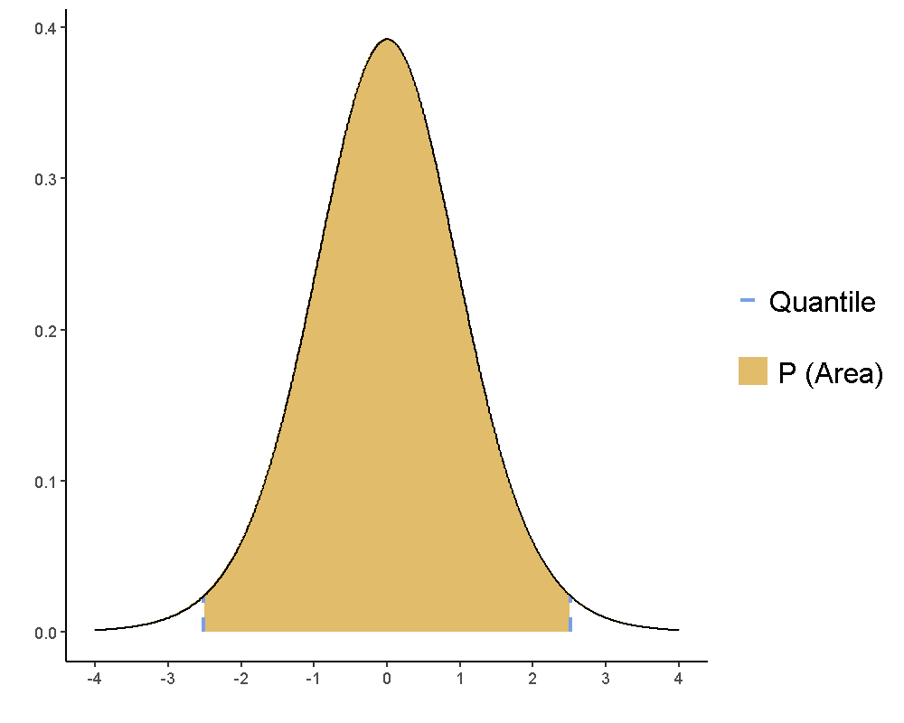

(\#fig:paired-two-tails-t)相依樣本t檢定之雙尾檢定：肯定對立假設的t統計數範圍

JASP與jamovi示範檔案的報表設定呈現t統計值(JASP:`t`;jamovi:`	statistic`)、自由度(`df`)、p值(`p`)、還有差異分數平均值(`Mean Difference`)，以及差異分數的標準誤(`SE Difference`)。請讀者注意此標準誤數值，相當接近圖\@ref(fig:paired-continuous-sampling)的抽樣分佈變異數的開根號。

勾選`Confidence interval`並設定估計百分比95%，報表會增加95%信賴區間的結果(JASP:`95% CI for Mean Difference`;jamovi:`	95% Confidence Interval`)。請注意這個信賴區間不包含0，與假設檢定的結果一致。增加勾選`Effect Size`，報表會增加這筆資料的效果量(`Cohen's d `)。效果量的意義在這個單元的最後部分介紹。

根據美國心理學會報告格式指南，一筆推論統計的報告要搭配文字說明，呈現報表內的數值。報告這則案例雙尾檢定結果，寫作示範如下：

> 15位病患在有月亮時出現破壞行為的平均次數，比其他時間的平均次數多2.43次(有月亮：M = 3.02, SD = 1.50；沒月亮：M = 0.59, SD = 0.46， 95% CI [1.624 3.241])，達到預期的統計顯著水準，*t*(14) = 6.45, *p* < .001, *d* = 1.67。

- 單尾檢定

現在換個角度探討這個案例：我們想知道有月亮時出現破壞行為次數，有沒有明顯比其他時候多？或者沒有月亮時出現破壞行為次數，有沒有明顯比有月亮時少？這兩個問題對應的對立假設，就變成 $\mu_{\bar{D}} > 0$ 與 $\mu_{\bar{D}} < 0$ 。在`JASP`與`jamovi`的設定視窗，分別選擇 $Measure 1 > Measure 2$ 以及 $Measure 1 < Measure 2$，就能執行相對的單尾檢定。

如果判斷水準是p值要小於.05，肯定對立假設：有月亮時出現破壞行為次數，比其他時候多的t統計值必為正數，如圖\@ref(fig:paired-one-tail-t)，右圖曲線之下有著色區域的t值；肯定對立假設：無月亮時出現破壞行為次數，比有月亮時少的t統計值必為負數，如圖\@ref(fig:paired-one-tail-t)，左圖曲線之下有著色區域的t值。

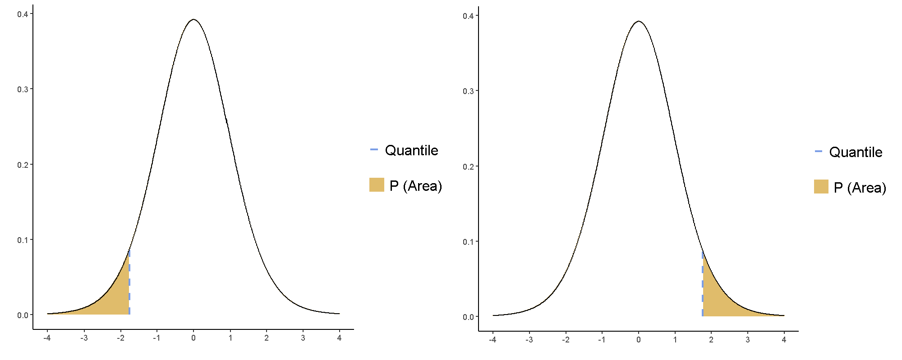

(\#fig:paired-one-tail-t)相依樣本t檢定之單尾檢定：肯定對立假設的t統計數範圍

勾選`Confidence interval`以及`Effect Size`，，除了t統計值、自由度、p值、還有差異分數平均值，以及差異分數的標準誤，報表會增加這筆資料的信賴區間與效果量。請留意單尾檢定的信賴區間只會呈現其中一邊的數值，另一邊為正無限大或負無限大。如果分析結果是否定這個案例的對立假設，信賴區間必定包括0。效果量因差異分數的計算方式，會為正數或負數，但是其絕對值必定相等。

## 效果量、樣本數與考驗力 {#paired-power}

最後以本單元相依樣本t檢定的案例，討論效果量、樣本數與考驗力的關係。[JASP示範檔案](https://osf.io/35nk8/)與[jamovi示範檔案](https://osf.io/pfmkz/)的報表呈現的效果量，都是Cohen's d，計算公式是：

$$d = \frac{\bar{D} - \mu_{\bar{D}}}{s_{\bar{D}}}$$

這個公式與t統計數的公式的差異只有分母的樣本標準差，這說明效果量是特指每一次測量結果的標準化數值。即使使用相同的實驗程序，數量相同的樣本，每一次測量的變異數都不會一樣，每次結果以此公式轉換為效果量，才有比較的意義[^11]。

[^11]:效果量是整合性分析(meta analysis)的基本分析單元，比較相同程序但不同來源的實驗結果，能讓研究者了解進行一次實驗發現顯著效果的可能性。

考驗力是型二錯誤率的補集，顯示以當前的判斷水準，能發現顯著結果的機率。和型一錯誤率一樣，要累積多次實驗，我們才能知道某種測量的顯著效應。理想的顯著分析結果，需要事前有足夠資訊，確保研究結果能有起碼的機會被重現。心理科學研究的統計考驗力，一般建議至少要達到0.8或80%。

樣本數大小直接影響考驗力高低，多少樣本才能維持建議的考驗力，則受到效果量的調節。以本單元相依樣本的案例來說，維持雙尾檢定的顯著結果判斷水準不變，再次實驗要得到相同效果量並維持於80%考驗力，需要收集至少6位病患的紀錄。圖\@ref(fig:paired-power)是使用`jamovi`的jpower套件，設定以上述的分析條件，畫出樣本數與效果量在80%考驗力的對應曲線。這條曲線顯示，效果量越小的話，需要越多樣本，才能保障達到該效果量的結果，有達到足夠的考驗力。讀者可下載產製圖\@ref(fig:paired-power)的[jamovi示範檔案](https://osf.io/fb534/)，檢視其他導到相依樣本t檢定考驗力變化的條件。

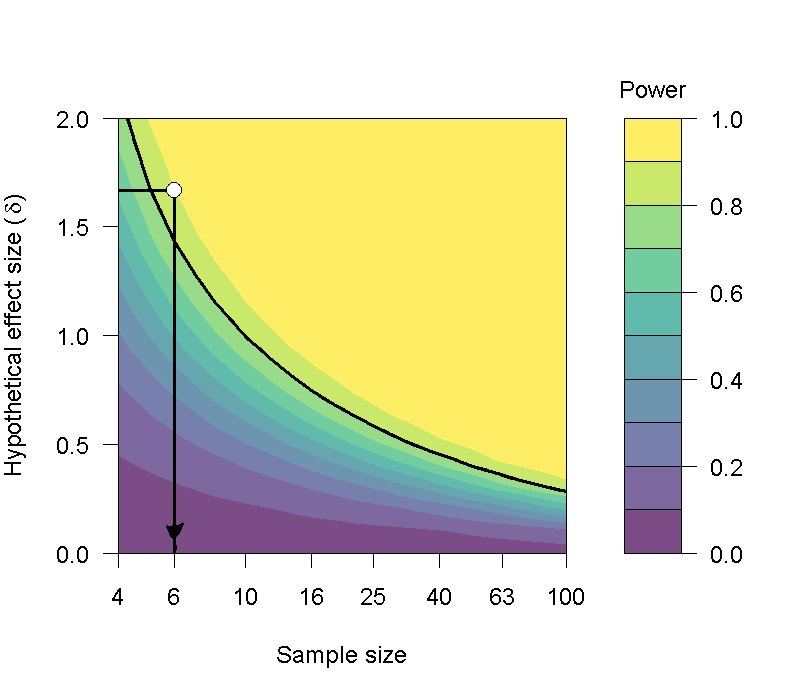

(\#fig:paired-power)達到指定考驗力之相依樣本t檢定效果量，所需要的樣本數分析。

極少有心理科學的研究題目只需要個位數樣本，就有顯著結果且考驗力至少80%的研究。過去有許多研究者只追求結果顯著與否，忽略考驗力未達建議標準，樣本還未收集到能保障建議考驗力的數量，卻因為已發現顯著結果，就停止實驗並發表。最近十年許多原本被認為具有啟發性的研究結果，再次檢視後發現都是低考驗力的顯著結果，其他研究者難以重現如同原始研究的顯著結果[例如 @camererEvaluatingReplicabilitySocial2018; @kleinManyLabsInvestigating2018]。因此有學者建議，學習統計的目標應該以能確保研究結果的可再現性為重點，而不是製造能吸引注意的顯著發現[@pengReproducibilityCrisisScience2015]。

## 總結 {#paired-summary}

- 通常使用相依樣本分析的目的，是要確認重覆量數測得的差異分數是否存在。
- McNemar檢定顯現無母數統計的特色：隨機變數平均值的抽樣分佈不保證遵守中央極限定理，形成常態分佈。
- 無法確定母群體機率函數時，使用t分佈進行母數統計推論，雖有較高的型二錯誤率，但有較保守的型一錯誤率。
- 研究任務在於確認目標現象的差異分數，效果量是必須呈現的資訊，同時是評估研究設計應收集多少樣本的指標。

## 習題 {#paired-practice} 

- TBA

