# 獨立樣本的推論統計 {#independent}

行為與社會科學研究許多種變項是比較背景接近的兩群人士，在兩種不同情境狀況的行為表現。若研究者使用連續尺度收集資料，適用的資料分析方法就是獨立樣本t檢定。這個單元將介紹無母數統計的獨立性檢定，以及母數統計的獨立樣本t檢定。

## 無母數：獨立性檢定 {#independent-chisquare}

這裡示範的獨立性檢定也是運用卡方分佈，判斷研究結果有沒有符合預期。不同於單元\@ref(paired-categorical)介紹的McNemar氏檢定，獨立樣本的卡方檢定比較兩群參與者做出某種反應的比例是否相同，所以統計數的計算原則相同，只是要處理的資料來源較多。以下先介紹示範案例，再說明獨立性檢定的統計數為何較符合自由度為1的卡方分佈，以及示範分析程序。

### 案例介紹 {#independent-chisquare-case}

Rogers與Milkman[-@RogersRemindersAssociation2016]發表增加一般大眾使用折價卷行為的研究，其中一項網路實驗請受測者填寫一件問卷，最後有一個額外酬賞題，如果受測者記得回答，就能領到額外賞金。這項實驗比較問卷最後告知有此酬賞的提示，以及完全沒有給予提示的受測者，記得回答酬賞題的人數。

透過這個示範案例[JASP示範檔案](https://osf.io/rfsjc/)，我們可以計算有提示的受測者(No cue)與沒有提示的受測者(Have cue)的總人數，
以及每群有回答(respond)或未回答(miss)酬賞題的人數， 整理如表\@ref(tab:contigency-data)。

Table: (\#tab:contigency-data)Rogers與Milkman(2016)的示範資料。

          無提示   有提示
-------  -------  -------
未回答        63       20
有回答        90      132
總人數       153      152

### 獨立性檢定示範 {#independent-chisquare-test}

表\@ref(tab:contigency-data)的格式有個專有名詞：**列聯表**。欄位名稱都是放置關鍵獨變項的分組名稱，列名稱是各分組內間斷尺度數值的出現次數。將原始資料轉換成列聯表，目的是分析分組間的次數比例是否相同。所以進行這項研究的分析之前，可如此宣告判斷水準：

> 如果有提示的受測者點開酬賞題的人數明顯不同於沒提示的受測者，獨立性考驗應該出現小於.05的*p*值，否則*p*值應該大於.05。

圖\@ref(fig:independence-operation)是開啟JASP的`Frequencies`模組的`Contingency Tables`操作選單畫面，請留意`Columns`最好放置關鍵的獨變項欄位。圖\@ref(fig:independence-result)的輸出報表上方表格就是列聯表，一般報告顯示各細格實際次數與百分比，這裡為了讓你比對獨立性考驗與適合度考驗的不同，將期望次數一併呈現。

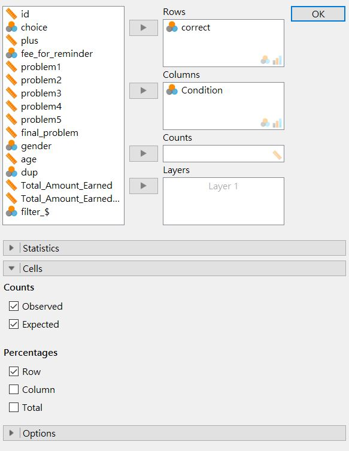

(\#fig:independence-operation)卡方檢定獨立性考驗操作設定示範。

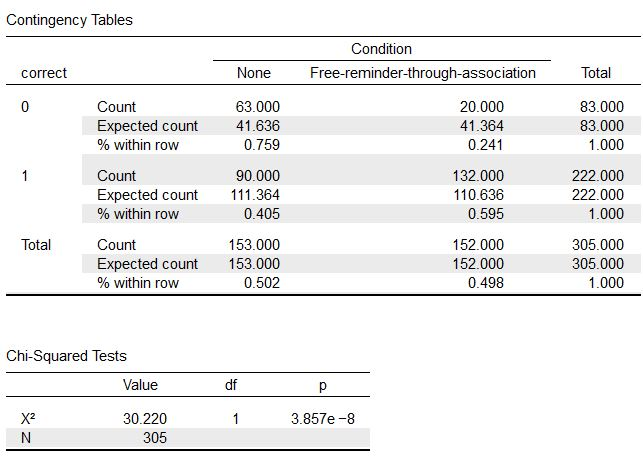

(\#fig:independence-result)卡方檢定獨立性考驗報表示範。

圖\@ref(fig:independence-result)的下方表格是輔助報告的統計資訊，請留意與多了一個總人數(N)的資訊，示範報告寫作如下：

> 給予提示確實提高受測者點開酬賞題的行為，$\chi^2$ (1, N = 305) = 30.220, *p* < .01。

### 獨立性檢定的抽樣分佈 {#independent-chisquare-sampling}

我們在[jamovi示範檔案](https://osf.io/v4upr/)設計抽樣分佈的模擬程序，了解為何獨立性檢定的統計數最符合自由度為1的卡方分佈。獨立性檢定的抽樣分佈來自兩群受試者，各自有參與人數(Nocue_N,Havecue_N)，與做出其中一種反應的比例(Miss,Respond)。為了便於說明，這個程序設定兩群人數都是150人，各組會做出其中一種反應的比例如圖\@ref(fig:independence-result)的細格期望百分比。如此每一輪模擬製造的隨機數字，代表每一群做出各種回答的人數。這些隨機數字輸入以下公式，就能得到樣本的統計數。公式中i與j分別代表受試者群與反應種類，$n_{ij}$與$p_{ij}$分別對應初始設定的各群人數，以及做出某種回答的比例，$r_{ij}$是模擬程序製造的模擬數字。

$$\chi^2 = \sum_i \sum_j \frac{(r_{ij}-n_{ij}p_{ij})^2}{n_{ij}p_{ij}}$$

同單元\@ref(paired-categorical-chisquare)，我們可以製造上萬筆實驗結果的統計數，繪製如圖\@ref(fig:chi-independent-simulation)的機率函數圖。

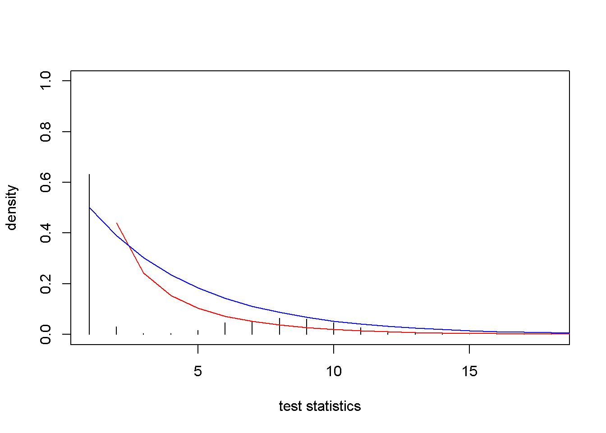

(\#fig:chi-independent-simulation)獨立性檢定抽樣分佈(黑色柱狀圖);自由度為1的卡方分佈(紅色線條);自由度為2的卡方分佈(藍色線條)

計算差異平方和，會發現抽樣分佈與自由度為1的卡方分佈之差異(0.022)，小於抽樣分佈與自由度為2的卡方分佈之差異(0.051)。我們可以將上述公式改寫為以下形式，其中O代表各細格實際次數，E代表各細格期望次數：

$$\chi^2 = \sum_i \sum_j \frac{(O_{ij}-E_{ij})^2}{E_{ij}}$$

## 獨立樣本t檢定 {#independent-t}

獨立樣本t檢定是行為科學研究最常見的分析方法，也是本書第一個要模擬兩個抽樣分佈進行解說的方法。因為兩個樣本分別來自不同的樣本分佈，一般統計教材使用獨立樣本t檢定介紹效果量與考驗力，但是少有教材運用模擬程序解析其中的關係。我們將延續單元\@ref(paired-power)的課題，探討樣本數、效果量與考驗力的關係。

### 案例介紹 {#independent-t-case}

這裡採用JASP開發團隊執行長Wagenmakers與同事們[-@wagenmakersTurningHandsTime2015]嘗試再現德國社會心理學者Topolinski與Sparenberg[-@TopolinskiTurningHandsTime2012]的體現認知實驗，公開資料做為獨立樣本t檢定的示範。Topolinski與Sparenberg的實驗是請參與者來實驗室進行12題開放態度量表，題目內容像是「我經常嘗試新奇的外國食物」。參與者以五點量表表達自己對題目主題的開放程度（-2:非常不同意；2:非常同意）。實驗室環境安排如圖\@ref(fig:roll-setting)，102位參與者答題時要依指示捲動面前的衛生紙捲，其中48位以順時針方向轉動(clockwise)，另外54位以逆時針方向轉動(counter-clockwise)。

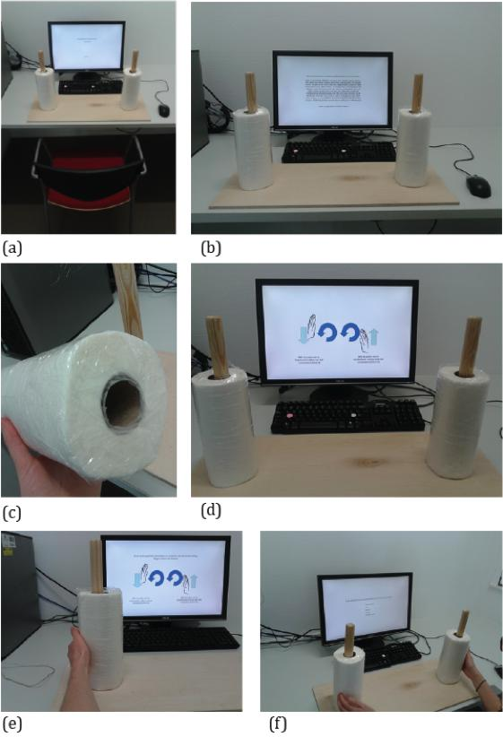

(\#fig:roll-setting)Wagenmakers等人(2017)再現Topolinski與Sparenberg(2012)體現認知實驗的現場設置。

Topolinski與Sparenberg的假設是大多數可轉動的工具開啟方向都是順時針，順時針捲動衛生紙卷的參與者，回答開放態度量表的問題，給的評分應該比逆時針捲動的參與者高。原始研究確實發現顯著較高分的結果，再現研究結果則存放於JASP的示範資料集`Kitchen Rolls`。

Wagenmakers決定執行研究之前，只有Topolinski與Sparenberg發表的結果，無法確定這次結果會不會一樣，因此適合以母群平均數尚待確認的立場，設定判斷水準。兩組平均數經過假設檢定與信賴區間的分析，可能的結果會是：

> 如果捲動衛生紙捲的方向會影響參與者的開放態度，兩組平均數的差異雙尾t檢定應該出現小於.05的*p*值，而且95%信賴區間不會包括0。

至於兩組變異數，我們當然期望是一致的。獨立組設計也預先假設兩組資料彼此獨立，抽樣分配都符合常態分佈。在執行獨立樣本t檢定之前，會檢測這筆資料有沒有違反**變異等量假設**與**常態分佈假設**的分析標準。包括`JASP`與`jamovi`的多數統計軟體，獨立樣本t檢定都有檢測**變異等量**與**常態分佈**的選項，我們可以運用假設檢定的作業原則，設定分析資料未違反兩種假設的判斷水準：

> (1)如果兩組資料符合**變異等量假設**，Levene檢驗的*p*值應該大於.05。(2)如果兩組資料符合**常態分佈假設**，Shapiro-Wilk檢驗的*p*值應該大於.05。如果任何一項出現小於.05的*p*值，必須在報告中討論。

獨立組比較研究通常希望收集的資料各組樣本數目相同，但是通常不能盡如人意。獨立組t檢定有樣本數不相等的版本，如果資料違反變異等量的假設，就該使用不相等的版本。`JASP`與`jamovi`設定選項中的`Welch`，就是可執行此版本的t檢定的選項。

### 獨立樣本平均數的抽樣分佈 {#independent-sample}

比照單元\@ref(paired-continuous-distribution)，我們設計獨立樣本平均數t檢定的模擬程序，解說為何假設檢定的統計值與計算信賴區間，應該採用t分數而非z分數。模擬程序原始碼可參考[jamovi示範檔案](https://osf.io/spn64/)。

首先設定母群體機率函數，除了兩組參與者評分的平均數(`counter_mean`與`clock_mean`)與樣本標準差(`counter_sd`與`clock_sd`)，再加上兩組人數(`counter_n`與`clock_n`)。以這些參數設定每位參與者的評分平均數是**均勻分佈**的隨機變數，分佈涵括的所有數值的發生機率都相等。逆時針組的最小的發生次數是平均數減1.75倍樣本標準差，最大的發生次數是平均數加1.75倍樣本標準差。順時針組的最小的發生次數是平均數減1.85倍樣本標準差，最大的發生次數是平均數加1.85倍樣本標準差。如圖\@ref(fig:independent-continuous-populations)所示。

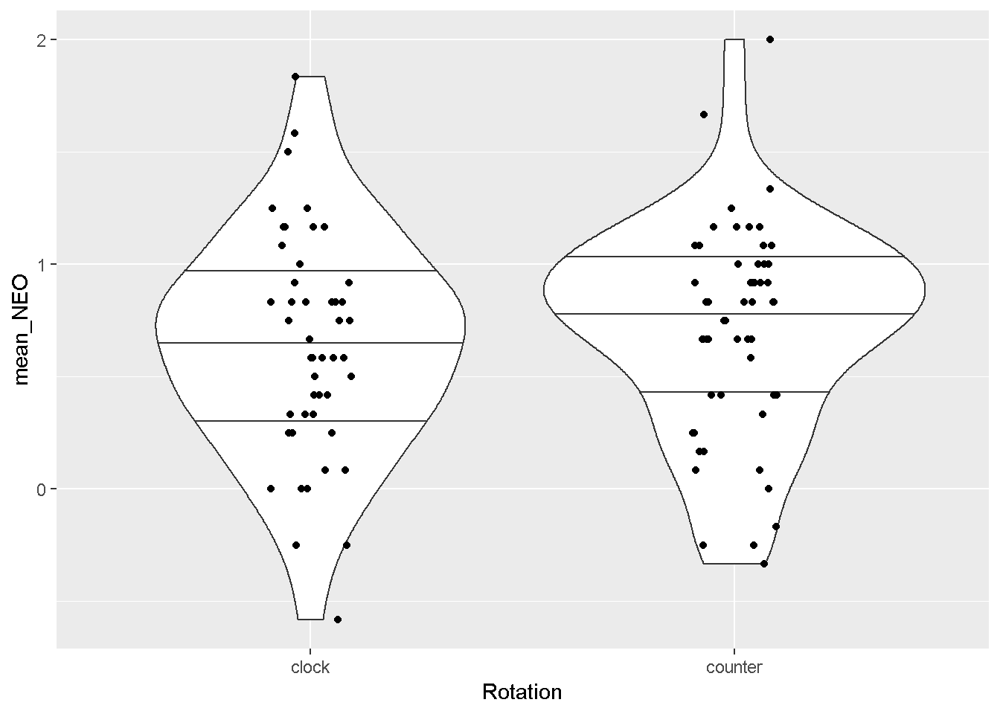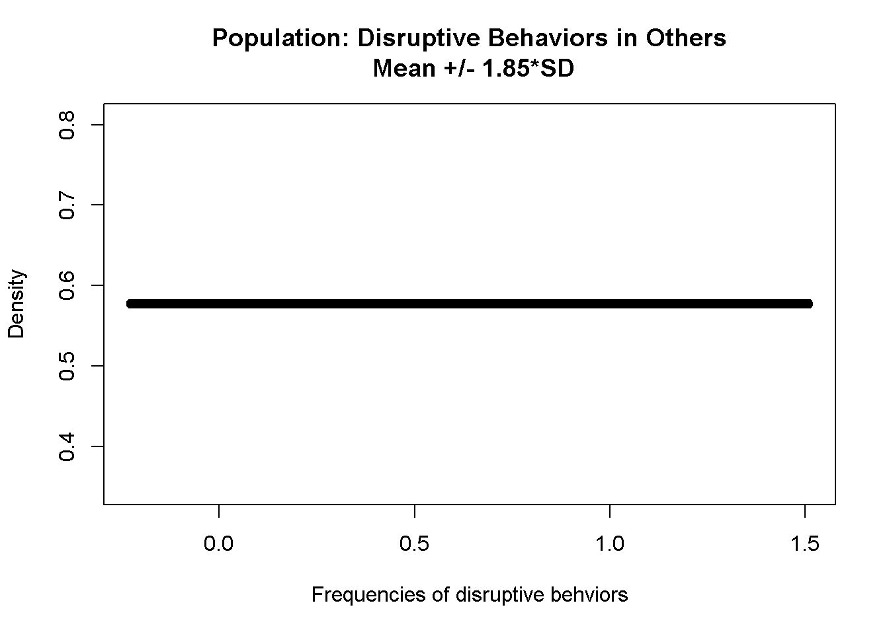

(\#fig:independent-continuous-populations)獨立樣本t檢定母群體機率函數

兩種母群體機率函數分別製造10000筆模擬平均數，依序相減形成$\bar{y_1}-\bar{y_2}$的抽樣分佈，如圖\@ref(fig:independent-continuous-sampling)所示，此抽樣分佈的平均數與變異數接近真實資料的統計值，該變異數亦接近於兩群抽樣分佈的**合併變異數(pooled variance)**所換算的估計標準誤。

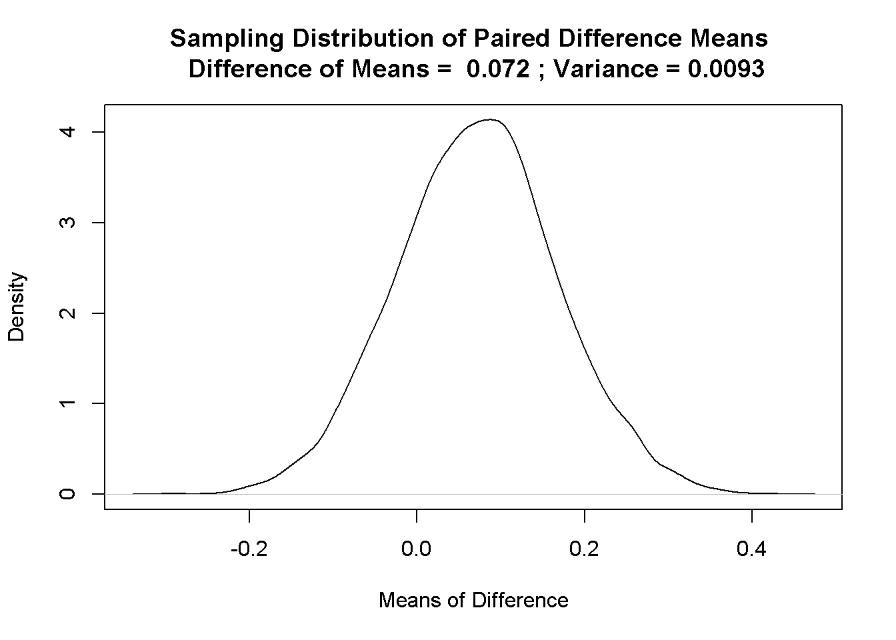

(\#fig:independent-continuous-sampling)兩組樣本平均數差異值的抽樣分佈

分位圖(圖\@ref(fig:independent-continuous-sampling-qq))亦顯示此抽樣分佈與常態分佈一致。

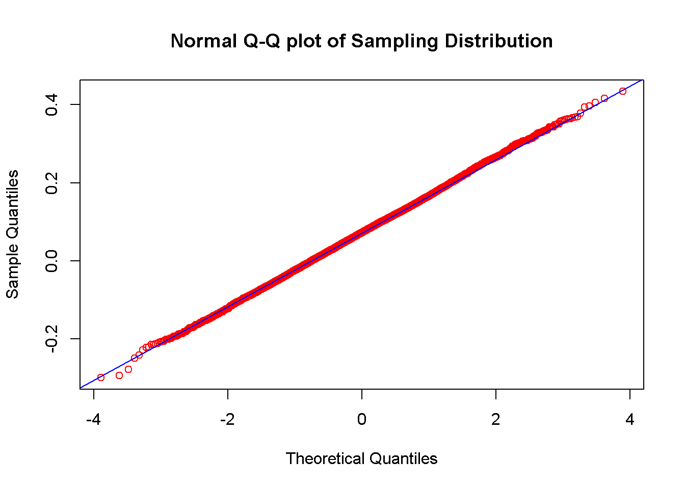

(\#fig:independent-continuous-sampling-qq)兩組樣本平均數差異值的抽樣分佈分位圖

將構成抽樣分佈的所有$\bar{y_1}-\bar{y_2}$轉換為標準分數，就能形成如圖\@ref(fig:independent-continuous-sampling-dist)的黑色曲線，此曲線與自由度是100的t分佈(藍色曲線)，以及常態分佈(紅色曲線)高度重疊。

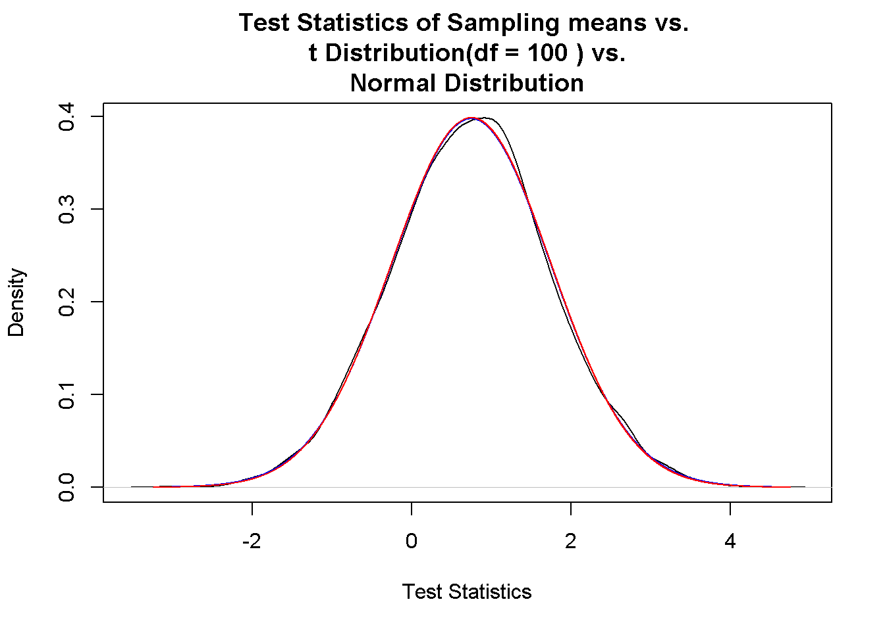

(\#fig:independent-continuous-sampling-dist)兩組樣本平均數差異值的標準化分數 vs. 常態分佈 vs. t分佈

計算曲線之間的**差異平方和**，可發現兩組樣本平均數差異值的標準化分數與t分佈的差異158.44，小於與常態分佈的差異159.33。

### 示範檔案操作與解讀 {#independent-t-example}

開啟[JASP示範檔案](https://osf.io/kw6vy/)，點擊報表你會看到`T-Tests`的`Independent Samples T-Test`功能選單。圖\@ref(fig:JASP-independent-t-operation)是根據分析前宣告，勾選與調整的信賴水準。

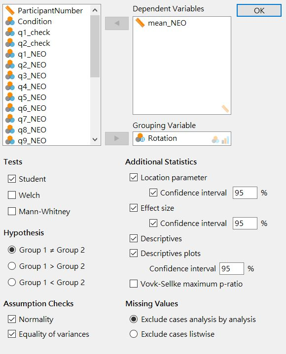

(\#fig:JASP-independent-t-operation)JASP獨立樣本雙尾t檢定分析操作設定示範。

接著從圖\@ref(fig:JASP-independent-t-result)來看如何從報表擷取要報告的資訊。最上面表格裡的t檢定與信賴區間資料，可比照前面的案例擷取符合報告格式的資訊，以分析前宣告的標準，這項研究並沒有發現顯著差異。中間是**變異等量假設**與**常態分佈假設**的檢定結果，根據分析前宣告的標準，兩者都符合假設。最後的描述統計表格，都是在報告中與t檢定統計資訊放置於文字呈現。

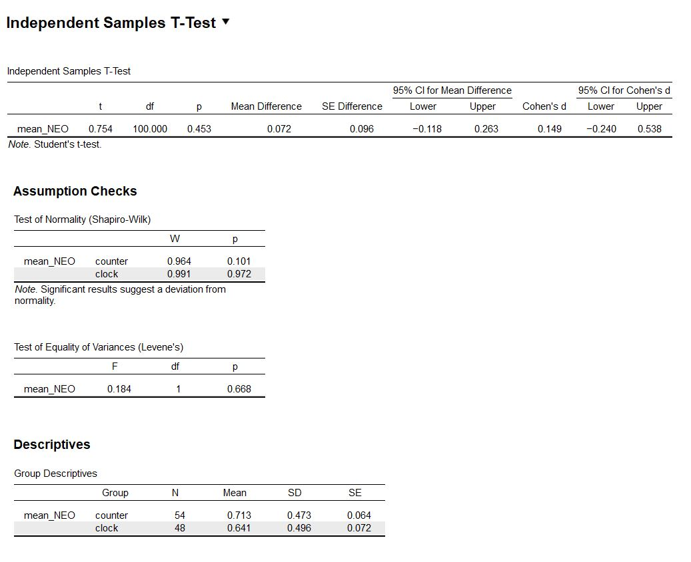

(\#fig:JASP-independent-t-result)JASP獨立樣本雙尾t檢定報表示範。

這次實驗沒有發現顯著差異，如果是傳統的教學或研究習慣，會簡略報告。但是因為有預先宣告，報告約定要呈現的資訊，才是負責的研究態度。報告寫作範例如下：

順時針捲動的平均評分比逆時針捲動的平均評分高0.072分(順時針：M = 0.641, SD = 0.496；無關聯：M = 0.713, SD = 0.473， 95% CI [-0.118 0.263])，並未達到事先宣告的統計顯著水準，*t*(100) = 0.754, *p* = .453, *d* = 0.149。

因為事前宣告已言明如果通過檢驗標準，就沒有違反**變異等量假設**與**常態分佈假設**的問題，在報告中就沒有呈現的必要。

## 研究設計與統計考驗力 {#independent-design}

Wagenmakers等人的再現研究雖然沒有發現顯著結果，但是給我們一個機會探討效果量較小的研究，要如何改進，才能確保能發現顯著差異，又有起碼80%的考驗力。再度開啟考驗力分析的[jamovi示範檔案](https://osf.io/fb534/)，第二份jPower報表`Independent Samples T-Test`顯示如果效果量只有0.149的兩組獨立樣本研究，要得p值通過.05判斷水準，且有80%考驗力的顯著結果，`Kitchen Roll`的兩群參與者人數需要各有至少709人，總共1418人。以圖\@ref(fig:indpendent-power)的曲線推測，除非這項實驗可測得的效果量能增加，或者降低其望達到的考驗力水準，才能減少參與者的人數。但是降低考驗力水準是本書建議讀者不該採取的策略，即使能得到通過.05判斷水準的p值，實驗結果也不容易再次重現。

(\#fig:independent-power)達到指定考驗力之獨立樣本t檢定效果量，所需要的樣本數分析。

如果`Kitchen Roll`可以改成重覆量數設計，收集相依樣本的資料。結果依然測得效果量是0.149，同樣採用雙尾檢定與.05判斷水準進行相依樣本t檢定，`jPower`的估計顯示需要356人，就能確保顯著結果有80%的考驗力，如圖\@ref(fig:paired2-power)所示。讀者可透過作業問題的引導，比較兩種設計的考驗力分析，了解為何較難再現的心理科學研究，多數是獨立組設計的研究領域。

(\#fig:paired2-power)達到指定考驗力之相依樣本t檢定效果量，所需要的樣本數分析。

## 總結 {#independent-summary}

- TBA

## 習題 {#independent-practice} 

- TBA

