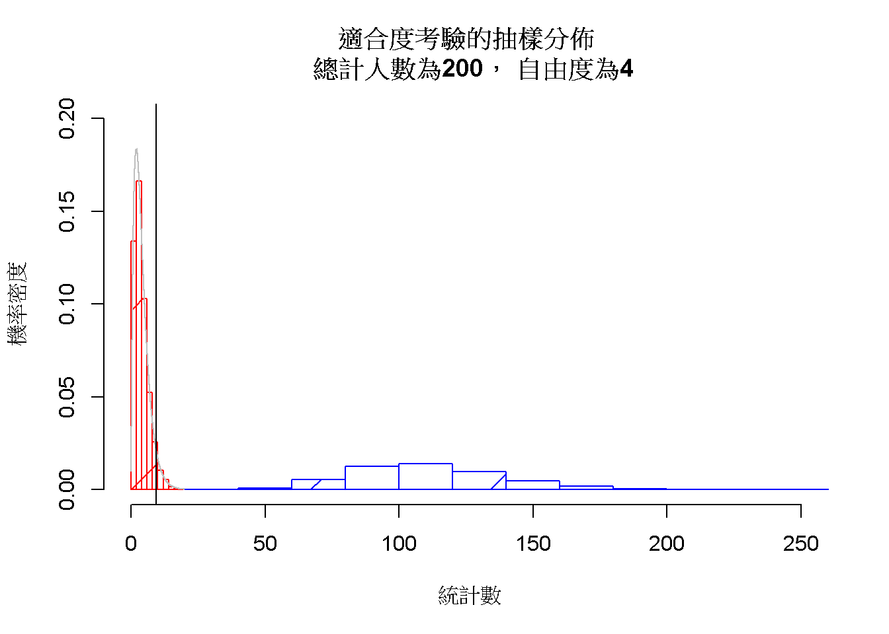
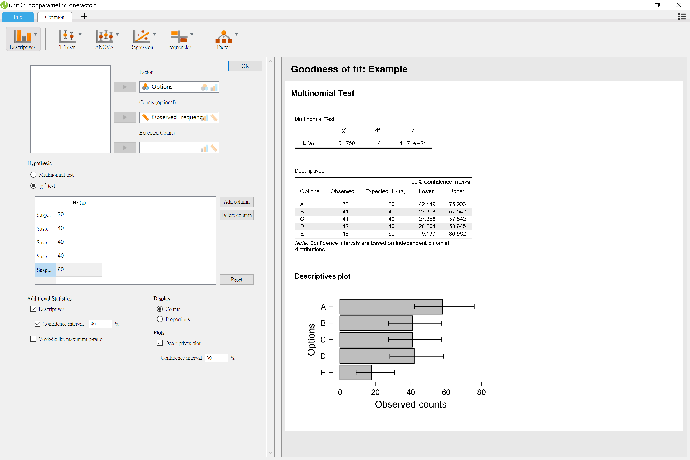
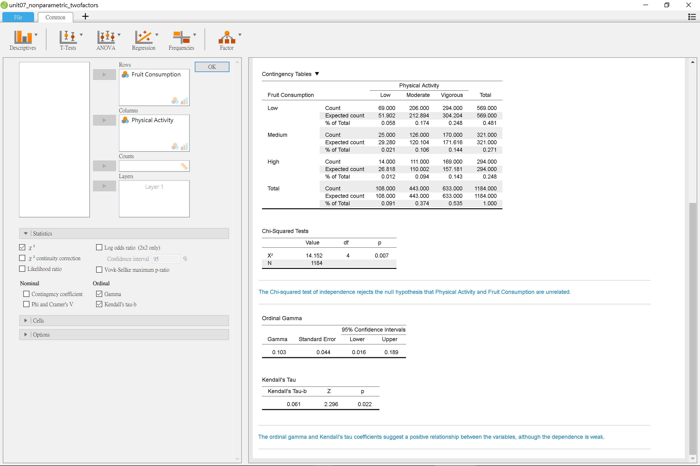
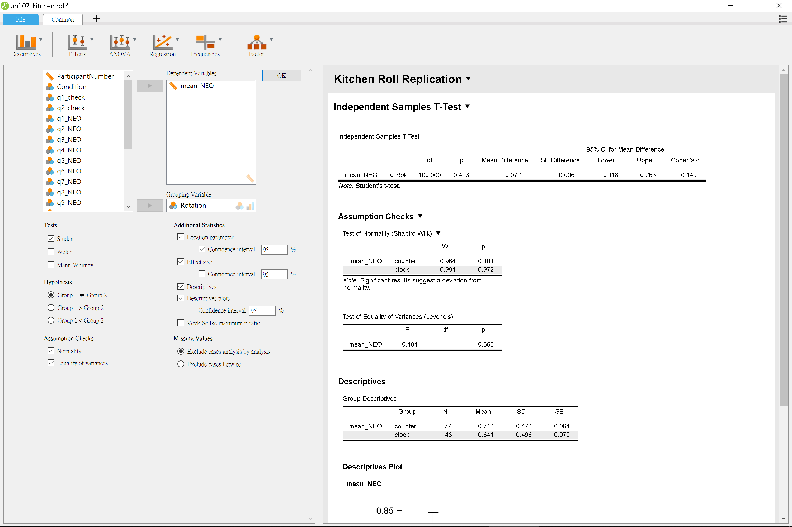

# 獨立樣本的推論統計 {#independent}

行為與社會科學研究許多種變項是比較背景接近的兩群人士，在兩種不同情境狀況的行為表現。若研究者使用連續尺度收集資料，適用的資料分析方法就是獨立樣本t檢定。這個單元將介紹無母數統計的獨立性檢定，以及母數統計的獨立樣本t檢定。

## 無母數獨立樣本推論統計 {#independent-chisquare}

本單元示範的獨立性檢定也是運用卡方分佈，判斷各組次數之間的差異有沒有符合預期。不同於單元\@ref(paired-categorical)介紹的McNemar氏檢定，獨立樣本的卡方檢定比較多組觀察次數的比例是否相同？或著是否不同於預期的各組比例？這兩類問題分別稱為適合度問題(goodness of fit)與獨立性/關聯性問題(independence/association)。

以下介紹兩類示範案例，說明計算實際次數與期望次數差異的統計數為何比較符合卡方分佈，以及示範分析程序。

### 適合度問題案例介紹 {#independent-chisquare-case1}

有位在網路連載推理小說的作家，撰寫新作品的過程同時經營直播節目，每一集與聽眾討論最新完成的章節。新作品描寫一件兇殺案，故事開始就帶出五位被懷疑是兇手的主角，我們以代號Ａ，Ｂ，Ｃ，Ｄ，Ｅ稱之。作家在連載開始就邀請聽眾猜測誰是真兇，並開放聽眾投票。在最後一集揭曉之前，有兩百位聽眾投票，累計結果如下表：

|A|B|C|D|E|
|:---:|:---:|:---:|:---:|:---:|
|58|41|41|42|18|

作家預想他設計的情節引導讀者認為Ａ是真兇，其實Ｅ才是真正兇手。你要如何運用推論統計，證實作家的設計達成他的目的？

### 適合度檢定的抽樣分佈 {#independent-chisquare-sampling1}

根據作家的故事設計，作家心中有組最不期待看到的數據：認為是E的觀眾人數，比認為是A的觀眾人數高出一倍以上。將次數換成比例，作家最不期待讀者的票選比例如下表的模樣：

|A|B|C|D|E|
|:---:|:---:|:---:|:---:|:---:|
|0.1|0.2|0.2|0.2|0.3|

以總數200人來說，總計結果會如下表：

|A|B|C|D|E|
|:---:|:---:|:---:|:---:|:---:|
|20|40|40|40|60|

幫助作家分析的你想用適合度考驗，首先要考慮這個狀況能不能使用。適合度考驗的獨變項必是唯一，且為類別變項，如同這個範例的真兇身份。依變項是獨變項各類別的**觀察次數(O)**，在此就是觀眾投人數；同時問題目標能設定明確的**期望次數(E)**，兩者差異的平方才能代表觀察結果與期望結果的差距。適合度檢定的抽樣分佈是以下方統計數公式堆積：

$$\sum\frac{(O - E)^2}{E}$$

堆積而成的抽樣分佈通常接近**卡方機率函數**，而且**自由度**決定**函數樣態**。適合度檢定的自由度等於類別數目減1。而總觀察次數決定觀察次數與期望次數差異平方的變異，進而決定抽樣分佈的範圍，導致型二錯誤率與考驗力的變化。

(\#fig:onefactor-sampling)適合度考驗的抽樣分佈。 虛無假設(紅)與對立假設(藍)

圖\@ref(fig:onefactor-sampling)顯現的對立假設抽樣分佈，是與這次投票一致的所有模擬結果，與期望次數的模擬數據之差異構成。與都是期望次數的模擬數據之虛無假設抽樣分佈相比，兩者有頗大的差異，因此型二錯誤率幾乎為零。如果今天作家不期待看到的結果是五位主角投票人數沒有明顯差異，就會發現對立假設抽樣分佈與虛無假設抽樣分佈部分範圍重疊，讀者可自行下載[jamovi示範檔案](https://osf.io/kcswx/)，觀察這種狀況的對立假設抽樣分佈。

圖\@ref(fig:onefactor-sampling)內的垂直黑線，代表以自由度4的卡方機率函數，判斷水準是.05的統計數9.49。虛無假設抽樣分佈超過此線的比例，代表本範例的型一錯誤率估計值，運用[jamovi示範檔案](https://osf.io/kcswx/)，讀者可發現無論如何改變期望次數的組合，虛無假設抽樣分佈樣態改變幅度不大，型一錯誤率都會維持在.05左右。所以分析者可以根據實際需求，調整判斷水準也能保證認定有差異的結論出錯之機率，不會超過型一錯誤率。

### 適合度檢定示範 {#independent-chisquare-test1}

JASP與jamovi的適合度檢定套件各有特色，建議讀者先下載[jamovi示範檔案](https://osf.io/kcswx/)，與[JASP示範檔案](https://osf.io/9sdbv/)。跟隨以下說明調整模組選單，了解兩者的差異。

jamovi的適合度檢定模組由`Frequencies` -> `N outcomes`開啟。圖\@ref(fig:jamovi-goodnessoffit)的設定選單輸入資料中的兩個欄位`Options`與`Observed Frequency`，如果所有聽眾的選擇並未總計，只要置入`Options`。此例作家不期待的結果，只要操作`Expected Proportions`，改變五位主角的相對比例，就能得到分析結果。

(\#fig:jamovi-goodnessoffit)jamovi適合度考驗操作示範

JASP的適合度檢定模組由`Frequencies` -> `Multinomial Test`開啟。圖\@ref(fig:JASP-goodnessoffit)的欄位設定和jamovi完全相同，不同處是之下的`Hypothesis`可選擇`Multinomial Test`與`$\chi^2$ Test`兩種之一。期望次數是輸入次數決定，並提供信賴區間等計算。JASP適合度檢定的信賴區間提供每一格實際次數的估計範圍，因此本例將區間百分比調整為99%，增加估計的標準。從圖\@ref(fig:JASP-goodnessoffit)的柱狀圖可見，認為是主角A的人數遠高於20；認為是主角E的人數遠低於60。

(\#fig:JASP-goodnessoffit)jamovi適合度考驗操作示範

### 獨立性問題案例介紹 {#independent-chisquare-case2}

Seo等人[-@seoRelationsPhysicalActivity2007]調查1,184位美國中西部大學生平常從事的運動強度(低度、溫和、劇烈；Low, Moderate, Vigorous)，與日常攝取水果數量(少量、一般、超量; Low, Medium, High)之間的關係。研究者認為兩種條件之間並非無關，所以一開始分析工作，先使用卡方檢定確認之，再計算相關係數。

這份資料收錄於JASP的資料庫，讀者可從JASP檔案選單，開啟`Data Library` -> `5. Frequency` -> `Health Habits`，取得JASP示範檔或原始資料。

(\#fig:inde-contigency)美國大學生平常從事的運動強度與日常攝取水果數量

### 獨立性檢定的抽樣分佈 {#independent-chisquare-sampling2}

我們在[jamovi示範檔案](https://osf.io/j86hw/)設計上述範例的抽樣分佈模擬程序。圖\@ref(fig:inde-contigency)列出的列聯表除了各類表觀察次數，還有各欄與各列的總和，各細格元素如下表所示：

||低度|溫和|劇烈|**列總和**|
|---|---|---|---|---|
|少量|$O_{11}$|$O_{12}$|$O_{13}$|$R_1$|
|一般|$O_{21}$|$O_{22}$|$O_{23}$|$R_2$|
|超量|$O_{31}$|$O_{32}$|$O_{33}$|$R_3$|
|**欄總和**|$C_1$|$C_2$|$C_3$|N|

這項範例的抽樣分佈來自兩個預設彼此無關的問卷題目：運動強度、日常攝取水果數量。兩者都是類別變項，各題選項的選擇人數是各類別**觀察次數(O)**，由列聯表的列總和與欄總和，可計算兩個問題彼此無關的**期望次數(E)**，公式如下：

$$E_{ij} = \frac{R_i \times C_j}{N}$$

與適合度分析相同，每次研究結果的觀察次數與期望次數之差距平方和，堆積任可可能結果的抽樣分佈。

$$\sum_i \sum_j \frac{(O_{ij}-E_{ij})^2}{E_{ij}}$$

根據範例列聯表的欄列總和比例，運用拔靶法，製造兩個獨變項之間有關聯(對立假設)的抽樣分佈，與兩個獨變項之間沒有關聯(虛無假設)的抽樣分佈。模擬結果如圖\@ref(fig:chi-independent-simulation)的抽樣分佈。

(\#fig:chi-independent-simulation)獨立性考驗的抽樣分佈。 虛無假設(紅)與對立假設(藍)

模擬顯示兩件獨立性檢定的不同之處。第一是自由度，由於有兩個獨變項，根據計算的機率所學，任何獨變項與依變項的組合都是一種隨機變數，都有一個要被估計的期望值，所以本範例的兩個獨變項各自的自由度是$3 - 1 = 2$。兩個獨變項對應的依變項都是同一批觀次數，造成相依的關係，因此自由度是$2 \times 2 = 4$

第二是抽樣分佈並不相容一般卡方機率函數。卡方機率函數的期望值即自由度，如圖\@ref(fig:chi-independent-simulation)顯示的黃色曲線；另一條灰色曲線是非中心化卡方機率函數[^1]，期望值是自由度與非中心參數($\lambda$)的總和。以.05設定的決定水準來看，一般卡方機率函數估計的型一錯誤率約0.30，非中心化卡方機率函數估計的型一錯誤率約0.025。相對地，一般卡方機率函數估計的型二錯誤率約0.01，非中心化卡方機率函數估計的型一錯誤率約0.15。

許多類似本書示範的JASP與jamovi套裝統計軟體，並未內建非中心化卡方機率函數的計算功能，都是以一般卡方機率函數計算所有卡方檢定的p值。因此建議讀者使用套裝統計軟體分析獨立性檢定，搭配其他相關係數的計算。

[^1]:非中心化卡方機率函數詳見[維基百科介紹](https://en.wikipedia.org/wiki/Noncentral_chi-squared_distribution)。

### 獨立性檢定示範 {#independent-chisquare-test2}

圖\@ref(fig:independence-jamovi)與圖\@ref(fig:independence-JASP)示範jamovi與JASP的操作設定，jamovi示範檔案請[點此下載](https://osf.io/j86hw/)，JSAP示範檔案可由官方檔案庫直接取得。

(\#fig:independence-jamovi)卡方檢定獨立性考驗操作設定示範：jamovi

(\#fig:independence-JASP)卡方檢定獨立性考驗操作設定示範：JASP

請讀者留意以上示範同時計算兩件次序變項相關係數：Gamma與Kendall's $\tau$。為保障p值小於決定水準的獨立性檢定有可信度，建議報告同時說明相關係數的分析，如以下示範：

> 根據.05的判斷水準，1184位大學生平常運動強度與攝食水果的總量，應該有關聯性，卡方檢定顯示$\chi^2$(4, N=1184) = 14.152, p = .007。相關係數分析也支持一致的結論，Kendall's $\tau$ = 0.061, p = .022。

## 獨立樣本t檢定 {#independent-t}

獨立樣本t檢定是行為科學研究最常見的分析方法，也是本書第一個要模擬兩個抽樣分佈進行解說的方法。因為兩個樣本分別來自不同的樣本分佈，一般統計教材使用獨立樣本t檢定介紹效果量與考驗力，但是少有教材運用模擬程序解析其中的關係。我們將延續單元\@ref(paired-power)的課題，探討樣本數、效果量與考驗力的關係。

### 獨立樣本平均數案例介紹 {#independent-t-case}

這裡採用JASP開發團隊執行長Wagenmakers與同事們[-@wagenmakersTurningHandsTime2015]嘗試再現德國社會心理學者Topolinski與Sparenberg[-@topolinskiTurningHandsTime2012]的體現認知實驗，公開資料做為獨立樣本t檢定的示範。Topolinski與Sparenberg的實驗是請參與者來實驗室進行12題開放態度量表，題目內容像是「我經常嘗試新奇的外國食物」。參與者以五點量表表達自己對題目主題的開放程度（-2:非常不同意；2:非常同意）。實驗室環境安排如圖\@ref(fig:roll-setting)，102位參與者答題時要依指示捲動面前的衛生紙捲，其中48位以順時針方向轉動(clockwise)，另外54位以逆時針方向轉動(counter-clockwise)。

(\#fig:roll-setting)Wagenmakers等人(2017)再現Topolinski與Sparenberg(2012)體現認知實驗的現場設置。

Topolinski與Sparenberg假設大多數可轉動的工具，開啟方向都是順時針，以順時針方向捲動衛生紙卷的參與者，回答開放態度量表的問題，給的評分應該比逆時針捲動的參與者高。原始研究確實發現顯著較高分的結果，再現研究結果則存放於JASP的示範資料集`Kitchen Rolls`。

Wagenmakers決定執行研究之前，只有Topolinski與Sparenberg發表的結果，無法確定這次結果會不會一樣，因此適合以組間差異尚待確認的觀點，設定判斷水準。兩組平均數經過假設檢定與信賴區間的分析，可能的結果會是：

> 如果捲動衛生紙捲的方向會影響參與者的開放態度，兩組平均數的差異雙尾t檢定應該出現小於.05的*p*值，而且95%信賴區間不會包括0。

至於兩組變異數，嚴謹的分析會鑑定有沒有違反**變異等量假設**與**常態分佈假設**的標準，再決定要採用的t檢定策略。JASP與jamovi等統計軟體的獨立樣本t檢定模組，都有附Levene檢驗與Shapiro-Wilk檢驗，讓使用者以假設檢定檢視要分析的資料有無違反。未違反假設的資料，檢驗結果的p值必定大於.05或更高的標準。我們可以運用假設檢定的作業原則，設定分析資料未違反兩種假設的判斷水準：

> (1)如果兩組資料符合**變異等量假設**，Levene檢驗的*p*值應該大於.05。(2)如果兩組資料符合**常態分佈假設**，Shapiro-Wilk檢驗的*p*值應該大於.05。如果任何一項出現小於.05的*p*值，必須在報告中討論。

獨立組比較研究通常希望收集的資料各組樣本數目相同，但是通常不能盡如人意。如果資料不違反**變異等量假設**與**常態分佈假設**，自由度必是兩組總人數減2(n1 + n2 - 2)，因為各組各有要估計的期望值。計算統計數的**標準誤**，等於兩組資料的合併標準差(pooled standard deviation)以樣本數加權。如以下公式：

$$s_p \sqrt{\frac{1}{n_1}+\frac{1}{n_2}}$$

$$s_p = \sqrt{\frac{(n_1 - 1) \times s_1^2 + (n_2 - 1) \times s_2^2}{n_1 + n_2 - 2}}$$

如果資料違反變異等量假設，建議使用變異數不相等的t檢定方法。`JASP`與`jamovi`設定選項中的`Welch`，就是執行此版本的t檢定選項。

### 獨立樣本平均數的抽樣分佈 {#independent-sample}

比照單元\@ref(paired-continuous-distribution)，我們設計獨立樣本平均數t檢定的模擬程序，解說為何假設檢定的計算假設檢定的p值與信賴區間，是採用t機率分佈。模擬程序原始碼可參考[jamovi示範檔案](https://osf.io/spn64/)。

同樣使用拔靴法製造模擬數據，比起單元\@ref(onesample)與單元\@ref(paired)，此次一開始要分別製造兩批模擬數據，再合成代表兩組有差異的抽樣分佈(對立假設)，與兩組無差異的抽樣分佈(虛無假設)。首先檢視順時針組與逆時針組的資料範圍，如圖\@ref(fig:independent-continuous-populations)所示。

(\#fig:independent-continuous-populations)kitchen roll研究資料分組資料

順時針組的評分平均值為0.64、樣本標準差為0.5；逆時針組的評分平均值為0.71、樣本標準差為0.47。根據原始資料，使用拔靴法分別製造兩批各10000筆模擬平均數，形成圖\@ref(fig:independent-groups-sample)的平均數抽樣分佈，可見模擬平均數抽樣分佈的平均值近真實資料的統計值，模擬分佈的樣本標準誤是真實資料樣本標準差的$\frac{1}{\sqrt{48 }}$與$\frac{1}{\sqrt{54 }}$。

(\#fig:independent-groups-sample)順時針(紅色)與逆時針(藍色)的樣本平均值抽樣分佈。

兩組的合併標準差為0.234，加權標準誤為0.046，接近圖\@ref(fig:independent-hypothesis-sampling)的對立與虛無假設抽樣分佈標準誤。

(\#fig:independent-hypothesis-sampling)平均值差異的5抽樣分佈：虛無假設(紅色)與對立假設(藍色)

兩種抽樣分佈皆符合常態分佈，以雙尾檢定的判斷水準.05為界，估計型一錯誤率為0.026，型二錯誤率為0.903。模擬數據的剖析確定這筆資料符合**常態分佈假設**，可採用變異等量t檢定分析策略。除了估計的型一錯誤率接近判斷水準，更值得注意的是型二錯誤率估計高達0.9。因為這筆資料是重現他人研究，值得探究這份研究低考驗力的原因。

### 示範檔案操作與報告 {#independent-t-example}

這項研究的獨立樣本t檢定分析可參考[jamovi示範檔案](https://osf.io/spn64/)與[JASP示範檔案](https://osf.io/dkwuf/)。JASP與jamovi的示範畫面請參考圖\@ref(fig:JASP-independent-t-operation)與圖\@ref(fig:jamovi-independent-t-operation)。

(\#fig:JASP-independent-t-operation)JASP獨立樣本雙尾t檢定分析操作設定示範。

(\#fig:jamovi-independent-t-operation)jamovi獨立樣本雙尾t檢定分析操作設定示範。

這次實驗沒有發現顯著差異，如果是傳統的教學或研究習慣，會簡略報告。為了教學示範與展現負責任的研究態度，請讀者參考以下報告寫作範例：

> 順時針捲動的平均評分比逆時針捲動的平均評分高0.072分(順時針：M = 0.641, SD = 0.496；無關聯：M = 0.713, SD = 0.473， 95% CI [-0.118 0.263])，並未達到事先宣告的統計顯著水準，*t*(100) = 0.754, *p* = .453, *d* = 0.149。

如果沒有違反**變異等量假設**與**常態分佈假設**的問題，在報告裡沒有必要呈現Welch氏t檢定。然而 @delacreWhyPsychologistsShould2017 建議使用獨立t檢定分析的資料，應該全面採用Welch氏t檢定。有關此建議，請讀者自行尋找論文閱讀及判斷。

## 獨立組設計與統計考驗力 {#independent-design}

Wagenmakers等人的再現研究雖然沒有發現顯著結果，但是給我們一個機會探討效果量較小的研究，要如何改進，才能確保能發現顯著差異，又有起碼80%的考驗力。再度開啟考驗力分析的[jamovi示範檔案](https://osf.io/spn64/)，最後的jPower報表`Independent Samples T-Test`顯示如果效果量只有0.15的兩組獨立樣本研究，要得p值通過.05判斷水準，且有80%考驗力的顯著結果，`Kitchen Roll`的兩群參與者人數需要各有至少699人，總共1398人。以圖\@ref(fig:independent-power)的曲線推測，除非這項實驗可測得的效果量能增加，或者降低其望達到的考驗力水準，才能減少參與者的人數。但是降低考驗力水準是本書建議讀者不該採取的策略，即使能得到通過.05判斷水準的p值，實驗結果也不容易再次重現。

(\#fig:independent-power)達到指定考驗力之獨立樣本t檢定效果量，所需要的樣本數分析。

如果`Kitchen Roll`可以改成重覆量數設計，收集相依樣本的資料。結果依然測得效果量是0.15，同樣採用雙尾檢定與.05判斷水準進行相依樣本t檢定，jPower的估計顯示需要351人，就能確保顯著結果有80%的考驗力，如圖\@ref(fig:paired2-power)所示。讀者可透過作業問題的引導，比較兩種設計的考驗力分析，了解為何較難再現的心理科學研究，多數是獨立組設計的研究領域。

(\#fig:paired2-power)達到指定考驗力之相依樣本t檢定效果量，所需要的樣本數分析。

## 總結 {#independent-summary}

- TBA

## 習題 {#independent-practice} 

- TBA

