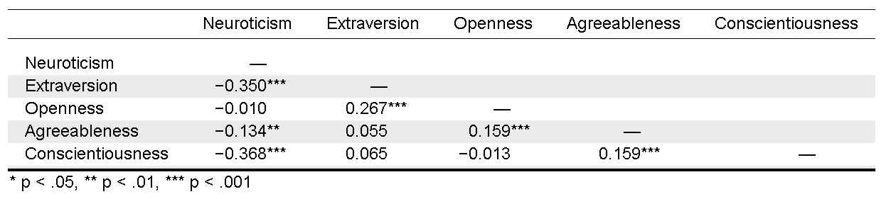
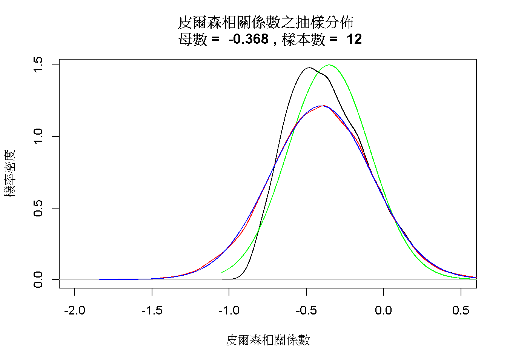
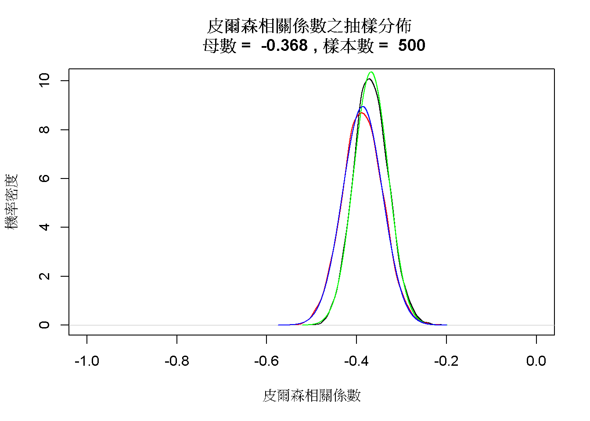
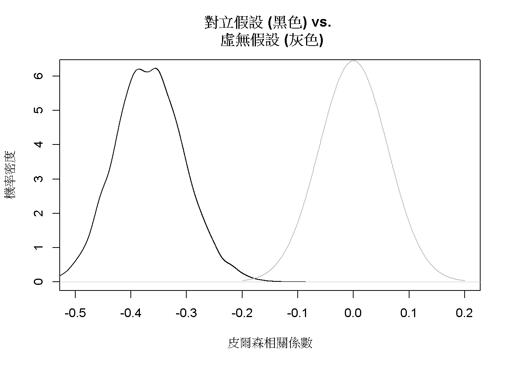
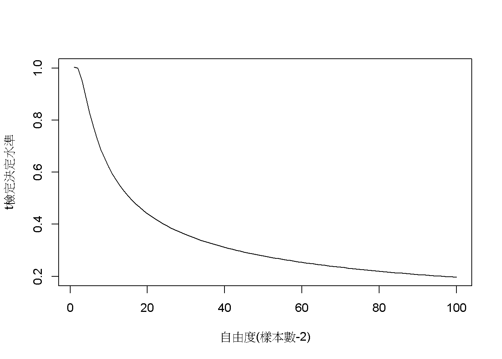
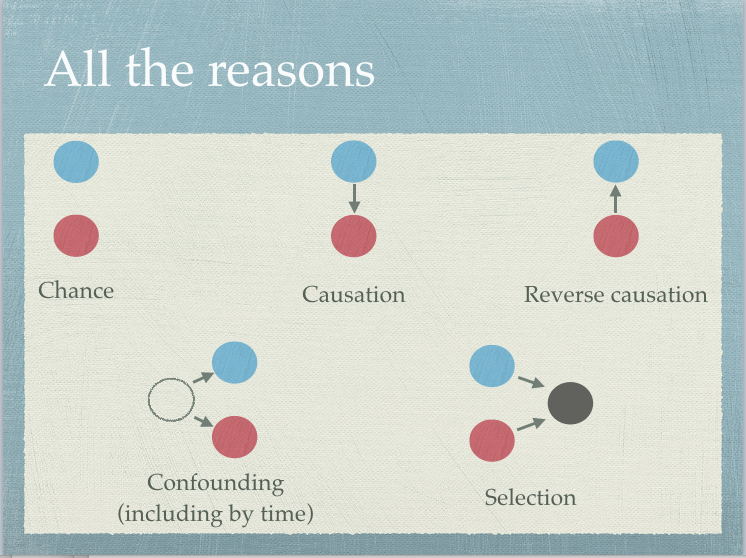
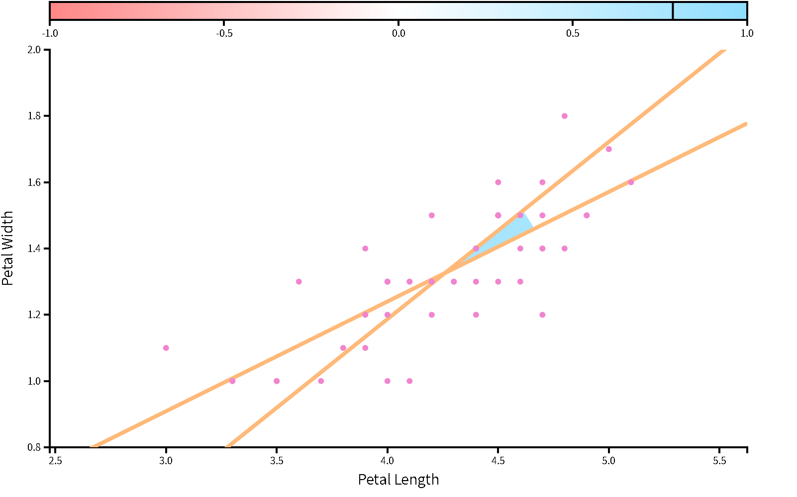
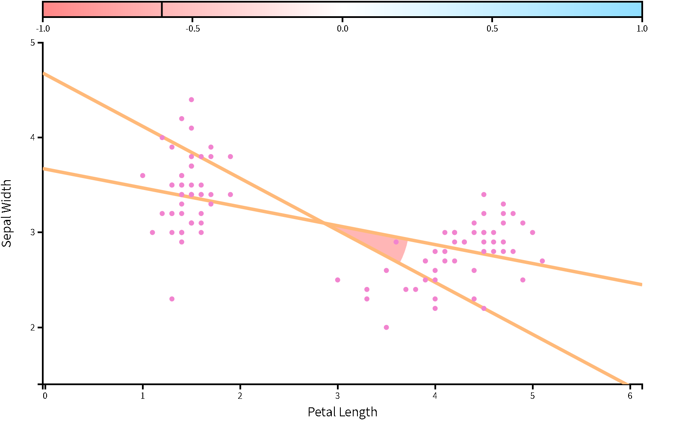
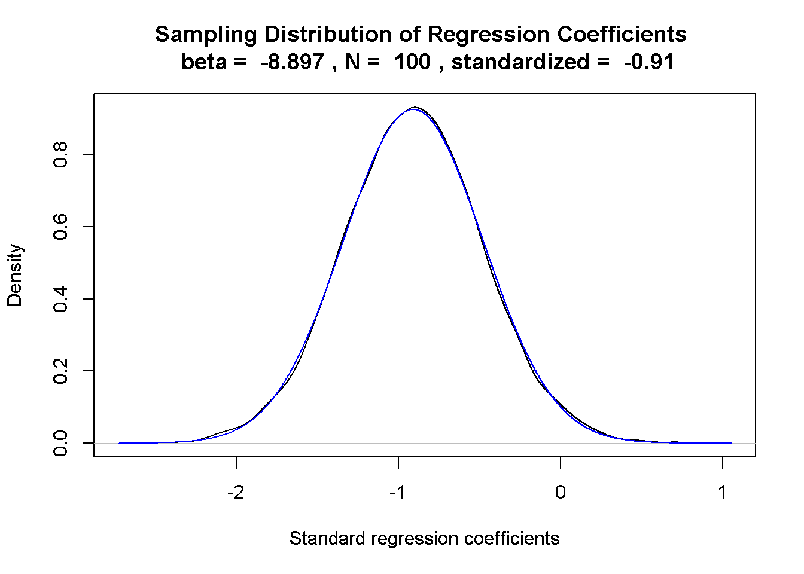

# 相關與迴歸 {#corr-reg}

這個單元介紹兩個連續變項相關程度的皮爾森相關係數，以及如何計算兩者之間的簡單迴歸。以統計方法的發展歷史來說，相關與迴歸的分析方法比假設檢定還早出現。早在十九世紀，[Francis Galton](https://en.wikipedia.org/wiki/Francis_Galton)(他的表親是提出演化論的Charles Darwin)測量大量不同人種的感官能力與各式運動反應資料，他把各種資料湊成好幾對，繪製成一系列**散佈圖(scatterplot)**，歸納出第一套計算**迴歸係數**的方法。他想要運用資料之間的迴歸，分析不同人種之間的差異。儘管理論和研究方法都還不夠成熟，Francis Galton收集與分析資料的方法直接影響智力的研究與智力測驗的發展。

進入大數據時代，資料科學家想做的事情和Francis Galton差不了多少，都是計算一系列變項的相關性，挑出其中最可能預測變項A的變項B，評估兩者迴歸關係的預測能力。在雙變項的世界，變項之間的共同變異(covariance，以下簡稱共變)，是表達變項相關的最佳指標。

## 案例介紹 {#corr-reg-case}

相關係數的示範案例採用五大性格特質的真實資料。五大性格由情緒不穩定性(Neuroticism)、外向性(Extraversion)、經驗開放性(Openness)、親和性(Agreeableness)、盡責性(Conscientiousness)等五種主題的測驗題目組成。示範資料來自 @DolanTestingMeasurementInvariance2009 收集500位大學新生的施測資料，`JASP`與`jamovi`都有收錄這筆公開資料。除了示範如何利用兩種軟體製作符合寫作格式的相關係數表格，`jamovi`示範檔也提供相關係數抽樣分佈的模擬程序。

簡單迴歸的示範資料來自 @navarroLearningStatisticsJamovi2018 提供的案例。這項案例紀錄一位新手爸爸在小孩出生後一百天裡，小嬰兒的睡眠時間，爸爸的睡眠時間，以及爸爸用0到100分自評的情緒低落程度。本單元將用`JASP`與`jamovi`示範，如何算出以爸爸的睡眠時間預測情緒低落程度的簡單迴歸，以及探討迴歸係數的抽樣分佈。

## 皮爾森相關 {#corr-reg-person}

皮爾森相關係數是兩個變項之間的共變數(Covariance)，與標準差乘積的相除。設定兩個變項來自的母群體都是常態分佈( $N(\mu_X, \sigma_X), N(\mu_Y, \sigma_Y)$ )，皮爾森相關係數的公式就可寫成：

$$ \rho_{X,Y} = \frac{cov(X,Y)}{\sigma_X \sigma_Y} $$

如同五大人格特質的測量資料都是由母群體取隨機抽樣的樣本，任兩個人格特質的相關係數在報告中都記為r，以樣本平均數與標準差計算，計算公式是：

$$ r_{xy} = \frac{\sum x_i y_i - n \bar{x} \bar{y}}{(n-1)s_x s_y} $$

圖\@ref(fig:JASP-big5-corr)呈現JASP輸出五大人格特質之間相關係數，讀者可由[JASP示範檔](https://osf.io/jk8vs/)或[jamovi示範檔](https://osf.io/8y6bq/)了解輸出表格內容的模組設定。我們使用相關係數絕對值最大的盡責性與情緒不穩定性(-0.368)，探討相關係數抽樣分佈的特性。

(\#fig:JASP-big5-corr)五大人格特質：JASP輸出報表。

### 相關係數的抽樣分佈 {#corr-reg-r-sampling}

`JASP`與`jamovi`提供的相關係數範例資料，都有上百筆的觀察值。原因是樣本數不足一百的隨機樣本所累積的抽樣分佈，不會是像常態分佈一樣的對稱分佈，如此一來必定造成型一與型二錯誤率的估計偏差。樣本數不足時需要使用**費雪轉換**，才能將抽樣分佈轉換為常態分佈。以下費雪轉換公式，可轉換所有來自同一母群體的所有樣本相關係數。轉換後的樣本相關係數平均數會略高於原始平均數，**標準誤**必接近$\frac{1}{\sqrt{n-3}}$。

$$F(r) = \frac{1}{2} ln \frac{1+r}{1-r}$$

(\#fig:big5-smalln)設定樣本數為十二位學生，五大人格特質相關係數的抽樣分佈。

以 @DolanTestingMeasurementInvariance2009 的五大人格特質資料 為例，如果盡責性與情緒不穩定性相關係數的母群體是$\rho = -0.368$，只收集12位學生的資料，模擬10000筆樣本相關係數形成的抽樣分佈如同圖\@ref(fig:big5-smalln)呈現負偏態的黑色曲線，與分佈中心是-0.368的常態分佈(綠色曲線)有明顯的差異。10000樣本相關係數經過費雪轉換，形成的抽樣分佈(紅色曲線)與平均數是-0.41及標準誤是0.33的常態分佈(藍色曲線)完全契合，此標準誤相當接近以公式$\frac{1}{\sqrt{n-3}}$計算的0.33。

(\#fig:big5-largen)設定樣本數為五百位學生，五大人格特質相關係數的抽樣分佈。

將樣本數增加至如至500人，樣本相關係數的抽樣分佈就會契合對稱的機率分佈，如圖\@ref(fig:big5-largen)代表抽樣分佈的黑色曲線，完全符合抽樣分佈平均數-0.37與標準誤0.04的常態分佈(綠色曲線)。費雪轉轉換後的抽樣分佈(紅色曲線)雖然也符合常態分佈(藍色曲線)，但是估計的期望值-0.39明顯不同於母群體。由此例可知，運用相關係數分析資料的研究，要獲得不偏的相關係數估計值，收集的樣本數要達到上百筆。

相關係數的抽樣分佈貝有常態性，所以能運用t機率分佈，以假設檢定或信賴區間分析當下資料估計的相關係數，是否相容於無相關的狀況，即相關係數為0。如果這筆樣本不是來自相關係數為0的母群體，只有相當低的機率出自相關係數為0的抽樣分佈。圖\@ref(fig:big5-hypo)呈現分析相關係數是否為0，對立假設與虛無假設的模擬抽樣分佈。

(\#fig:big5-hypo)樣本數為200，五大人格特質之相關係數是否為0的假設檢定。

### 相關係數的強度 {#corr-reg-strength}

圖\@ref(fig:big5-hypo)也體現相關係數是一種效果量，所以一次研究得到的相關係數要多高才算理想，必須考慮收集的樣本數。有些統計教材表列所謂的強中弱相關係數，這樣的區分並未考慮樣本數。在此以檢定水準為.05的雙側t檢定為例，圖\@ref(fig:corr-crit)列出自由度1到100，與可否定虛無假設的最小相關係數。讀者可運用[jaomvi示範檔案](https://osf.io/8y6bq/)，自行修改樣本數與檢定水準的p值，察看符合需要的理想樣本數與相關係數。

(\#fig:corr-crit)檢定水準為.05的雙側t檢定之判斷水準與樣本數(自由度)之變化

### 相關係數的意義

估計變項之間的相關性通常是一項研究問題的開始，因為發現兩個變項之間存在不為零的相關性，其實有許多意義。圖\@ref(fig:corr-reasons)展示最有可能的五種：自變項與依變項因機遇同時存在(chance)；自變項影響依變項的變化(causation)；依變項影響自變項的變化(reverse causation)；混淆變項同時影響自變項與依變項(confounding)；自變項與依變項經過中介變項相互影響(selection;moderation)。

究竟有明顯相關的自變項與依變項是那一種意義？需要進一步研究才能區分。該採取那種研究策略，最好有能引導分辨變項關係的理論，研究者才能掌握最適當的策略。心理科學研究追求的最佳理論，有指引變項之間因果關係的功能，然而任何科學一開始並不會有堅實的理論，需要研究者以清晰的研究設計，收集大量可核實的資料，才能提供更新理論的材料。

(\#fig:corr-reasons)相關係數的各種意義。Thomas Lumley提供(推特帳號：tslumley)。

## 簡單迴歸 {#corr-reg-simple}

迴歸的重要功能是透過自變項(X)的數值，預測依變項(Y)的觀察而獲得的數值。自變項與依變項資料能形成無限多種線性迴歸關係，有最大預測力的迴歸關係，必然涵括自變項與依變項的平均數，且自變項估計的依變項數值($\hat{Y}$)與真實的依變項(Y)數值之差異最小。預測數值與真實數值的差異是以差異平方和總計，所以使用這種方式求得的迴歸關係又稱為**最小平方迴歸**。簡單迴歸關係的自變項必然與迴歸係數(b)與截距(a)構成線性關係，如同下方的迴歸式。

$$ \hat{Y} = b \cdot X + a $$

如果自變項(X)與依變項(Y)是正相關，截距(a)是以自變項(X)的資料，預測依變項(Y)範圍的最小值，例如圖\@ref(fig:reg-positive)；如果兩者是負相關，截距(a)是可預測範圍的最大值，例如圖\@ref(fig:reg-negative)。由此可知迴歸係數與相關係數有密切的關聯，迴歸係數也是一種隨機變數，接著透過範例分析，了解如何運用與迴歸係數有關的參數，評估迴歸關係的預測力。

(\#fig:reg-positive)自變項與依變項是正相關的簡單迴歸：以鳶尾花資料庫的versicolor花瓣長度與花瓣寬度為例。

(\#fig:reg-negative)自變項與依變項是負相關的簡單迴歸：以鳶尾花資料庫的setosa與versicolor花瓣長度與花萼寬度為例。

### 範例分析示範  {#corr-reg-demo}

我們使用新手爸爸照顧小嬰兒100天紀錄，運用簡單迴歸以爸爸的睡眠時間預測爸爸情緒低落程度，透過[JASP示範檔案](https://osf.io/bmgtv/)與[jamovi示範檔案](https://osf.io/g5ycu/)示範如何計算以及擷取報告資訊。`JASP`使用`Regression`模組的`Linear Regression`功能，在設定選單的**Dependent Variable**匯入**dan.grump**；**Covariates**匯入**dan.sleep**。即可輸出圖\@ref(fig:JASP-reg)的報表：從上面開始第一個表格*Model Summary*是預設輸出的報告，其中的R(0.903)是自變項與依變項相關係數之絕對值，$R^2$(0.816)是依變項的變異可被自變項估計的比例，但是這個數值在簡單迴歸並無明顯功能。第二個報表*ANOVA*需要於設定選單裡的`Statistics`勾選**Model fit**，這份報表報告的內容於稍後單元\@ref(corr-reg-least)介紹。第三個報表*Coefficients*需要於設定選單裡的`Statistics`勾選**Estimates**，這個報表指出這道直線迴歸的截距是125.96，迴歸係數是-8.937，所以報告中的線性迴歸式是：

$$ \hat{Y} = -8.937 \cdot X + 125.96 $$

迴歸係數與截距都是隨機變數，所以報表有兩項數值是否為0的統計檢定結果；*Coefficients*報表的另一個重點是*Standardized*這欄的數值只有自變項，這個數值是**標準化迴歸係數**，也就是相關係數(-0.903)，是以兩個變項資料的標準化分數($z_y, z_x$)得到的迴歸關係，所以迴歸線必定通過散佈圖座標軸原點，截距必為0。最後一個*Descriptivies*報表要勾選設定選單裡`Statistics`的**Descriptives**，呈現兩個變項的資料個數、平均值、樣本標準差、與樣本標準誤。情緒低落程度的估計標準誤(1.005)除以爸爸睡眠時間的估計標準誤(0.102)，再乘以兩個變項的相關係數(-0.903)，就是迴歸係數-8.9。所以簡單迴歸的迴歸係數與相關係數，能運用以下公式相互換算：

$$r_{xy} = \frac{se_y}{se_x} \cdot b$$

(\#fig:JASP-reg)新手爸爸育兒紀錄簡單迴歸分析：JASP輸出報表。

### 迴歸係數的抽樣分佈 {#corr-reg-coff-sampling}

(\#fig:reg-sample)樣本數為100，迴歸係數之抽樣分佈。

我們已知迴歸係數也是一種隨機變數，所以只要改裝相關係數抽樣分佈的模擬程序，就能探索迴歸係數的抽樣分佈。在[jamovi示範檔案](https://osf.io/g5ycu/)的模擬程序程式碼首四行的設定參數，除了樣本數與相關係數，還有設定自變項與依變項的樣本標準誤。這段模擬程序以新手爸爸的分析結果設定這四個數值，得到圖\@ref(fig:reg-sample)符合常態分佈的抽樣分佈。這道抽樣分佈的平均數是-0.91，標準誤是0.43，極為接近圖\@ref(fig:JASP-reg)的*Coefficients*報表報告的標準化迴歸係數，以及自變項的標準誤。讀者可以嘗試改變兩個變項的標準誤，形成的抽樣分佈雖然標準誤會有變化，平均數依然接近標準化迴歸係數。

### 最小平方法 {#corr-reg-least}

現在來談談最小平方法的真正意義：有最大預測力的迴歸關係，實際的依變項數值與依變項預測值的差異平方和，是所有迴歸關係之中最小的。首先我們先了解，經由迴歸線得到的依變項預測值，與依變項平均值的差異平方和($\sum(\hat{Y} - \bar{Y})^2$)，必定小於實際的依變項數值與依變項平均值的差異平方和($\sum(Y - \bar{Y})^2$)，也就是依變項實際資料變異數的分子。前者通常稱為迴歸變異平方和(Sum of Squared Regression，簡記SSR)，後者通常程為總變異平方和(Sum of Squared Total，簡記SST)。

SST與SSR之間的差異等於實際的依變項數值與依變項預測值的差異之平方和($\sum(Y - \hat{Y})^2$)，這些差異值在統計學中被稱為殘差(residual)，總和稱為殘差平方和(Sum of Squared Error，簡記SSE)。除了殘差平方和與迴歸變異平方和的總和必然等於總變異平方和，符合最小平方的迴歸關係，殘差平方和必須小於其他線性迴歸。符合最小平方的迴歸係，也會得到SSR佔SST的比例，等於自變項與依項數的相關係數平方($R^2$)，所以這個參數又稱為決定係數。

根據圖\@ref(fig:JASP-reg)的*ANOVA*報表，可知爸爸育兒紀錄迴歸分析的SST是9998.590，SSR與SSE分別是8159.876與1838.714，讀者可檢視[jamovi示範檔案](https://osf.io/g5ycu/)資料的三個計算變項：`squared.total`，`squared.regression`，`squared.residual`，其內皆是各筆資料的差異值平方，運用描述統計模組計算所有差異平方和之總和，確實符合上述數值。

<!---
*ANOVA*報表的F檢定確定迴歸差異平方和的平均值(Mean Squared Regression)，顯著大於殘差平方和的平均值(Mean Squared Error)。

如果迴歸係數的t檢定確定迴歸係數不為零，F檢定的報告應該也會一致。有關F檢定的原理與使用方法，我們將在第\@ref(oneway-anova)單元學習。

所有估計值與依變項平均的差異平方總和，正是迴歸平方和(Sum of Squared Regression)。兩種平方和的加總，剛好就是觀察值與依變項平均的差異平方總和(Sum of Squared Total)。
--->

### 簡單迴歸的信賴區間  {#corr-reg-ci}

在前面的單元裡，我們都有學到計算信賴區間的方法。簡單迴歸的信賴區間是指根據設定的信賴水準(如95%)，有多少比例的依變項觀察值，是在迴歸線的預測範圍之內。`jamovi`線性迴歸模組提供的繪圖選項，能標示信賴區間範圍，如圖\@ref(fig:jamovi-reg)的示範。信賴區間的寛度是估計標準誤的倍數，從以下估計標準誤公式可知，正是殘差平方和平均值的開根號。

$$S_{y \cdot x} = \sqrt{\frac{(Y-\hat{Y})^2}{n-2}}$$

(\#fig:jamovi-reg)新手爸爸育兒紀錄簡單迴歸分析：以jamovi繪製迴歸線與95%估計區間。

## 總結 {#corr-reg-summary}

- 相關係數代表兩個變項之間的相關性，其中有多重意義。
- 小樣本資料估計的相關係數通常有偏誤，Fisher校正能使資料符合常態，卻無法修正偏誤。
- 簡單迴歸在測量誤差範圍內，描述依變項數據隨自變項數據變化的趨勢。
- 樣本數足夠時，相關係數與迴歸係數的抽樣分佈都符合常態性，能運用t機率分佈進行假設檢定與估計信賴區間。

## 習題 {#corr-reg-practice} 

- TBA
