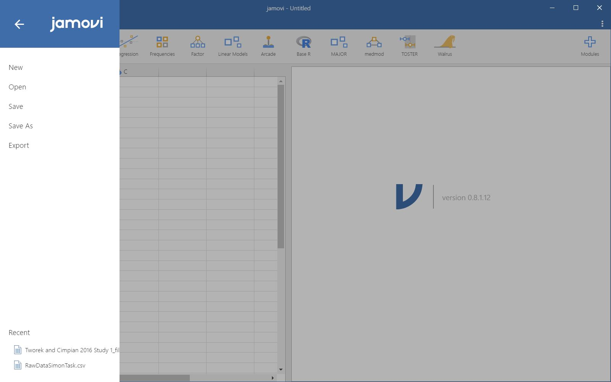

\cleardoublepage 
# (APPENDIX) 附錄 {-} 

# JASP與jamovi使用技巧

附錄分享個人JASP與jaomvi的設定與操作技巧，讀者可根據自已的使用習慣與經驗調整。

## JASP與jamovi開發簡史與介面介紹 {#app-part1}

[JASP](https://jasp-stats.org/)是由荷蘭阿姆斯特丹大學Eric-Jan Wagenmakers教授領導的團隊於2015年啟動開發專案，核心是R套件路[BayesFactor](http://bayesfactorpcl.r-forge.r-project.org/)，所以JASP從一開始就是開源軟體。因為核心成員是貝氏統計的專家，JASP不僅能做傳統的統計，也能計算貝式因子，並且操作方式與SPSS一樣。就算你還不明白什麼是貝氏因子，還是能用JASP學習傳統統計方法。

JASP能開啟的檔案格式有已格式化的文字檔(.csv, .txt)、SPSS資料檔(.sav)、以及Libera Office試算表(.ods)。從[官方網站](https://jasp-stats.org/)下載對應作業系統的安裝程式，安裝成功後打開JASP，切換到`File`界面(見圖 \@ref(fig:JASP-FILE) )，點選**Computer**，從存放在個人電腦中的資料夾位置，開啟gss2010.sav。從畫面上你可以看到，你可以透過網路開啟存放在[OSF](https://osf.io/)的檔案。0.9版起，**Example**裡有相當豐富的範例檔案讓使用者學習。

(\#fig:JASP-FILE)JASP檔案選單

成功載入資料內容後，JASP自動跳到*Common*界面，如圖 \@ref(fig:JASPCOMMON) 。這筆資料有五個欄位，每個欄位名稱之前有一些特別的符號，稍後我們會知道這些符號提示欄位裡的資料，JASP是以什麼樣的**尺度**處理。

(\#fig:JASPCOMMON)JASP資料界面

[jamovi](https://www.jamovi.org/)是由澳洲的軟體工程師[Jonathon Love](https://jona.thon.love/)領銜開發的開源統計軟體。Jonathon曾參與開發最早發表的[JASP](https://jona.thon.love/)，返回故鄉自立門戶後，與朋友合作開發jamovi。開發理念是讓不擅長寫程式碼的人士，能以接近試算表軟體的介面，使用各種強大的統計功能。

從[jamovi官方網站](https://www.jamovi.org/)下載對應作業系統的安裝程式並安裝成功之後，會發現介面和JASP有些不一樣，如圖 \@ref(fig:jamovi-blank)。

(\#fig:jamovi-blank)jamovi起始畫面

使用者需要點擊圖 \@ref(fig:jamovi-blank) 紅色圓圈處的三條橫線，才能打開如圖 \@ref(fig:jamovi-menu) 的檔案選單，選擇開啟存在本機的檔案。

(\#fig:jamovi-menu)jamovi檔案管理選單

## jamovi模組安裝  {#app-part2}

jamovi使用者可以增加自已或他人開發的模組。只要點選操作介面右上界標記`Modules`的大十字圖案，就可以開啟模組管理選單(見圖 \@ref(fig:jamovi-modules) )，安裝與更新需要使用的模組。如果使用jamovi的電腦不方便連線管理，使用者可以從[官方模組網頁](https://www.jamovi.org/library.html)，下載模組的檔案包，從本機安裝。

(\#fig:jamovi-modules)jamovi模組管理選單

本書建議讀者安裝的模組有`Rj`(編寫與執行R程式碼)、`jpower`(考驗力分析與解說)、`distrACTION`(機率分佈圖解)、`R data sets`(R官方示範資料集)、`Statkat`(統計方法建議諮詢)、`learning statistics with jamovi`(同名教科書示範資料集)。本書介紹的模擬程序，都是透過jamovi模組`Rj`執行。有安排模擬程序的示範檔案，相關單元及程式碼內註解，都有說明重要參數設定，讀者只要改變參數數值，就可以觀察模擬結果的變化。

> 如果讀者有安裝R，jamovi的版本為1.2.0.0，只要在R安裝`jmvconnect`套件，就能在`Rj`使用R的套件，例如`ggplot2`，`dplyr`。

(\#fig:jamovi-Rj)設定Rj使用已安裝的R套件

## 數值顯示設定 {#app-part3}

報表顯示的數值都會有小數點之後的數字，推論統計必定產生的p值是最典型有小數點的數值。很多時候匯入的資料會有遺漏值，且因為資料編輯方法的關係，遺漏值會以各式各樣的代碼出現在資料裡。JASP與jamovi都有設定選項，讓使用者因應狀況，調整軟體處理這些數值的方式。

圖 \@ref(fig:JASP-pref-ana) 與圖 \@ref(fig:JASP-pref-missing) 顯示開啟JASP設定選項的方法，以及調整小數點位數，還有設定遺漏值代碼的方法。JASP提供兩種小數點位數調整選項：`Display exact p-values`打勾之後，報表中的p值都會以精確的數值顯示；不打勾則顯示*< .05*, *< .001*等符合報告規範的數字。`Fix the numbers of decimals`之後的數值，決定除了p值之外，報表的每個數值可呈現之小數點後位數。遺漏值除了程式預設的四種代碼，使用者可根據實際需要，自行設定代碼符號，加入列表後，JASP自動判讀該代碼為遺漏值。

(\#fig:JASP-pref-ana)JASP設定選單–小數點位數設定

(\#fig:JASP-pref-missing)JASP設定選單–遺漏值設定

jamovi的設定選單相對簡潔，圖\@ref(fig:jamovi-preference)是設定選單開啟的畫面。**Results**一欄的`Number format`與`p-value format`的功能與JASP的Analysis選單一樣，決定報表中的數值與p值顯示的小數點位數。**Import**一欄可設定遺漏值預設代碼，看似不如JASP多樣化，jamovi其實以其他功能取代之。

(\#fig:jamovi-preference)jamovi設定選單

## 匯入與匯出資料 {#app-part4}

JASP與jamovi都可以匯入 [逗號分隔值](https://en.wikipedia.org/wiki/Comma-separated_values) (Comma-Separated Values, CSV)的純文字表格資料。兩種程式都預設資料第一列是欄位標題，如同援引自[Svetlana Cheusheva的部落格](https://www.ablebits.com/office-addins-blog/2014/05/01/convert-csv-excel/)的範例(見圖 \@ref(fig:csv-preview) )，CSV資料可匯入任何像Excel一樣的試算表軟體。許多試算表軟體會自動處理匯入的CSV資料，將符合欄位設定的資料轉換為預設格式，JASP和jamovi會以內建演算規則，將每個欄位轉換為類別變項或連續變項。**使用者須注意，內建演算規則轉換的變項，不一定符合使用者的計畫設定，進行分析之前必須再次確認。**

(\#fig:csv-preview)上圖：使用純文字編輯器直接開啟csv檔；下圖：使用Excel自動匯入功能開啟csv檔

許多商用的統計軟體也能匯入CSV表格資料，完成分析的存檔則都是各家的獨門格式，知名的SPSS、SAS皆是如此。JASP與jamovi都能匯入SPSS的存檔，jamovi還可以匯入SAS與STATA。為了促進可重製分析，在此建議可將運用JASP或jamovi匯入商用統計軟體的存檔，再將資料以CSV格式匯出。

## 輸出報表 {#app-part5}

使用者想散佈JASP或jamovi完成的分析報表，除了直接傳送檔案，也可以上傳Open Science Framework(osf.io)。上傳OSF的JASP與jamovi存檔，可直接在網站瀏覽報表內容。有關上傳與管理檔案的方法，可參考本書作者的[格落格貼文](http://scchen.com/zh/post/open-science-framework.zh/)。圖 \@ref(fig:JASP-osf) 是本書JASP範例存檔在OSF網頁的樣子。

(\#fig:JASP-osf)在OSF網站瀏覽JASP分析報表，圖中是Emily Rosa的範例。

