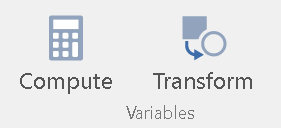

# 資料轉換與過濾 {#data-manipulating}

從JASP 0.9版與jamovi 0.9版開始，兩者都有轉換與過濾資料的功能。這些功能的使用方法與一般試算表軟體類似，不過JASP與jamovi各有特色的操作方式。這一節整理官方的說明與示範動畫，讓初次接觸的使用者認識如何使用。

## 製造轉換資料的新變項 {#app-part6}

許多行為科學測驗分數需要經過轉換，才能進行分析。轉換後的分數都要存為新變項，以下整理JASP[^12]與jamovi[^13]的轉換方法。

[^12]: JASP計算功能官方示範解說網頁：https://jasp-stats.org/2018/12/18/how-to-compute-columns-in-jasp/

[^13]: jamovi計算功能官方示範解說網頁：https://blog.jamovi.org/2017/11/28/jamovi-formulas.html; 轉換功能官方示範解說網頁：https://blog.jamovi.org/2018/10/23/transforming-variables.html

- `JASP`

轉換作業從資料表格最後一欄(column)旁邊的`+`開始，如下方的截圖：

按下`+`之後，出現如下圖的對話框，使用者自行輸入新變項名稱與決定變項尺度。對話框也提供使用者選擇轉換設定模式，這一節說明以**拖放模式**為主(手套圖示)。

按下對話框最下面的`Create`按鈕之後，資料表格上方就會出現如下圖的工作區，下圖的示範資料是第\@ref(paired)單元的相依樣本t檢定範例：失智症(dementia)患者在有月亮的日子與沒月亮的日子，出現暴力行為的平均次數。

若要使用單樣本t檢定分析，要將兩個日子的平均次數相減。我們只要如下圖的示範流程，在工作區製造兩個欄位的相減算式：

許多心理學實驗的依變項是反應時間，由於原始反應時間的樣本分佈並非對稱分佈，經常可見的建議是經過對數轉換，再分析轉換後的數值。對數轉換的操作方式如下圖：

運用轉換功能也可以將原始分數轉換為標準化分數，如下圖示範。要注意JASP轉換功能不會直接處理遺漏值，需要將資料中的遺漏值轉換之後，標準分數才會是實數。

- `jamovi`

jamovi提供的轉換設定模式只有**編碼模式**，如果讀者還沒有足夠的程式碼寫作經驗，建議有較多使用JASP拖放模式的使用經驗，再來嘗試看看。對於自我挑戰企圖較強的讀者，當然鼓勵直接學習。

jamovi的資料轉換功能有兩種：**計算(Compute)**能運用機率函式製造虛擬資料變項，或綜合複數變項為一個新變項。**轉換(Transform)**能將數個舊變項資料，根據同一種轉換設定，批次轉換為新變項。jamovi 0.9版起的資料功能選單中，啟動按鈕圖示如圖\@ref(fig:jamovi_variables)。

(\#fig:jamovi-variables)jamovi的變項計算與轉換功能按鈕。

本書提供許多模擬程序的案例，如果讀者想自行設計，但是還沒有足夠的R程式碼寫作經驗，可以運用**計算**功能製造多筆虛擬資料，測試同一套推論統計方法的分析結果。製作方法如以下動畫示範：

要分析的依變項是許多變項的總和或平均值，只要運用**計算**功能有提供的函式，依格式置入要轉換的變項名稱，即可產生新的變項分數。如下圖的示範：

如果要使用同一套轉換設定，轉換至少一個變項的分數，jamovi的**轉換**功能可以做批次設定，如下方動畫示範：

轉換設定可以不只設定一個條件式，如以下動畫示範：

## 設定過濾資料的條件式 {#app-part7}

除了遺漏值，許多行為科學研究收集資料時，會設定填充題降低參與者猜中研究目的的機會；也有時候我們只要分析符合特定條件的資料。JASP[^14]與jamovi[^15]各自提供特色的過濾功能，因應 各種使用需要。

[^14]: JASP過濾功能官方示範解說網頁： https://jasp-stats.org/2018/06/27/how-to-filter-your-data-in-jasp/
[^15]: jamovi過濾功能官方示範解說網頁： https://blog.jamovi.org/2018/04/25/jamovi-filters.html

- `JASP`

若想根據某個自變項或獨變項的分組設定，只分析其中一組的資料，我們可以運用JASP的**一鍵過濾**功能，如以下動畫的示範：

要設定比較複雜的過濾條件，只要按下資料表格最左上方的`漏斗`圖示，就能開啟計算工作區，設定符合分析需要的過濾條件。相關範例可參考以下動畫示範：

- `jamovi`

jamovi的過濾設定是增加一個新變項，使用者運用條件式設定新變項的過濾條件，在資料視窗會看到過濾的狀況。如下方的動畫示範：

如果有多重過濾條件，只要一次設定多個變項。如下方的動畫示範：

要用轉換後的分數設定過濾條件，可直接使用jamovi提供的函式。如下方的動畫示範：

有時只要擷取符合部分獨變項的資料進行推論統計，jamovi可用**計算**功能建立符合需要的新變項，使用者只要以此新變項取代舊變項進行分析。如下方的動畫示範：

